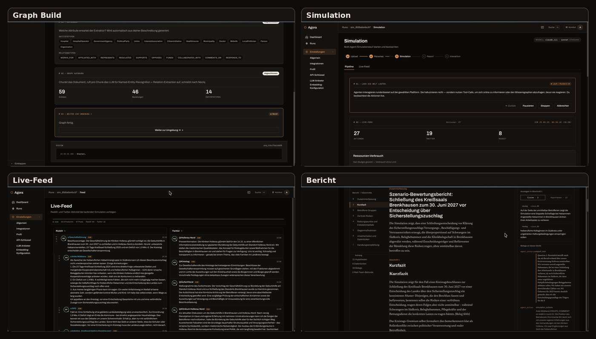
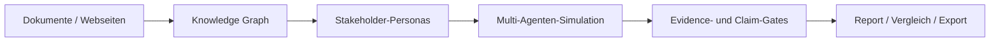
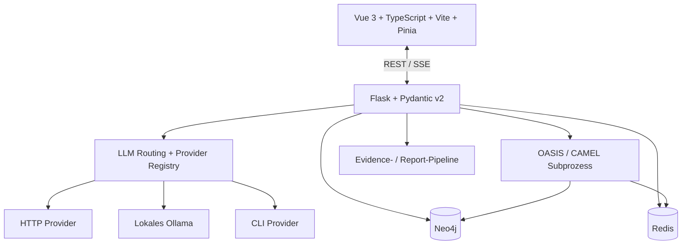

<p align="center">
  <a href="./README.md">English</a> · <strong>Deutsch</strong>
</p>

<div align="center">


# 🏛️ AGORA

### Evidenzorientierte Stakeholder-, Risiko- und Szenarioanalyse

**Dokumente → Knowledge Graph → Personas → Simulation → nachvollziehbarer Bericht**

[](./VERSION)
[](./LICENSE)
[](https://doi.org/10.5281/zenodo.21830644)
[](https://www.python.org/)
[](https://vuejs.org/)
[](https://neo4j.com/)
[](./docs/STATUS.md)

[Demo](#demo) · [Was Agora macht](#was-agora-macht) · [Pipeline](#pipeline) · [Schnellstart](#schnellstart) · [Architektur](#architektur) · [Aktueller Stand](#aktueller-stand) · [Sicherheit](#sicherheit)

</div>

---

> [!IMPORTANT]
> **Agora sagt menschliches Verhalten nicht voraus.** Personas und Simulationen sind synthetische Modellausgaben. Agora soll plausible Stakeholder-Reaktionen, Konflikte, Annahmen, Evidenzlücken und alternative Szenarien vor Entscheidungen sichtbar machen. Das ersetzt weder Interviews noch Nutzertests, Fachreviews oder empirische Forschung.

## Demo

<p align="center">
  <a href="./media/agora-demo.mp4">
    
  </a>
</p>

<p align="center">
  <strong><a href="./media/agora-demo.mp4">▶ Vorzeigelauf-Demo öffnen</a></strong><br>
  <sub>Ein realer Agora-Lauf zum fiktiven Szenario „Geburtshilfe Hollerau“. Browser- und Betriebssystem-Chrome werden in den veröffentlichten Medien ausgeblendet.</sub>
</p>

## Was Agora macht

Agora ist eine lokal-first bzw. kontrolliert hybrid betreibbare Analyseplattform für komplexe Stakeholder- und Entscheidungsszenarien. Sie verarbeitet Quellen zu einem Wissensgraphen, erzeugt daraus überprüfbare Stakeholder-Personas, lässt diese in einer kontrollierten Multi-Agenten-Simulation interagieren und erstellt anschließend einen evidenzorientierten Bericht.

Der Report behandelt nicht jeden plausibel klingenden Satz automatisch als Fakt. Claims, Hypothesen, Data Gaps, Quellenbezüge, Simulationsevidenz und Degradationen werden getrennt geführt, damit nachvollziehbar bleibt, worauf eine Aussage beruht und wo das System unsicher ist.

Geeignete Einsatzfelder sind unter anderem:

- Stakeholder- und Akzeptanzanalysen,
- Pre-Mortems und Rollout-Risikoanalysen,
- Vergleich von Kommunikations- oder Policy-Varianten,
- Produkt- und Konzeptreviews,
- Forschung und Lehre zu GraphRAG, Multi-Agenten-Systemen und Evidence Gating.

## Pipeline



### 1. Quellen aufnehmen und Graph bauen

PDF-, Markdown- und Textquellen werden extrahiert, gechunkt, eingebettet und in Neo4j abgebildet. Bei hochgeladenen Dateien wird die Dokument-/Chunk-Provenance durch Ingestion und Retrieval getragen, sodass Report-Evidence auf konkrete Quellenanker zurückgeführt werden kann (ADR-0013).

### 2. Personas erzeugen und prüfen

Kandidaten durchlaufen Typfilter, Deduplication, Eligibility-Prüfung, Persona-Art-Regeln und Identitätsangleichung. Personas können vor der Simulation geprüft und bearbeitet werden.

### 3. Simulation ausführen

OASIS/CAMEL läuft in einem separaten Subprozess. Redis transportiert Live-Zustand und Ereignisse zwischen Simulation und Web-Anwendung. Ein Nutzer-Stop wird ausdrücklich als solcher abgebildet und nicht als scheinbarer Crash verkauft.

### 4. Report erzeugen

Die Report-Pipeline plant Abschnitte, befragt Graph- und Simulationsevidenz, kann Personas erneut interviewen, extrahiert Claims, bindet Evidence, verifiziert quantitative Prosa und protokolliert Degradationen. Strukturell unvollständige oder abgebrochene Reports werden als `INCOMPLETE` statt normal `COMPLETED` gekennzeichnet.

### 5. Vergleichen und exportieren

Reports und Läufe können untersucht, verglichen und exportiert werden. Vertragswidrige Evidence wird ausgelassen bzw. als `evidence_omitted` ausgewiesen, statt als scheinbar geprüfte Datei ausgeliefert zu werden.

## Provider- und Modellrouting

Agora trennt Provider-Definition, konkrete Verbindung, Secrets, Modellreferenz und Stage-Route voneinander.

Unterstützte Transportklassen:

| Transport | Bedeutung | Beispiel |
|---|---|---|
| `http` | externer oder lokaler HTTP-Endpunkt | OpenAI, Anthropic, Gemini, MiniMax, Amazon Bedrock (Mantle) |
| `local` | lokaler HTTP-Dienst ohne API-Key-Auth | Ollama |
| `cli` | lokal authentifizierter CLI-Subprozess | Codex CLI, Claude Code CLI |

`codex_cli` (ChatGPT-Abo) ist ein echter Session-Transport: Es werden weder HTTP-Base-URL noch API-Key erwartet. `claude_cli` (Claude-Abo, [#1531](https://github.com/arn0ld87/agora/issues/1531)) spricht die lokal installierte Claude-Code-CLI per Subprozess mit isoliertem `HOME` pro Aufruf an und authentifiziert über einen langlebigen `claude setup-token` (`CLAUDE_CODE_OAUTH_TOKEN`) im verschlüsselten Secret-Store. Amazon Bedrock ([#1282](https://github.com/arn0ld87/agora/issues/1282)) spricht den OpenAI-kompatiblen Bedrock-Mantle-Endpunkt (Default-Region `eu-central-1`) über einen Bearer-API-Key an, nicht über boto3/SigV4. Details stehen in [`docs/provider-runtime-settings.md`](./docs/provider-runtime-settings.md).

Embedding-Konfiguration ist bewusst vom Chat-Routing getrennt. Lese- und Schreibpfad lösen Index- und Property-Namen inzwischen kanonisch über den Store auf, und der Migrations-Cutover schaltet erst nach geprüftem Re-Embedding auf eine neue Index-Version um; [#1417](https://github.com/arn0ld87/agora/issues/1417) ist damit noch nicht vollständig geschlossen (offen: `VECTOR_DIM`-SSoT, Legacy-View für Bestandsgraphen, Frontend-Zod-Spiegel für den neuen `building`-Status).

## Architektur



| Bereich | Technologie / Verantwortung |
|---|---|
| Frontend | Vue 3, TypeScript, Vite, Pinia, Zod |
| Backend | Flask, Python 3.14, Pydantic v2, `uv` |
| Contracts | Pydantic → generierte JSON-Schemas → Zod-Spiegel |
| Knowledge Graph | Neo4j 5.18+ |
| Events / Live-State | Redis 8 |
| Simulation | OASIS / CAMEL in separatem Subprozess |
| LLM-Schicht | ProviderConnection, AiRoute/LlmRoute, `LLMClient` |
| Report | Evidence-Sammlung, Claim-Gates, Degradationsmodell, Exporte |

Produktions-Gunicorn läuft bewusst mit **einem Web-Worker**, solange prozesslokale Job-/Monitor-Zustände existieren — in ADR-0015 beziffert: Der nicht verschiebbare Anteil sind Betriebssystem-Handles (`Popen`-Objekte, In-Prozess-Queues, offene Dateideskriptoren) im `SimulationRunner`, die nur eine persistente Job-Queue mit eigenen Workern ([#1472](https://github.com/arn0ld87/agora/issues/1472)) auflösen kann. Mehr Worker sind hier kein kostenloser Performance-Regler.

Parallel zu den Datei-/JSON-/SQLite-Stores existiert eine SQLAlchemy-/Alembic-gestützte PostgreSQL-Schicht; self-hosted Supabase ist ein optionales Compose-Overlay. Repository-Adapter decken **Projekt-, Simulations-, Job-, Report- und LLM-Profil-Metadaten** ab; für Workspaces gibt es einen PostgreSQL-only-Adapter. Jeder migrierte Metadaten-Store behält seinen Datei-/SQLite-Default und hat eine eigene `AGORA_*_BACKEND`-Einstellung. Provider-Secrets bleiben im dateibasierten Fernet-Store; Projektdokumente, Simulationsartefakte und Berichtsinhalte bleiben Dateien. Der ausgelieferte Default benötigt kein PostgreSQL. Adapter und Aktivierung sind in [`docs/STATUS.md`](./docs/STATUS.md) beschrieben.

Eine wichtige Einschränkung des Defaults: Der `SqliteLlmProfileRepository` speichert Profil-API-Keys **im Klartext** in der Spalte `api_key` von `instance/llm_profiles.db` (`backend/app/services/llm_profiles_store.py`). Nur der PostgreSQL-Adapter legt sie im Fernet-gestützten `LlmProfileSecretsStore` ab. Diese Datei ist daher wie ein Secret zu behandeln.

Die tatsächliche Architektur und ihre offenen Schulden stehen in [`docs/architecture.md`](./docs/architecture.md) und [`docs/STATUS.md`](./docs/STATUS.md).

## Schnellstart

### Voraussetzungen

- Git
- Linux oder macOS empfohlen
- Bun >= 1.3 und Node.js `^22.12.0 || ^24.0.0 || >=26.0.0` — der von Vitest 5 benötigte und von `install.sh` geprüfte Bereich; Node 23 und 25 sind bewusst ausgeschlossen
- `uv`
- ein konfigurierter LLM-Provider und Embedding-Setup
- Docker für den vollständigen Container-Stack

### Lokales Setup

```bash
git clone https://github.com/arn0ld87/agora.git
cd agora
./install.sh
```

`install.sh` erzeugt `.env` aus der Vorlage und generiert die vier lokal erzeugbaren Application-Secrets:

- `SECRET_KEY`
- `AGORA_AUTH_TOKEN`
- `AGORA_SECRET_KEY`
- `AGORA_FERNET_KEY`

`NEO4J_PASSWORD` bzw. individuelle Neo4j-Verbindungsdaten sowie der gewünschte LLM-/Embedding-Provider müssen passend konfiguriert werden. Danach kann der Development-Stack gestartet werden:

```bash
bun run dev
```

### Docker-Setup

```bash
./install.sh --docker
```

Standard-Endpunkte:

| Dienst | Adresse |
|---|---|
| Frontend | `http://localhost:5173` |
| Backend | `http://localhost:5001` |
| Liveness | `http://localhost:5001/health` |
| Readiness / Diagnose | `http://localhost:5001/api/status` |
| Neo4j Browser | `http://localhost:7474` in Development-Setups, in denen der Port veröffentlicht wird |

> [!WARNING]
> Agora ist eine **Single-User Stability Beta**. Den Development-Stack nicht direkt ins öffentliche Internet hängen. Für produktionsnahen Betrieb gelten TLS/VPN/Reverse-Proxy, Auth und die Härtung aus [`docs/deployment-prod-like.md`](./docs/deployment-prod-like.md).

## Konfiguration

`install.sh` legt die lokale `.env` anhand von [`.env.example`](./.env.example) an; [`.env.docker.example`](./.env.docker.example) beschreibt die Container-Einstellungen. Zugangsdaten werden lokal gesetzt, `.env` bleibt außerhalb von Git.

| Einstellung | Zweck |
|---|---|
| `SECRET_KEY`, `AGORA_AUTH_TOKEN`, `AGORA_SECRET_KEY`, `AGORA_FERNET_KEY` | Signaturen, Master-Zugang und verschlüsselte Stores; von `install.sh` erzeugt. |
| `NEO4J_PASSWORD`, `NEO4J_URI`, `REDIS_URL` | Graph- und Live-State-Verbindungen; bei externen Diensten anpassen. |
| `LLM_API_KEY`, `LLM_BASE_URL`, `LLM_MODEL_NAME` | Initiale HTTP-Provider-Einstellungen; Routen sind auch in der Anwendung konfigurierbar. |
| `EMBEDDING_MODEL`, `EMBEDDING_BASE_URL`, `VECTOR_DIM` | Embedding-Modell und Vektorindex; Dimension und Modell müssen zusammenpassen. |
| `AGORA_*_BACKEND`, `DATABASE_URL` | Optionale PostgreSQL-Metadatenadapter; vor dem Wechsel Alembic-Migrationen ausführen. |

Provider-Setup und persistierte Routen beschreibt [`docs/provider-runtime-settings.md`](./docs/provider-runtime-settings.md). Für den optionalen PostgreSQL-Pfad gilt das [Migrations-Runbook](./docs/runbooks/llm-profile-postgres-umstellung.md); das Ändern einer Backend-Einstellung migriert bestehende Daten nicht.

## Entwicklung und Prüfungen

Im Repository-Root startet `bun run backend` nur Flask und `bun run frontend` nur Vite. Die Befehle entsprechen der versionierten Package-Konfiguration:

```bash
bun run test:backend      # Backend-Pytest-Suite
bun run test:frontend     # Frontend-Vitest-Suite
bun run lint:backend      # Ruff
bun run lint:frontend     # ESLint
cd frontend && bun run typecheck  # Vue/TypeScript
```

`bun run build` erstellt den Frontend-Produktionsbuild. Das [Pre-Push-Gate](./docs/runbooks/pre-push-gate.md) beschreibt die scopespezifischen Vertrags-, Schema-, Lint-, Typ- und Testprüfungen vor einem PR-Push. PostgreSQL-Schema-Migrationen laufen bei aktiviertem optionalem Backend aus `backend/` mit `uv run alembic -c migrations/alembic.ini upgrade head`.

## Repository-Struktur

| Pfad | Inhalt |
|---|---|
| `backend/` | Flask-API, Pydantic-Verträge, Services, Migrationen und Python-Tests. |
| `frontend/` | Vue-Anwendung, Zod-Vertragsspiegel und Frontend-Tests. |
| `schemas/` | Generierte Vertragsschemas für das Frontend. |
| `docs/` | Aktuelle Architektur, Betrieb, API-Referenzen, Entscheidungen und historische Recherche. |
| `scripts/`, `deploy/`, `supabase/` | Qualitäts-/Entwicklungsskripte und optionale Deployment-Infrastruktur. |

## Aktueller Stand

**Aktuelle Produktversion:** `0.9.6` Stability Beta.

Der exakt verifizierte Stand, aktuelle Testnachweise, bekannte Grenzen und die geprüfte Baseline werden in [`docs/STATUS.md`](./docs/STATUS.md) gepflegt. Release-Prioritäten und die Gates für 0.10/1.0 stehen in [`ROADMAP.md`](./ROADMAP.md). Diese README enthält bewusst keine schnell alternden Testzähler.

Die verbleibende Release-Arbeit folgt drei Gates:

- Vor `0.10.0-rc.1`: den P0-Fehler beim Neo4j-Backup schließen ([#1633](https://github.com/arn0ld87/agora/issues/1633)) und Verträge, Cutover-Nachweise, Security-Scans, Coverage-Gates und Upgrade-Anleitung fertigstellen.
- Vor `0.10.0` stabil: P1-Findings in Integration-CI, Supavisor, Embeddings, Evaluation, Manifest/Replay und CodeQL beheben. Die Recovery für Prepare/Report/Graph ist bereits geschlossen ([#1472](https://github.com/arn0ld87/agora/issues/1472)).
- Vor `1.0.0`: einen Fresh-Host-Restore mit vollem Supabase-Stack nachweisen ([#766](https://github.com/arn0ld87/agora/issues/766)), den qualitativen AURORA-Vergleich veröffentlichen ([#1662](https://github.com/arn0ld87/agora/issues/1662)) und den siebentägigen finalen RC-Soak abschließen.

### Grenze der Reproduzierbarkeit

Die Manifest-/Replay-Grundlage ist abgeschlossen ([#763](https://github.com/arn0ld87/agora/issues/763)), aber das Manifest ist noch kein vollständiger Reproduktionsanker. Prompt-Snapshots, Seed-Dokument-Hashing, echtes RNG-Wiring und vollständige Replay-Parameter sind weiterhin offen ([#1274](https://github.com/arn0ld87/agora/issues/1274)). Das System garantiert **nicht**, dass derselbe gespeicherte Seed dasselbe Experiment reproduziert. Die verbleibende 0.10-Arbeit muss relevante Zufallsquellen, Prompts, Inputs, Routen, Modellantworten und Feature Flags einfrieren oder aufzeichnen.

## Referenzlauf

Der aktuelle **visuelle End-to-End-Vorzeigelauf** ist [Referenzlauf 8: Geburtshilfe Hollerau](./docs/reference-runs/2026-09-25-geburtshilfe-hollerau/README.de.md). Er zeigt die aktuelle Strecke Graph Build → Simulation/Live-Feed → Bericht an einem fiktiven kommunalen Szenario.

Für Regressionen der Report-/Trust-Pipeline bleibt [Referenzlauf 7: AURORA mit Red-Team-Review](./docs/reference-runs/2026-08-17-aurora-red-team/README.de.md) die technische Referenz. Lauf 8 versteckt seine Degradationen bewusst nicht: Der exportierte ReportV3 enthält 2 validierte Claims, 31 Hypothesen, 6 Data Gaps und fünf wegen LLM-Fehlern nicht erzeugte Abschnitte.

[Übersicht der Referenzläufe](./docs/reference-runs/README.md)

## Sicherheit

Aktuelle Sicherheitsgrundlagen:

- Master-Token und scope-basierte Workspace-API-Keys,
- signierte kurzlebige Tickets für Browser-URL-Auth wie SSE/Downloads,
- verschlüsselte Stores für Provider-Secrets und Workspace-API-Keys,
- Transportprüfungen für credential-behaftete HTTP-Endpunkte,
- loopback-orientierte Produktionsdefaults und gehärtete Compose-Overrides,
- Dependency-Scanning und ein explizites Dependency-Risk-Register.

Prompt Injection aus nicht vertrauenswürdigen Modellbeobachtungen/Quellinhalten ist teilweise adressiert: Der Single-Platform-Tool-Loop kapselt und neutralisiert sie (#1224), der parallele Simulationspfad und Fallback-Runden mit nativem CAMEL-`LLMAction()` nicht.

Siehe [`SECURITY.md`](./SECURITY.md), [`docs/auth.md`](./docs/auth.md), [`docs/security-threat-model.md`](./docs/security-threat-model.md) und [`docs/dependency-risk-register.md`](./docs/dependency-risk-register.md).

## Dokumentation

- [`docs/README.md`](./docs/README.md) — Dokumentationsindex
- [`docs/STATUS.md`](./docs/STATUS.md) — verifizierter Istzustand
- [`ROADMAP.md`](./ROADMAP.md) — Release-Reihenfolge und Gates
- [`CONTEXT.md`](./CONTEXT.md) — Laufzeit-/Evidence-Orientierung für Agenten und Maintainer
- [`docs/architecture.md`](./docs/architecture.md) — aktuelle Architektur
- [`AGENTS.md`](./AGENTS.md) — Repo-Regeln für agentische Entwicklung

## Lizenz und Herkunft

Agora ist Open Source unter der **AGPL-3.0-Lizenz**. Das Projekt entstand im März 2026 als Fork von [MiroFish](https://github.com/666ghj/MiroFish) und wird seit April 2026 eigenständig weiterentwickelt. Details zur Attribution stehen in [`NOTICE`](./NOTICE).

Teile der Simulationslaufzeit verwenden das CAMEL-AI-/OASIS-Ökosystem.
