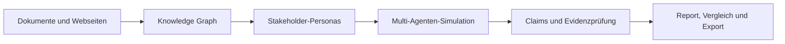
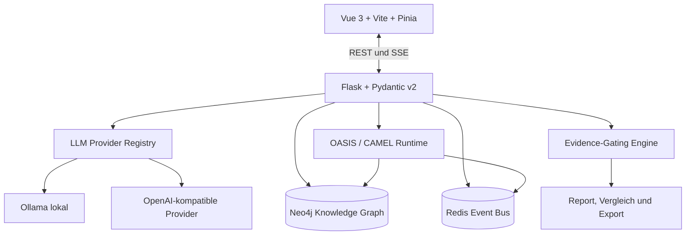

<p align="center">
  <a href="./README.md">English</a> · <strong>Deutsch</strong>
</p>

<div align="center">


# 🏛️ AGORA

### Evidenzorientierte Multi-Agenten-Analyse für Stakeholder, Zielgruppen und komplexe Entscheidungen

**Dokumente → Knowledge Graph → Personas → Simulation → nachvollziehbarer Bericht**

[](./VERSION)
[](./LICENSE)
[](https://doi.org/10.5281/zenodo.21830644)
[](https://www.python.org/)
[](https://vuejs.org/)
[](https://neo4j.com/)
[](./docs/STATUS.md)
[](./docs/STATUS.md)

[Demo](#demo) · [Was ist Agora?](#was-ist-agora) · [Funktionsweise](#funktionsweise) · [Prozess im UI](#-prozess-im-ui) · [Schnellstart](#schnellstart) · [Architektur](#architektur) · [Status](#projektstatus) · [Sicherheit](#sicherheit) · [Mitwirken](#projekt-unterstützen)

</div>

---

> [!IMPORTANT]
> **Agora sagt menschliches Verhalten nicht voraus.** Die Plattform erzeugt überprüfbare Szenarien, mögliche Einwände, Konfliktlinien und Datenlücken. Simulationsergebnisse ersetzen weder Interviews noch Nutzertests oder empirische Forschung.

## Demo

<p align="center">
  <a href="./media/agora-demo.mp4">
    
  </a>
</p>

<p align="center">
 <strong><a href="./media/agora-demo.mp4">▶ Vollständige 43-Sekunden-Demo öffnen</a></strong><br>
  <sub>Realer Lauf zur Einführung des KI-Lernassistenten „LernKompass 2027“.</sub>
</p>

Die Demo zeigt:

1. laufende Multi-Agenten-Simulation mit Status und Ressourcenverbrauch,
2. simulierte Reaktionen und technische Laufzeitdaten,
3. einen strukturierten Report mit Risiken, Konflikten und Datenlücken,
4. den Export des Ergebnisses als PDF.

---

## Referenzlauf

Der aktuelle, kritisch dokumentierte End-to-End-Lauf untersucht erneut die **Domainmigration `alexle135.de` → `alex-schneider.dev`** über **20 vollständig abgeschlossene Simulationsrunden** nach dem 0.9.x-Hardening von Evidence und Provenance.

Der Report bindet **46 Claim-Zeilen** (22 eindeutige gerenderte IDs) und enthält **141 Hypothesen** sowie **133 Data Gaps**. Anders als in früheren Läufen ist die dominante Fehlerklasse nicht mehr fehlendes Evidence Binding. Der Lauf legt die nächste Trust-Grenze offen: Agora kann eine Aussage an ein reales Seed-Fragment binden und trotzdem verlieren, ob dieses Fragment selbst einen dokumentierten Fakt, eine unbelegte Behauptung, eine Hypothese, einen Widerspruch oder eine synthetische Aussage darstellt. Im adversarialen Seed wird dadurch eine ausdrücklich unbelegte SEO-Aussage zu einem validierten Welt-Claim hochgestuft, während eine andere Section dieselbe Aussage korrekt als unbelegt bezeichnet.

Derselbe Lauf macht außerdem eine Fremdrollen-Interviewantwort zum einzigen `medium`-Claim, rendert Seed-only-Claims als `Simulationskonsens` und lässt weiterhin einen Nicht-Stakeholder (`Fachblog`) in den Social-Trace. Gleichzeitig fängt der Gate mehrere unbelegte numerische Zielwerte korrekt ab und schwächt die Aussage, Option B sei die einzig tragfähige Strategie.

> [!NOTE]
> Dies ist die aktuelle **Trust-Pipeline-Referenz**, keine Hochglanz-Demo und kein Nachweis prädiktiver Validität. Der vorherige Lernassistenten-Lauf bleibt die reichhaltigere Referenz für Simulationsdynamik: 665 Aktionen und sechs Cluster gegenüber 109 Interaktionen und drei Clustern hier.

**[→ Referenzlauf 5 lesen](./docs/reference-runs/2026-08-12-domain-migration-20-runden/README.de.md)** · **[English](./docs/reference-runs/2026-08-12-domain-migration-20-runden/README.md)**

Frühere Läufe: [Referenzlauf 4](./docs/reference-runs/2026-08-11-ki-lernassistent-20-runden/README.de.md) (erster Evidence-Binding-at-Scale-Lauf; reichhaltigere Simulationsdynamik) · [Lauf 3](./docs/reference-runs/2026-08-11-ki-lernassistent/README.md) · [Lauf 2](./docs/reference-runs/2026-08-09-domain-migration-v2/README.md) · [Lauf 1](./docs/reference-runs/2026-08-09-domain-migration/README.md)

---

## Was ist Agora?

Agora ist eine lokal oder hybrid betreibbare Analyseplattform. Sie verarbeitet Dokumente, Webseiten und Fragestellungen zu einem Wissensgraphen, erzeugt daraus überprüfbare Stakeholder-Personas und lässt diese in einer kontrollierten Multi-Agenten-Simulation interagieren.

Der anschließende Report trennt dokumentbelegte Aussagen von Hypothesen, unbelegten Behauptungen und fehlenden Informationen. Statt lediglich plausibel klingenden LLM-Text zu erzeugen, versucht Agora jede relevante Aussage auf Quellen, Graphobjekte und Simulationsereignisse zurückzuführen.

### Kernnutzen

| Problem | Agora-Ansatz |
|---|---|
| Kritische Stakeholder werden spät berücksichtigt | Konfliktlinien und Einwände vor einer Entscheidung explorieren |
| LLM-Berichte vermischen Fakten und Spekulation | Claims nach Evidenzgrad klassifizieren und mit Quellen verknüpfen |
| Varianten werden nur nach Bauchgefühl verglichen | Runs, Prompts, Modelle und Eingabevarianten gegenüberstellen |
| Entscheidungen beruhen auf unvollständigen Unterlagen | Datenlücken und nicht repräsentierte Gruppen sichtbar machen |
| Sensible Daten sollen das eigene Netz nicht verlassen | Lokaler Betrieb mit Neo4j, Redis und Ollama möglich |

### Geeignete Anwendungsfälle

- **Stakeholder- und Akzeptanzanalyse:** mögliche Widerstände, Interessen und Kommunikationsprobleme strukturieren.
- **Pre-Mortem:** untersuchen, warum ein Vorhaben scheitern könnte, bevor es umgesetzt wird.
- **Kommunikationsvarianten:** Botschaften, Narrative und Positionierungen miteinander vergleichen.
- **Produkt- und Konzeptreview:** Annahmen, Risiken und unberücksichtigte Zielgruppen identifizieren.
- **Forschung und Lehre:** Multi-Agenten-, GraphRAG- und Evidence-Gating-Workflows nachvollziehbar untersuchen.

---

## Funktionsweise



### 1. Wissen aufnehmen

PDF-, Markdown- und Textdateien sowie Webseiten werden extrahiert und segmentiert. Bei **hochgeladenen Dateien** trägt jedes Segment seine Dokument- und Chunk-Herkunft durch Ingest, Graph-Aufbau und Retrieval (ADR-0013), und diese Herkunft erreicht den Report als auflösbaren Belegsanker — siehe Schritt 5. Live abgerufene Webseiten durchlaufen diesen Weg nicht: sie kommen als Rechercheergebnis in den Report und erhalten keine Dokument- oder Chunk-ID.

### 2. Knowledge Graph aufbauen

Neo4j speichert Entitäten, Beziehungen, Behauptungen, Quellenfragmente und Vektor-Embeddings. Dadurch können semantische Suche und Graphbeziehungen gemeinsam genutzt werden.

### 3. Personas erzeugen und prüfen

Agora leitet Stakeholder-Personas aus dem Wissensgraphen ab. Rollen, Interessen und Haltungen können vor dem Lauf geprüft, verändert oder neu generiert werden.

### 4. Simulation ausführen

Die OASIS-/CAMEL-Laufzeit orchestriert die Agenten. Redis überträgt Status, Ereignisse und Laufzeitdaten zwischen Simulation, Backend und Oberfläche.

### 5. Evidenzorientierten Report erstellen

Der Report verarbeitet Graph- und Simulationsdaten zu strukturierten Claims. Quellengattung, Confidence und Datenlücken werden gesondert dargestellt; jedes Evidence-Item nennt seine Gattung (Agentenzitat, Agentenaktion, Graph-Relation, Web-Quelle, Seed-Korpus). Ein Evidence-Item aus dem Seed-Korpus trägt einen auflösbaren Anker auf die konkrete Stelle im Ausgangsdokument ([#1154](https://github.com/arn0ld87/agora/issues/1154)); ein Graph-Fakt ohne belegte Herkunft bleibt Graph-Relation, statt einen geratenen Anker zu bekommen.

Confidence weist ihren eigenen Geltungsbereich aus: sie trennt Simulationskonsens von Quellenbindung, und `verified` verlangt eine Entailment-Prüfung am selben Evidence-Item, nicht bloß einen Ähnlichkeitswert. Eine nachträglich herabgestufte Aussage behält ihren Wortlaut und weist in der Aussagentabelle aus, unter welcher Stufe er entstanden ist. Der Berichtskopf nennt den Simulationsstand, auf dem der Bericht beruht — abgeschlossene Runden, geplante Gesamtzahl und ob die Simulation beim Start der Reportgenerierung noch lief.

### 6. Varianten vergleichen und exportieren

Runs können nach Modell, Prompt und Eingabevariante verglichen und in mehrere Formate exportiert werden (JSON, Markdown, CSV, ZIP). Jeder Export trägt dieselbe vertragsgeprüfte Evidenzsicht wie der Lesepfad; vertragswidrige Evidenz wird mit maschinenlesbarer Begründung zurückgehalten, statt als scheinbar geprüfte Datei auszuliefern.

Der stochastische Anteil eines Simulationslaufs ist geseedet und damit wiederholbar. Ein vollständiger Replay — gleicher Seed, gleicher Report — verlangt zusätzlich eine Aufzeichnung der Modellantworten und ist offen ([#763](https://github.com/arn0ld87/agora/issues/763)).

---

## 📸 Prozess im UI

Die Pipeline in der Agora-Weboberfläche folgt fünf aufeinander aufbauenden Schritten — Run starten, Upload, Personas, Report und Interaktion. Die folgenden Screenshots zeigen einen realen Lauf (`proj_c12f138aa04e` zum Thema SchulKI) von der Quelldatei bis zum 1‑zu‑1‑Gespräch mit den generierten Personas:

### 1. Run starten — Quelle wählen, Modell konfigurieren

Im Dashboard wird ein neuer Run angelegt: Quelldatei ablegen, Modellprofil und Sprache auswählen, Anzahl der Personas und Simulationsrunden einstellen, dann starten.


### 2. Upload — Wissensgraph aus Dokumenten aufbauen

Direkt nach dem Start extrahiert Agora aus den hochgeladenen Dokumenten Entitäten und Beziehungen und zeigt sie als interaktiven Graphen. Beziehungs‑Labels sind ein‑ und ausblendbar, der Graph ist als `.graphml`, `.svg`, `.png`, `.pdf` oder `.html` exportierbar.

| Frisch hochgeladen | Vollständig aufgebaut |
|---|---|
|  |  |

Über den Relationship‑Inspector lässt sich jeder Knoten anklicken — die Beziehungen und Selbst‑Referenzen werden in einem seitlichen Panel sichtbar.


### 3. Personas — Zielgruppen aus dem Graphen generieren

Aus dem Wissensgraphen werden hunderte Personas abgeleitet. Vor der Generierung werden LLM‑Modell, Agentensprache und die maximale Anzahl Agenten konfiguriert.


Während der Generierung füllt sich eine Karten‑Übersicht mit Name, Rolle, Interessen und Tags. Jede Persona lässt sich vor dem Simulationslauf einzeln prüfen, bearbeiten, neu generieren oder freigeben.

| Generierte Personas | Persona-Detailansicht |
|---|---|
|  |  |

### 4. Report — Evidence-Gating & Section-Generierung

Während der Simulation laufen die Agenten‑ und Werkzeug‑Aufrufe parallel. Jede Report‑Section wird mit Evidenzbindung (ADR‑0002), Confidence und Quellenverweisen erzeugt; bei fehlgeschlagenem LLM‑Call liefert die Section stattdessen eine nachvollziehbare Fehlermeldung mit Verweis auf den Server‑Log.


### 5. Interaktion — gezielte Nachfragen an die Personas

Nach Abschluss des Reports lassen sich einzelne Personas direkt ansprechen — entweder im 1‑zu‑1‑Gespräch oder als Umfrage. So können hypothesengetriebene Nachfragen gestellt und Evidenzlücken gezielt geschlossen werden.


---

## 🏗️ Architektur



### Technologie-Stack

| Bereich | Technologie | Aufgabe |
|---|---|---|
| Frontend | Vue 3, Vite, Pinia, TypeScript, Zod | Oberfläche, Statusdarstellung und Eventverarbeitung |
| Backend | Flask, Pydantic v2, Python 3.14, `uv` | REST API, SSE, Contracts und Orchestrierung |
| Knowledge Graph | Neo4j 5.18+ | Entitäten, Relationen, Claims und Vektorindizes |
| Event Bus | Redis 5.0+ | Status, Pub/Sub, IPC und Simulationsereignisse |
| Simulation | OASIS / CAMEL AI | Multi-Agenten-Interaktionen und Rollensteuerung |
| LLM-Schicht | Provider Registry und `chat_json` | Ollama sowie OpenAI-kompatible Anbieter |
| Qualität | Pytest, Frontend-Tests, E2E-Smokes, GitHub Actions | Contracts, Migrationen und Kernabläufe absichern |

---

## ⚡ Schnellstart

### Voraussetzungen

- Git
- Linux oder macOS empfohlen
- ein konfigurierter LLM- und Embedding-Provider
- für den vollständigen Stack: Docker

### Lokales Setup

```bash
git clone https://github.com/arn0ld87/agora.git
cd agora
./install.sh

cp .env.example .env
# LLM-Endpunkte und Secrets in .env konfigurieren
bun run dev
```

### Docker-Setup

```bash
./install.sh --docker
```

| Dienst | Adresse | Funktion |
|---|---|---|
| Frontend | `http://localhost:5173` | Agora-Weboberfläche |
| Backend | `http://localhost:5001` | REST API und SSE Gateway |
| Readiness | `http://localhost:5001/readyz` | Backend-Status |
| Neo4j Browser | `http://localhost:7474` | Graph und Cypher Console |

> [!WARNING]
> Agora ist aktuell ein experimentelles Single-User-System. Die Anwendung nicht ungeschützt im öffentlichen Internet betreiben. Nutze Tailscale, WireGuard, ein VPN oder einen korrekt konfigurierten HTTPS-Reverse-Proxy.

---

## 📊 Projektstatus

**Aktuelle Version:** `0.9.4` Stability Beta

| Bereich | Stand |
|---|---|
| Backend | mehr als 4.700 gesammelte Unit- und Contract-Tests |
| Frontend | mehr als 180 Testdateien |
| E2E | 20 grüne Szenarien, darunter 6 verpflichtende Kern-Smokes |
| Main Branch | geschützt durch 17 Required Status Checks |
| Produkt-Frontend | Vue-v4-Routen sind die einzige ausgelieferte Oberfläche |
| Betriebsmodell | stabilisierter Single-User-Betrieb, noch keine allgemeine Produktionsfreigabe |

### Release-Pfad

| Version | Ziel | Status |
|---|---|---|
| `0.8.0` | funktionsfähige Technical Preview | abgeschlossen |
| `0.9.x` | Stabilisierung, Security- und Readiness-Gates | aktuell |
| `0.10.0` | reproduzierbare Runs, Replay, Budgets, Backup/Restore | geplant |
| `1.0.0` | stabile Verträge, Referenzlauf und nachgewiesener Produktnutzen | geplant |

Der verifizierte Ist-Zustand steht in [`docs/STATUS.md`](./docs/STATUS.md). Die verbindlichen nächsten Schritte stehen in [`ROADMAP.md`](./ROADMAP.md).

---

## ⚠️ Grenzen und verantwortungsvolle Nutzung

- **Personas sind simuliert.** Ihre Aussagen sind keine echten Kunden- oder Bürgermeinungen.
- **Confidence ist keine Wahrheitsskala.** Der Wert beschreibt die interne Evidenzbindung eines Claims.
- **Inputs bestimmen die Ergebnisse.** Datenqualität, Prompt, Modell und Seed können den Lauf erheblich verändern.
- **Ein Run ist keine Stichprobe.** Für belastbarere Aussagen sind mehrere Varianten und externe Reviews nötig.
- **Kleine Modelle sparen Kosten, reduzieren aber häufig die Qualität.** Besonders strukturierte Ausgaben und Evidenzzuordnung leiden.
- **Cloud-Provider erzeugen Datenschutz- und Kostenrisiken.** Datenflüsse und Auftragsverarbeitung müssen vorab geprüft werden.

Agora ist am nützlichsten als **Entscheidungsunterstützung vor realen Interviews, Fachreviews, Nutzertests oder Pilotprojekten**.

---

## 🔒 Sicherheit

- API-Zugriff über `AGORA_AUTH_TOKEN`
- zeitlich begrenzte, signierte Tickets für SSE und Downloads
- Secrets werden nicht in Reports, Logs oder Graphobjekte serialisiert
- HTTPS-Pflicht für credential-behaftete LLM- und Embedding-Endpunkte
- empfohlener Betrieb im lokalen Netz, über VPN oder hinter einem Reverse Proxy

Weitere Dokumentation:

- [`SECURITY.md`](./SECURITY.md)
- [`docs/security-hardening.md`](./docs/security-hardening.md)
- [`docs/dependency-risk-register.md`](./docs/dependency-risk-register.md)

---

## 🤝 Projekt unterstützen

Agora befindet sich zwischen funktionsfähiger Stability Beta und einer belastbaren Version 1.0. Besonders aufwendig sind wiederholte LLM-Läufe, Hardware für lokale Modelle, reproduzierbare Referenzsimulationen und fachliche Evaluationen.

Gesucht werden:

- **Forschungs- und Evaluationspartner**, die Multi-Agenten-Ergebnisse methodisch prüfen,
- **Compute- und Hardware-Sponsoren** für wiederholbare lokale Modellläufe,
- **Pilotpartner** mit echten, dokumentierten Stakeholder-Fragestellungen,
- **Open-Source-Mitwirkende** for Testing, UX, Security und Release Engineering,
- **Förder- und Kooperationspartner** für den Weg zu Version 1.0.

Kontakt und Mitarbeit:

- [GitHub Issues](https://github.com/arn0ld87/agora/issues)
- [Projektseite des Entwicklers](https://alexle135.de)
- [`AGENTS.md`](./AGENTS.md) für agentische Entwicklungsworkflows
- [`CLAUDE.md`](./CLAUDE.md) für Claude-Code-Aufgaben

---

<div align="center">

### ⚖️ Lizenz und Herkunft

Agora ist Open Source unter der **AGPL-3.0 Lizenz** ([`LICENSE`](./LICENSE)).  
Im März 2026 als Fork von [MiroFish](https://github.com/666ghj/MiroFish) (AGPL-3.0) entstanden, seit April 2026 eigenständig weiterentwickelt für professionelle DACH-Simulationen — Einzelheiten in [`NOTICE`](./NOTICE).  
Teile der Simulationslaufzeit basieren auf dem *CAMEL-AI-/OASIS-Ökosystem*.

*Entwickelt von [Alexander Schneider](https://alexle135.de)*

</div>