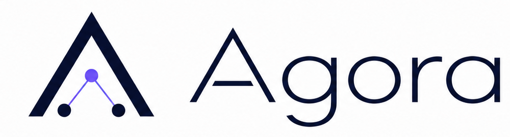
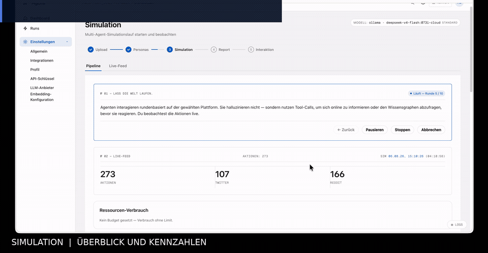

  <strong>Deutsch</strong> · <a href="./README.md">English</a>

# 🏛️ AGORA

### Evidenzorientierte Multi-Agenten-Analyse für Stakeholder, Zielgruppen und komplexe Entscheidungen

**Dokumente → Wissensgraph → Personas → Simulation → überprüfbarer Report**

---

> [!IMPORTANT]
> **Agora sagt menschliches Verhalten nicht voraus.** Die Plattform erzeugt überprüfbare Szenarien, mögliche Einwände, Konfliktlinien und Datenlücken. Simulationsergebnisse ersetzen keine Interviews, Nutzertests oder empirische Forschung.

## Demo

  

 <strong><a href="./media/agora-demo.mp4">▶ Vollständige 43-Sekunden-Demo öffnen</a></strong> 
  Realer Lauf zur Einführung des KI-Lernassistenten „LernKompass 2027“.

Die Demo zeigt:

1. laufende Multi-Agenten-Simulation mit Status und Ressourcenverbrauch,
2. simulierte Reaktionen und technische Laufzeitdaten,
3. einen strukturierten Report mit Risiken, Konflikten und Datenlücken,
4. den Export des Ergebnisses als PDF.

---

## Referenzlauf

Die aktuelle Referenz ist **Referenzlauf 6: AURORA**. Der Lauf untersucht für den fiktiven Städtischen Klinikverbund Falkenbrück den geplanten Produktivstart des KI-gestützten Triage- und Dokumentationssystems **Nexora Triage Assist**. Der Report wurde am **14. August 2026** als `report_3c594fcc7613` aus der bereits abgeschlossenen Simulation `sim_4245ff3d7b23` erzeugt.

Besonders nützlich ist dieser Lauf, weil **die Simulation unverändert blieb und nur die Report-Pipeline geändert wurde**. Damit eignet er sich als beobachtbare Reporter-Regression: Die Reportlaufzeit sank von ungefähr **17:52 Minuten auf 8:19 Minuten**, während `interview_agents` gezielt über alle sechs Reportabschnitte eingesetzt wurde.

Der Report empfiehlt einen **konditionierten, gestaffelten Rollout beginnend in Falkenbrück-Mitte**. Der Evidence Inspector stellt Reporttext, Claims, Hypothesen, Confidence und gebundene Evidenz nebeneinander dar.

### Evidence Inspector: Claims und Hypothesen

### Agenteninterviews als Evidenz

> [!NOTE]
> Dies ist bewusst **ein Referenzlauf und keine Hochglanz-Demo**. Er zeigt Fortschritte bei Laufzeit, Interviewintegration und Evidence Gating, dokumentiert aber weiterhin bekannte Trust-Grenzen: Der dokumentierte Fakt zu **38 Fällen mit abweichender Dringlichkeitseinstufung** kann noch fälschlich als unzureichend belegt degradiert werden; einzelne simulierte Zitate tragen noch einen generischen `seed_doc:seed_aurora#chunk:0`-Anker; stark passende `SUPPORTED`-Evidenz kann `low` Confidence behalten; und ReportV3 kann scheitern, obwohl der Task einen abgeschlossenen Zustand erreicht.

**[→ Vollständige Notizen zu Referenzlauf 6](./docs/reference-runs/2026-08-14-aurora-report/README.de.md)** · **[English](./docs/reference-runs/2026-08-14-aurora-report/README.md)**

Frühere Läufe: [Referenzlauf 5](./docs/reference-runs/2026-08-12-domain-migration-20-runden/README.de.md) · [Referenzlauf 4](./docs/reference-runs/2026-08-11-ki-lernassistent-20-runden/README.de.md) · [Lauf 3](./docs/reference-runs/2026-08-11-ki-lernassistent/README.md) · [Lauf 2](./docs/reference-runs/2026-08-09-domain-migration-v2/README.md) · [Lauf 1](./docs/reference-runs/2026-08-09-domain-migration/README.md)

---

## Was ist Agora?

Agora ist eine lokal oder hybrid betreibbare Analyseplattform. Sie verarbeitet Dokumente, Webseiten und Fragestellungen zu einem Wissensgraphen, erzeugt daraus überprüfbare Stakeholder-Personas und lässt diese in einer kontrollierten Multi-Agenten-Simulation interagieren.

Der anschließende Report trennt dokumentbelegte Aussagen von Hypothesen, unbelegten Behauptungen und fehlenden Informationen. Statt lediglich plausibel klingenden LLM-Text zu erzeugen, versucht Agora jede relevante Aussage auf Quellen, Graphobjekte und Simulationsereignisse zurückzuführen.

> Die übrige deutschsprachige Produktdokumentation bleibt unverändert gegenüber dem Stand vor dieser Referenzlauf-Aktualisierung.
