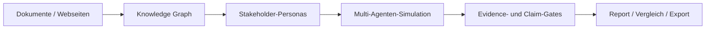
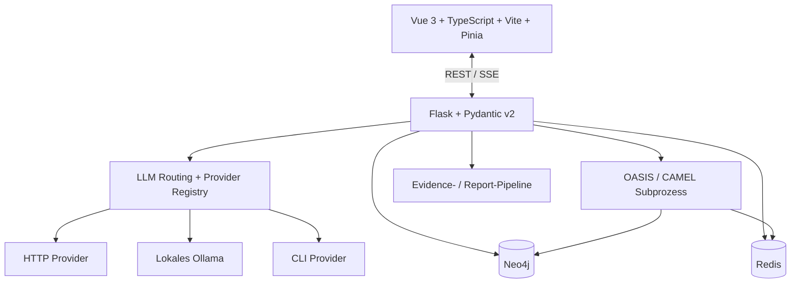

<p align="center">
  <a href="./README.md">English</a> · <strong>Deutsch</strong>
</p>

<div align="center">


# 🏛️ AGORA

### Evidenzorientierte Stakeholder-, Risiko- und Szenarioanalyse

**Dokumente → Knowledge Graph → Personas → Simulation → nachvollziehbarer Bericht**

[](./VERSION)
[](./LICENSE)
[](https://doi.org/10.5281/zenodo.21830644)
[](https://www.python.org/)
[](https://vuejs.org/)
[](https://neo4j.com/)
[](./docs/STATUS.md)

[Demo](#demo) · [Was Agora macht](#was-agora-macht) · [Pipeline](#pipeline) · [Schnellstart](#schnellstart) · [Architektur](#architektur) · [Aktueller Stand](#aktueller-stand) · [Sicherheit](#sicherheit)

</div>

---

> [!IMPORTANT]
> **Agora sagt menschliches Verhalten nicht voraus.** Personas und Simulationen sind synthetische Modellausgaben. Agora soll plausible Stakeholder-Reaktionen, Konflikte, Annahmen, Evidenzlücken und alternative Szenarien vor Entscheidungen sichtbar machen. Das ersetzt weder Interviews noch Nutzertests, Fachreviews oder empirische Forschung.

## Demo

<p align="center">
  <a href="./media/agora-demo.mp4">
    
  </a>
</p>

<p align="center">
  <strong><a href="./media/agora-demo.mp4">▶ 43-Sekunden-Demo öffnen</a></strong><br>
  <sub>Ein realer Agora-Lauf zum fiktiven Rollout des KI-Lernassistenten „LernKompass 2027“.</sub>
</p>

## Was Agora macht

Agora ist eine lokal-first bzw. kontrolliert hybrid betreibbare Analyseplattform für komplexe Stakeholder- und Entscheidungsszenarien. Sie verarbeitet Quellen zu einem Wissensgraphen, erzeugt daraus überprüfbare Stakeholder-Personas, lässt diese in einer kontrollierten Multi-Agenten-Simulation interagieren und erstellt anschließend einen evidenzorientierten Bericht.

Der Report behandelt nicht jeden plausibel klingenden Satz automatisch als Fakt. Claims, Hypothesen, Data Gaps, Quellenbezüge, Simulationsevidenz und Degradationen werden getrennt geführt, damit nachvollziehbar bleibt, worauf eine Aussage beruht und wo das System unsicher ist.

Geeignete Einsatzfelder sind unter anderem:

- Stakeholder- und Akzeptanzanalysen,
- Pre-Mortems und Rollout-Risikoanalysen,
- Vergleich von Kommunikations- oder Policy-Varianten,
- Produkt- und Konzeptreviews,
- Forschung und Lehre zu GraphRAG, Multi-Agenten-Systemen und Evidence Gating.

## Pipeline



### 1. Quellen aufnehmen und Graph bauen

PDF-, Markdown- und Textquellen werden extrahiert, gechunkt, eingebettet und in Neo4j abgebildet. Bei hochgeladenen Dateien wird die Dokument-/Chunk-Provenance durch Ingestion und Retrieval getragen, sodass Report-Evidence auf konkrete Quellenanker zurückgeführt werden kann (ADR-0013).

### 2. Personas erzeugen und prüfen

Kandidaten durchlaufen Typfilter, Deduplication, Eligibility-Prüfung, Persona-Art-Regeln und Identitätsangleichung. Personas können vor der Simulation geprüft und bearbeitet werden.

### 3. Simulation ausführen

OASIS/CAMEL läuft in einem separaten Subprozess. Redis transportiert Live-Zustand und Ereignisse zwischen Simulation und Web-Anwendung. Ein Nutzer-Stop wird ausdrücklich als solcher abgebildet und nicht als scheinbarer Crash verkauft.

### 4. Report erzeugen

Die Report-Pipeline plant Abschnitte, befragt Graph- und Simulationsevidenz, kann Personas erneut interviewen, extrahiert Claims, bindet Evidence, verifiziert quantitative Prosa und protokolliert Degradationen. Strukturell unvollständige oder abgebrochene Reports werden als `INCOMPLETE` statt normal `COMPLETED` gekennzeichnet.

### 5. Vergleichen und exportieren

Reports und Läufe können untersucht, verglichen und exportiert werden. Vertragswidrige Evidence wird ausgelassen bzw. als `evidence_omitted` ausgewiesen, statt als scheinbar geprüfte Datei ausgeliefert zu werden.

## Provider- und Modellrouting

Agora trennt Provider-Definition, konkrete Verbindung, Secrets, Modellreferenz und Stage-Route voneinander.

Unterstützte Transportklassen:

| Transport | Bedeutung | Beispiel |
|---|---|---|
| `http` | externer oder lokaler HTTP-Endpunkt | OpenAI, Gemini, MiniMax, Bedrock Mantle |
| `local` | lokaler HTTP-Dienst ohne API-Key-Auth | Ollama |
| `cli` | lokal authentifizierter CLI-Subprozess | Codex CLI |

`codex_cli` ist ein echter Session-Transport: Es werden weder HTTP-Base-URL noch API-Key erwartet. Details stehen in [`docs/provider-runtime-settings.md`](./docs/provider-runtime-settings.md).

Embedding-Konfiguration ist bewusst vom Chat-Routing getrennt. Ein bekannter Runtime-SSoT-Bruch wird in [#1417](https://github.com/arn0ld87/agora/issues/1417) verfolgt.

## Architektur



| Bereich | Technologie / Verantwortung |
|---|---|
| Frontend | Vue 3, TypeScript, Vite, Pinia, Zod |
| Backend | Flask, Python 3.14, Pydantic v2, `uv` |
| Contracts | Pydantic → generierte JSON-Schemas → Zod-Spiegel |
| Knowledge Graph | Neo4j 5.18+ |
| Events / Live-State | Redis |
| Simulation | OASIS / CAMEL in separatem Subprozess |
| LLM-Schicht | ProviderConnection, AiRoute/LlmRoute, `LLMClient` |
| Report | Evidence-Sammlung, Claim-Gates, Degradationsmodell, Exporte |

Produktions-Gunicorn läuft bewusst mit **einem Web-Worker**, solange prozesslokale Job-/Monitor-Zustände existieren. Mehr Worker sind hier kein kostenloser Performance-Regler.

Die tatsächliche Architektur und ihre offenen Schulden stehen in [`docs/architecture.md`](./docs/architecture.md) und [`docs/STATUS.md`](./docs/STATUS.md).

## Schnellstart

### Voraussetzungen

- Git
- Linux oder macOS empfohlen
- Bun >= 1.3 und Node.js `^22.12.0 || ^24.0.0 || >=26.0.0` — der von Vitest 5 benötigte und von `install.sh` geprüfte Bereich; Node 23 und 25 sind bewusst ausgeschlossen
- `uv`
- ein konfigurierter LLM-Provider und Embedding-Setup
- Docker für den vollständigen Container-Stack

### Lokales Setup

```bash
git clone https://github.com/arn0ld87/agora.git
cd agora
./install.sh
```

`install.sh` erzeugt `.env` aus der Vorlage und generiert die vier lokal erzeugbaren Application-Secrets:

- `SECRET_KEY`
- `AGORA_AUTH_TOKEN`
- `AGORA_SECRET_KEY`
- `AGORA_FERNET_KEY`

`NEO4J_PASSWORD` bzw. individuelle Neo4j-Verbindungsdaten sowie der gewünschte LLM-/Embedding-Provider müssen passend konfiguriert werden. Danach kann der Development-Stack gestartet werden:

```bash
bun run dev
```

### Docker-Setup

```bash
./install.sh --docker
```

Standard-Endpunkte:

| Dienst | Adresse |
|---|---|
| Frontend | `http://localhost:5173` |
| Backend | `http://localhost:5001` |
| Liveness | `http://localhost:5001/health` |
| Readiness / Diagnose | `http://localhost:5001/api/status` |
| Neo4j Browser | `http://localhost:7474` in Development-Setups, in denen der Port veröffentlicht wird |

> [!WARNING]
> Agora ist eine **Single-User Stability Beta**. Den Development-Stack nicht direkt ins öffentliche Internet hängen. Für produktionsnahen Betrieb gelten TLS/VPN/Reverse-Proxy, Auth und die Härtung aus [`docs/deployment-prod-like.md`](./docs/deployment-prod-like.md).

## Aktueller Stand

**Aktuelle Produktversion:** `0.9.5` Stability Beta.

Der exakt verifizierte Stand, aktuelle Testnachweise, bekannte Grenzen und die geprüfte Baseline werden in [`docs/STATUS.md`](./docs/STATUS.md) gepflegt. Release-Prioritäten und die Gates für 0.10/1.0 stehen in [`ROADMAP.md`](./ROADMAP.md). Diese README enthält bewusst keine schnell alternden Testzähler.

Die wichtigsten Arbeiten vor 1.0 liegen derzeit bei:

- restart-sicheren langlaufenden Prepare-/Report-/Graph-Jobs ([#1472](https://github.com/arn0ld87/agora/issues/1472)),
- einer kanonischen Embedding-Runtime-Konfiguration ([#1417](https://github.com/arn0ld87/agora/issues/1417)),
- Persona-/Entitätskohärenz und Rollenkonsistenz ([#1470](https://github.com/arn0ld87/agora/issues/1470), [#1471](https://github.com/arn0ld87/agora/issues/1471), [#1323](https://github.com/arn0ld87/agora/issues/1323)),
- Simulationstreue und Recommender-Reproduzierbarkeit ([#1236](https://github.com/arn0ld87/agora/issues/1236)),
- stärkerer Evidenzsemantik und sauberen Evaluationsfixtures ([#1345](https://github.com/arn0ld87/agora/issues/1345), [#1240](https://github.com/arn0ld87/agora/issues/1240)),
- vollständigen Manifest-/Replay-Daten und Reproduzierbarkeit ([#763](https://github.com/arn0ld87/agora/issues/763), [#1274](https://github.com/arn0ld87/agora/issues/1274)),
- nachgewiesenem Backup/Restore/Upgrade/Rollback und Baseline-Evaluation ([#766](https://github.com/arn0ld87/agora/issues/766), [#765](https://github.com/arn0ld87/agora/issues/765)).

### Grenze der Reproduzierbarkeit

Agora speichert Run- und Simulationsmetadaten einschließlich seed-bezogener Felder. Das System garantiert aktuell **noch nicht**, dass derselbe gespeicherte Seed dasselbe Experiment reproduziert. Dafür müssen alle relevanten Zufallsquellen, Prompts, Inputs, Routen, Modellantworten und Feature Flags eingefroren oder aufgezeichnet werden. Das ist 0.10-Arbeit, keine Behauptung von 0.9.5.

## Referenzlauf

Die aktuelle dokumentierte Referenz ist **Referenzlauf 7: AURORA mit Red-Team-Review**, erzeugt am 17.08.2026 für das fiktive Szenario Städtischer Klinikverbund Falkenbrück / „Nexora Triage Assist“.

Er ist bewusst ein **Referenzartefakt und kein Nachweis vollständiger Reproduzierbarkeit oder Produktvalidität**. Dokumentierte Stärken und Fehler dienen als Regressionsevidenz für Report- und Evidence-Pipeline. Dem Repository fehlen weiterhin alle Informationen, die einen bytegenauen Replay aus einem frischen Checkout garantieren würden.

[Referenzlauf 7 lesen](./docs/reference-runs/2026-08-17-aurora-red-team/README.de.md) · [Übersicht der Referenzläufe](./docs/reference-runs/README.md)

## Sicherheit

Aktuelle Sicherheitsgrundlagen:

- Master-Token und scope-basierte Workspace-API-Keys,
- signierte kurzlebige Tickets für Browser-URL-Auth wie SSE/Downloads,
- verschlüsselte Stores für Provider-Secrets und Workspace-API-Keys,
- Transportprüfungen für credential-behaftete HTTP-Endpunkte,
- loopback-orientierte Produktionsdefaults und gehärtete Compose-Overrides,
- Dependency-Scanning und ein explizites Dependency-Risk-Register.

Prompt Injection aus nicht vertrauenswürdigen Modellbeobachtungen/Quellinhalten bleibt ein aktiver Härtungsbereich ([#1224](https://github.com/arn0ld87/agora/issues/1224)).

Siehe [`SECURITY.md`](./SECURITY.md), [`docs/auth.md`](./docs/auth.md), [`docs/security-threat-model.md`](./docs/security-threat-model.md) und [`docs/dependency-risk-register.md`](./docs/dependency-risk-register.md).

## Dokumentation

- [`docs/README.md`](./docs/README.md) — Dokumentationsindex
- [`docs/STATUS.md`](./docs/STATUS.md) — verifizierter Istzustand
- [`ROADMAP.md`](./ROADMAP.md) — Release-Reihenfolge und Gates
- [`CONTEXT.md`](./CONTEXT.md) — Laufzeit-/Evidence-Orientierung für Agenten und Maintainer
- [`docs/architecture.md`](./docs/architecture.md) — aktuelle Architektur
- [`AGENTS.md`](./AGENTS.md) — Repo-Regeln für agentische Entwicklung

## Lizenz und Herkunft

Agora ist Open Source unter der **AGPL-3.0-Lizenz**. Das Projekt entstand im März 2026 als Fork von [MiroFish](https://github.com/666ghj/MiroFish) und wird seit April 2026 eigenständig weiterentwickelt. Details zur Attribution stehen in [`NOTICE`](./NOTICE).

Teile der Simulationslaufzeit verwenden das CAMEL-AI-/OASIS-Ökosystem.