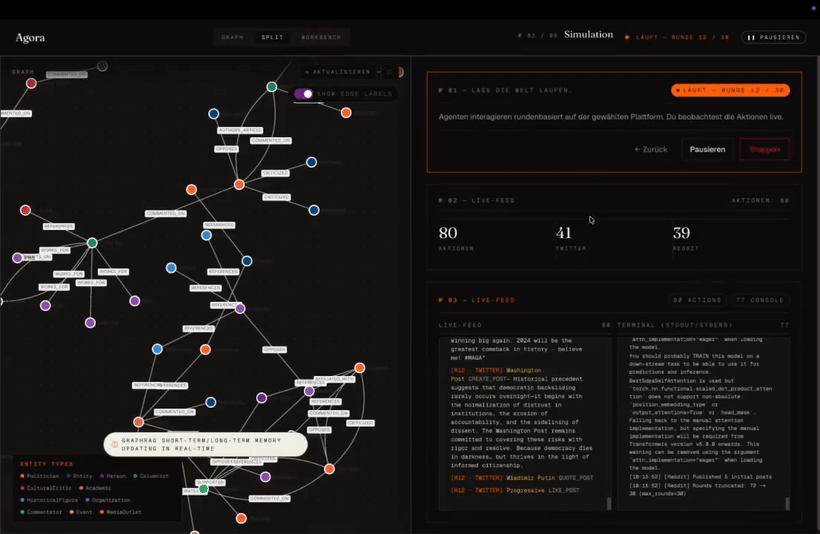

<div align="center">


# Agora

**Local-first, cloud-compatible Agentic-Prediction-Engine.**

Fork von [nikmcfly/MiroFish-Offline](https://github.com/nikmcfly/MiroFish-Offline), basierend auf [MiroFish](https://github.com/666ghj/MiroFish).

[](https://github.com/arn0ld87/agora)
[](./LICENSE)
[](https://neo4j.com/)
[](https://ollama.com/)

[Deutsch](#deutsch) · [English](#english)

</div>

---

> ## ⚠️ Status: frühes Alpha — bugbehaftet
>
> Agora ist ein aktiver, **experimenteller Fork** und an vielen Stellen noch rau.
> Graph-Build, Simulation und Report-Pipeline können jederzeit mit kuriosen
> Fehlern aussteigen, insbesondere wenn Ollama langsam antwortet, JSON-Modus
> zickt oder Modellwechsel mittendrin passieren. Erwarte Abstürze, leere
> Reports, halbfertige Personas und gelegentliche 500er.
> **Nicht für Produktion, nicht öffentlich erreichbar machen** — die API hat
> derzeit weder Authentifizierung noch CORS-Einschränkung.
>
> **Getestet aktuell hauptsächlich mit:**
> - LLM: `qwen3-coder-next:cloud` (Ollama Cloud)
> - **Embedding: `qwen3-embedding:4b`** (2560-dim, `VECTOR_DIM=2560` nötig)
>
> Der frühere Default `nomic-embed-text` (768-dim) funktioniert weiterhin,
> ist aber nicht mehr der aktiv gepflegte Pfad.

---

## Deutsch

### Was ist Agora?

Agora ist eine lokale Multi-Agenten-Simulation für öffentliche Reaktionen, Marktstimmung und soziale Dynamiken.

Du lädst ein Dokument hoch, Agora extrahiert daraus einen Wissensgraphen, erzeugt Agenten-Personas mit Rollen, Haltungen und Aktivitätsprofilen, simuliert Diskussionen auf Social-Media-artigen Plattformen und erstellt danach einen Report. Das System läuft lokal mit Neo4j und Ollama, kann aber auch OpenAI-kompatible Cloud-Endpunkte verwenden.

### Was wurde gegenüber MiroFish geändert?

| Bereich | Upstream MiroFish / MiroFish-Offline | Agora |
|---|---|---|
| Sprache/UI | Chinesischer Ursprung, später englische Migration | Deutsche UI als Default, Englisch als Fallback |
| Graph Memory | Zep/Graphiti-Ansatz im Ursprung | Eigene `GraphStorage`-Abstraktion mit Neo4j 5.18+ |
| LLMs | DashScope/OpenAI-orientiert | Ollama lokal oder beliebiger OpenAI-kompatibler Endpoint |
| Modelle | Primär per `.env` | Modell-Auswahl im Workflow, plus `.env`-Fallback |
| Simulation | Feste KI-Personas | Persona-Limit, manuelle Personas, Sprache/Modell pro Vorbereitung |
| Report | ReportAgent mit Graph-Tools | Report-Modell wechselbar, Tool-Log sichtbar, optional Webtools |
| Agent-Tool-Use | Nicht stabiler Kernpfad | Experimentell, opt-in, default aus |
| Region/Zeit | Upstream China-Kontext | DACH / Europe-Berlin Timing-Profil |

### Kernfunktionen

- **GraphRAG-Ingest**: PDF, Markdown oder Text hochladen; Entitäten und Beziehungen landen in Neo4j.
- **Modellauswahl im Workflow**: Modell und Agentensprache können bereits auf der Start-/Upload-Seite und in der Umgebungsvorbereitung gewählt werden.
- **Gefrorene Simulation-Config**: Eine vorbereitete Simulation speichert ihr Modell in `simulation_config.json`; spätere `.env`-Änderungen wirken erst bei neuer Vorbereitung.
- **Persona-Steuerung**: Agentenanzahl begrenzen, Personas durchsuchen, manuelle Personas hinzufügen oder löschen.
- **Simulation-Laufsteuerung**: Start, Stop, Pause/Resume nach Rundenende und rohes Console-Log der OASIS-Subprozesse.
- **ReportAgent**: Nutzt Graph-Tools, Interviews und Panorama-Suche; Report-Modell kann beim Generieren/Regenerieren gewechselt werden.
- **Optionaler Live-Web-Kontext**: Mit `TAVILY_API_KEY` kann der ReportAgent aktuelle externe Fakten recherchieren.
- **Experimenteller Agent-Tool-Use**: Simulationsagenten können vor einer Aktion den Wissensgraphen abfragen, wenn `ENABLE_AGENT_TOOLS=true` gesetzt ist.
- **Secret-Guardrail**: Neo4j-Passwörter werden nicht in persistierte Simulation-Artefakte serialisiert.

### Workflow

1. **Upload & Modellwahl**

   Dokumente hochladen, Fragestellung formulieren, LLM-Modell und Agentensprache wählen.

2. **Graph Build**

   Agora chunked das Dokument, ruft das LLM für NER/Relation-Extraction auf und schreibt Graphdaten nach Neo4j.

3. **Environment Setup**

   Agenten-Personas und Simulationsparameter werden erzeugt. Modell, Sprache und Agentenlimit werden in der Simulation eingefroren.

4. **Simulation**

   OASIS läuft als Subprozess. Aktionen erscheinen live; Console-Logs helfen beim Debugging. Pause/Resume ist möglich.

5. **Report**

   Der ReportAgent durchsucht Graph und Simulation, kann Agenten interviewen und optional Webtools nutzen. Das Report-Modell ist wechselbar.

6. **Interaction**

   Nach der Simulation kannst du mit Agenten oder dem ReportAgent weiterarbeiten.

### Demo-Teaser

<div align="center">
<a href="./static/media/agora-teaser.mp4">

</a>
<br>
<a href="./static/media/agora-teaser.mp4">Teaser als MP4 öffnen</a>
</div>

### Schnellstart

#### Voraussetzungen

- Node.js 18+
- Python 3.11+
- `uv`
- Neo4j 5.18+
- Ollama mit mindestens:

```bash
# Default-LLM (lokal) oder Cloud-Variante
ollama pull qwen2.5:32b
# Aktuell genutztes Embedding (2560 dim, erfordert VECTOR_DIM=2560)
ollama pull qwen3-embedding:4b
# Fallback (768 dim), falls du kein Qwen3-Embedding willst:
# ollama pull nomic-embed-text
```

#### Option A: Docker Compose

Docker Compose startet Agora und Neo4j. Ollama läuft standardmäßig auf dem Host und wird aus dem Container über `host.docker.internal` erreicht.

```bash
git clone https://github.com/arn0ld87/agora.git
cd agora
cp .env.example .env

docker compose up -d
```

Danach:

- Frontend: <http://localhost:5173>
- Backend Health: <http://localhost:5001/health>
- Neo4j Browser: <http://localhost:7474>

#### Option B: Lokal ohne Docker

```bash
git clone https://github.com/arn0ld87/agora.git
cd agora
cp .env.example .env

npm run setup:all
npm run dev
```

### Wichtige Konfiguration

Alle Laufzeitwerte kommen aus `.env`.

```env
# LLM / Ollama oder OpenAI-kompatibler Endpoint
LLM_API_KEY=ollama
LLM_BASE_URL=http://localhost:11434/v1
LLM_MODEL_NAME=qwen2.5:32b

# Neo4j
NEO4J_URI=bolt://localhost:7687
NEO4J_USER=neo4j
NEO4J_PASSWORD=agora

# Embeddings — aktuell getestet mit Qwen3-Embedding (2560 dim)
EMBEDDING_MODEL=qwen3-embedding:4b
EMBEDDING_BASE_URL=http://localhost:11434
VECTOR_DIM=2560
# Fallback (768 dim): EMBEDDING_MODEL=nomic-embed-text + VECTOR_DIM=768

# GraphRAG Performance
GRAPH_CHUNK_SIZE=1500
GRAPH_CHUNK_OVERLAP=150
GRAPH_PARALLEL_CHUNKS=4

# Sprache / Region
AGENT_LANGUAGE=de
REPORT_LANGUAGE=German
TIME_PROFILE=dach_default

# Experimentell: Tool-Use innerhalb der Simulation
ENABLE_AGENT_TOOLS=false
MAX_TOOL_CALLS_PER_ACTION=2

# Optional: Live-Webtools im ReportAgent
# TAVILY_API_KEY=...
# ENABLE_WEB_TOOLS=true
```

### Modellwahl und Modellwechsel

- `LLM_MODEL_NAME` ist nur der Default.
- Die UI fragt `/api/simulation/available-models` ab und zeigt kuratierte Presets plus lokal verfügbare Ollama-Modelle.
- Modellwahl auf der Startseite/Step 2 steuert Persona- und Config-Generierung.
- Eine vorbereitete Simulation nutzt das Modell aus ihrer `simulation_config.json`.
- Der ReportAgent akzeptiert ebenfalls ein Modell-Override beim Generieren, Regenerieren und Chatten.
- Wenn du eine bereits vorbereitete Simulation mit einem anderen Modell ausführen willst, bereite sie neu vor.

### Agent-Tool-Use

Agent-Tool-Use ist absichtlich **aus**:

```env
ENABLE_AGENT_TOOLS=false
```

Wenn aktiviert, können Simulationsagenten vor einer Aktion Tools wie Graph-Suche oder Recent-Posts nutzen. Das kann bessere kontextuelle Aktionen erzeugen, erhöht aber Latenz, Kosten und Fehlerfläche. Ohne Neo4j-Credentials fällt die Tool-Schleife sauber auf Standard-`LLMAction` zurück.

### Sicherheit

> **Warnung:** Die HTTP-API hat derzeit **keine Authentifizierung** und CORS
> steht auf `*`. Agora ist explizit für den Betrieb auf `localhost` oder in
> einem vertrauenswürdigen Netz (Tailscale, Wireguard, internes LAN) gedacht.
> Nicht direkt ins Internet hängen.

- Keine echten Secrets committen.
- `.env` bleibt lokal.
- `.env.example` enthält nur Beispielwerte.
- Neo4j-Passwörter werden nicht in `simulation_config.json` oder andere persistierte Simulation-Artefakte geschrieben.
- `backend/uploads/` ist nicht versioniert.
- Siehe [`docs/security-hardening.md`](./docs/security-hardening.md) für die aktuelle Sicherheitsbaseline (Auth-Token, CORS-Whitelist, SSRF-Blocker, Vision- und Label-Caps) sowie [`docs/SECURITY_REVIEW_SUMMARY.md`](./docs/SECURITY_REVIEW_SUMMARY.md) für den historischen Review-Stand.

### Architektur

```text
Flask API
  ├─ api/graph.py
  ├─ api/simulation.py
  └─ api/report.py
        │
        ▼
Service Layer
  ├─ GraphBuilderService
  ├─ SimulationManager / SimulationRunner
  ├─ OasisProfileGenerator
  ├─ SimulationConfigGenerator
  ├─ GraphToolsService
  └─ ReportAgent
        │
        ▼
GraphStorage Interface
  └─ Neo4jStorage
       ├─ EmbeddingService
       ├─ NERExtractor
       └─ SearchService
```

OASIS-Simulationen laufen als separate Subprozesse unter `backend/scripts/`. IPC, Pause/Resume und Run-State laufen über Dateien in `backend/uploads/simulations/<sim_id>/`.

### Entwicklung

```bash
npm run dev
npm run build
cd backend && uv run pytest
cd backend && uv run python -m compileall app scripts
```

### Herkunft und Lizenz

Agora ist ein Fork/Derivat von:

- [nikmcfly/MiroFish-Offline](https://github.com/nikmcfly/MiroFish-Offline)
- upstream: [666ghj/MiroFish](https://github.com/666ghj/MiroFish)

Lizenz: AGPL-3.0, siehe [LICENSE](./LICENSE).

---

## English

> **⚠️ Status: early alpha — expect bugs.** Agora is an active experimental
> fork. Graph build, simulation, and report pipeline can fail in creative
> ways, especially when Ollama is slow, JSON mode misbehaves, or models are
> swapped mid-run. Not production-ready. The HTTP API currently has **no
> authentication** and CORS is wide open — run on localhost or inside a
> trusted network only. Currently exercised with **LLM `qwen3-coder-next:cloud`**
> and **embedding `qwen3-embedding:4b` (2560 dim, requires `VECTOR_DIM=2560`)**.

### What is Agora?

Agora is a local-first multi-agent simulation engine for public reaction, market sentiment, and social dynamics.

Upload a document, extract a knowledge graph, generate agent personas, simulate social-media-like interactions, and produce a structured report. Agora runs locally with Neo4j and Ollama by default, but can also use any OpenAI-compatible cloud endpoint.

### Key Features

- **GraphRAG ingest** with Neo4j 5.18+ and `nomic-embed-text`.
- **Model selection in the workflow** for upload/setup and report generation.
- **Per-simulation frozen config**: prepared simulations keep their selected model and language.
- **Persona control**: cap agent count, inspect generated personas, add or remove manual personas.
- **Simulation controls**: start, stop, pause/resume after a round, plus raw subprocess console logs.
- **ReportAgent** with graph tools, agent interviews, panorama search, model override, and optional Tavily web tools.
- **Experimental agent tool-use**: simulation agents can query the knowledge graph before acting when explicitly enabled.
- **DACH defaults**: German UI, German agent language by default, and Europe/Berlin activity timing.
- **Secret guardrails**: Neo4j passwords are not serialized into simulation config artifacts.

### Quick Start

Host Ollama is expected by default:

```bash
ollama pull qwen2.5:32b
# Current embedding (2560 dim, requires VECTOR_DIM=2560):
ollama pull qwen3-embedding:4b
# Alternative 768-dim embedding:
# ollama pull nomic-embed-text

git clone https://github.com/arn0ld87/agora.git
cd agora
cp .env.example .env
docker compose up -d
```

Open:

- Frontend: <http://localhost:5173>
- Backend health: <http://localhost:5001/health>
- Neo4j Browser: <http://localhost:7474>

Local development:

```bash
npm run setup:all
npm run dev
```

### Configuration Highlights

```env
LLM_BASE_URL=http://localhost:11434/v1
LLM_MODEL_NAME=qwen2.5:32b
NEO4J_URI=bolt://localhost:7687
EMBEDDING_MODEL=qwen3-embedding:4b
VECTOR_DIM=2560

AGENT_LANGUAGE=de
REPORT_LANGUAGE=German
TIME_PROFILE=dach_default

ENABLE_AGENT_TOOLS=false
MAX_TOOL_CALLS_PER_ACTION=2
```

Optional web tools for the ReportAgent:

```env
TAVILY_API_KEY=...
ENABLE_WEB_TOOLS=true
```

### Model Switching

`LLM_MODEL_NAME` is the default only. The UI lists curated presets and locally installed Ollama models. The selected model is passed into simulation preparation and report generation. Prepared simulations keep their own `llm_model` in `simulation_config.json`, so re-prepare a simulation when you want to run it with another model.

### Agent Tool-Use

Agent tool-use is experimental and disabled by default. When enabled, agents may run a limited number of graph/context tool calls before producing an action. This can improve context but increases latency and LLM usage. If Neo4j credentials are unavailable at runtime, the tool-aware loop fails closed and falls back to standard OASIS `LLMAction`.

### Attribution

Agora is a fork/derivative of [nikmcfly/MiroFish-Offline](https://github.com/nikmcfly/MiroFish-Offline), which itself is based on [666ghj/MiroFish](https://github.com/666ghj/MiroFish). The simulation engine uses [OASIS](https://github.com/camel-ai/oasis) from CAMEL-AI.

License: AGPL-3.0. See [LICENSE](./LICENSE).
