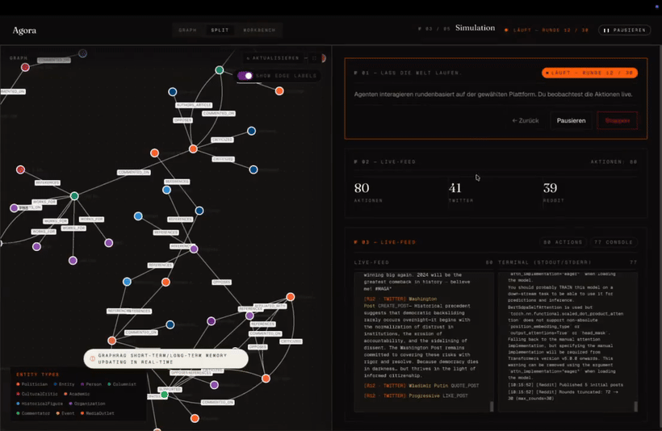

<div align="center">


# Agora

**Local-first, cloud-compatible Agentic-Prediction-Engine.**

Fork von [nikmcfly/MiroFish-Offline](https://github.com/nikmcfly/MiroFish-Offline), basierend auf [MiroFish](https://github.com/666ghj/MiroFish).

> **v0.9.0 released:** [Release Notes](docu/2026-05-01-v0.9.0-release-notes.md) — 12/12 Issues (Milestone „Domain Cleanup") geschlossen, **711 Tests grün** (671 Backend + 40 Frontend). Vorgänger: [v0.8.0](docu/2026-05-01-v0.8.0-release-notes.md).

[](https://github.com/arn0ld87/agora)
[](./LICENSE)
[](https://neo4j.com/)
[](https://ollama.com/)

[Deutsch](#deutsch) · [English](#english)

</div>

---

> ## Status: v0.9.0 — released 2026-05-01
>
> Agora ist ein aktiver, **experimenteller Fork**. Graph-Build, Simulation und
> Report-Pipeline können bei ungünstigen Bedingungen (langsame Ollama-Cloud,
> JSON-Mode-Aussetzer, Modellwechsel) Fehler produzieren.
> **Nicht öffentlich erreichbar machen.** Die API hat einen optionalen
> `AGORA_AUTH_TOKEN`-Guard und restriktive CORS-Defaults, ist aber weiterhin
> für lokale Single-User-Setups gedacht, nicht für Mehrbenutzer- oder
> Internet-Betrieb.
>
> **Getestet aktuell hauptsächlich mit:**
> - LLM: `qwen3-coder-next:cloud` (Ollama Cloud)
> - **Embedding: `qwen3-embedding:4b`** (2560-dim, `VECTOR_DIM=2560` nötig)
>
> Der frühere Default `nomic-embed-text` (768-dim) funktioniert weiterhin,
> ist aber nicht mehr der aktiv gepflegte Pfad.
>
> **Docker Hub:** `docker pull alexle135/agora-agora:latest` |
> [GHCR](https://github.com/arn0ld87/agora/pkgs/container/agora)

---

## Deutsch

### Was ist Agora?

Agora ist eine lokale Multi-Agenten-Simulation für öffentliche Reaktionen, Marktstimmung und soziale Dynamiken.

Du lädst ein Dokument hoch, Agora extrahiert daraus einen Wissensgraphen, erzeugt Agenten-Personas mit Rollen, Haltungen und Aktivitätsprofilen, simuliert Diskussionen auf Social-Media-artigen Plattformen und erstellt danach einen Report. Das System läuft lokal mit Neo4j und Ollama, kann aber auch OpenAI-kompatible Cloud-Endpunkte verwenden.

### Engineering-Stand v0.9.0

- **Quality-Gates vorhanden**: `npm run check` führt Backend-Linting (default-strict auf `app/ tests/`), Backend-Tests, Frontend-Lint, Frontend-Tests (Vitest auf `jsdom`) und Frontend-Build aus (**671 Backend + 40 Frontend Tests** (+192 ggü. v0.8.0), 2 Redis-Integrationstests skippen sauber ohne `TEST_REDIS_URL`).
- **Domain-Cleanup (v0.9.0)**: Drei Hot-Spot-Module entkernt — `simulation_manager.py` 789→403 LOC (−49 %), `report_agent.py` 3184→2179 LOC (−31,6 %), `neo4j_storage.py` 1127→195 LOC (−82,7 %). Neue Service-Schichten in `backend/app/services/` (Branching, Prepare-Pipeline, Report-Logger/Models/Prompts/Tools, Ingestion-Pipeline). Storage in fünf Module gesplittet: `neo4j_mappings.py` + Read/Write/Search-Mixins. Re-Export-Pattern hält alle Caller stabil — keine Breaking-Changes.
- **Wire-Identity gepinnt (v0.9.0, Issue #52)**: `models/graph.py` führt Backend-Graph-DTOs ein, deren Schema bit-identisch zum bisherigen Storage-Output ist; jede künftige Schema-Änderung wird durch DTO-Tests ausgelöst, bevor das Frontend kaputt geht.
- **FSM aktiv konsumiert (v0.9.0, Issue #42)**: Die deklarative State-Machine wird vom `SimulationManager` und allen API-Routen verwendet; `ALLOWED_TRANSITIONS` bleibt Single-Source-of-Truth, ungültige Übergänge werfen `InvalidStatusTransition`. Branching durchläuft jetzt explizit `CREATED → PREPARING → READY`; Force-Restart nutzt `_reset_to_ready(...)` mit Log-Begründung.
- **Design-System konsolidiert (Slice 1)**: `tokens.css` als Source-of-Truth, UI-Komponenten (`Btn`, `Badge`, `Field`, `Card`, `Select`) auf Tokens umgestellt, harte Farbwerte in Views/Layouts durch Token-Referenzen ersetzt.
- **Persona Review (Slice 2)**: Generierte Personas sind vor Simulationsstart prüfbar, editierbar und freigebbar. Quality-Heuristiken (Dubletten, fehlende Kernfelder, Rollen-Diversität) liefern Badges. `PERSONA_REVIEW_ENABLED=true` blockt Simulationsstart bis alle Personas approved sind.
- **Run Dashboard (Slice 3)**: Zentrale `/runs`-View mit Status, Datum, Modell, Dokument, Graph-ID, Persona-Anzahl. Detail-Drawer für Fehler, Artefakte und Copy-Buttons. Runs-Persistenz über `RunRegistry`.
- **Evidence & Confidence (Slice 4)**: Report-Claims tragen `confidence`-Score und strukturierte `evidence`-Blöcke (Graph-Metriken, Agentenaktionen). UI zeigt Confidence-Badges und Evidence-Drawer.
- **Export Center (Slice 5)**: JSON- und Markdown-Export für Reports, CSV für Polarisationsmetriken, GraphML für Graphen, SVG/PNG/PDF für Graph-Ansicht.
- **LLM-Resilienz**: `LLMClient.chat` und `describe_image` retryen über `llm_call_with_retry` auf transiente Upstream-Fehler (`APIConnectionError`, `APITimeoutError`, `RateLimitError`, `APIStatusError` mit 5xx/408/429). Schützt v. a. die Ontology-Generierung gegen Ollama-Cloud-5xx-Hickser.
- **Event-Bus-Transport (#9 + #17)**: `SimulationEventBus`-Port mit In-Memory-, File- und Redis-Adapter. Redis `7-alpine` wird vom `docker-compose.yml` mitgestartet. Live-Kanäle (`control`/`state`) gehen über Redis Pub/Sub mit retained Snapshot. **Seit Issue #17** laufen auch `rpc.command` / `rpc.response.*` hybrid: Backend published parallel auf Redis und File, `_await_response` race't beide Quellen, der Verlierer wird aufgeräumt. Subprocess-Listener `RedisIPCBridge` (`backend/scripts/subprocess_redis_bridge.py`) sitzt im OASIS-Eventloop neben dem File-Polling. Backout über `EVENT_BUS_BACKEND=file`.
- **Frontend Push (#9 Phase C)**: `GET /api/simulation/<id>/stream` (SSE) + `useEventStream`-Composable ersetzen das 2,5-s-Status-Polling in der Simulationsansicht.
- **Temporal Graph (#10)**: RELATION-Kanten tragen `valid_from_round`/`valid_to_round`/`reinforced_count`; `TemporalGraphService` liefert `/api/graph/snapshot/<gid>/<round>` und `/api/graph/diff/<gid>?start_round=..&end_round=..`. Im UI scrubt der **Round-Slider** im `GraphPanel` durch die Zeitachse (Client-side-Filter, kein extra API-Call beim Scrubben).
- **Polarisations-Metriken (#12)**: `NetworkAnalyticsService` mit Louvain-Communities, Echo-Chamber-Index und Bridge-Agent-Heuristik; API `GET /api/simulation/<id>/metrics`. Dokumentation in `docu/analytics.md`.
- **Ontology-Mutation (#11, Phase 1+2)**: `OntologyManager` (thread-safe) + `OntologyMutationService` mit Modi `disabled` / `review_only` / `auto`. **NER → Mutation-Wiring ist live**: `Neo4jStorage.add_text` reicht NER-emittierte unbekannte Entity-Types automatisch an den Service weiter; Service-Exceptions blockieren Ingestion nicht.
- **DI-Container (#14)**: Alle Kern-Services laufen über `AgoraContainer` — keine Service-Locator-Suche mehr in `app.extensions`.
- **API-Contract-Härtung Richtung v1.0**: zentrale Success-/Error-Envelopes (`success`, `data`, `error`, `code`) werden schrittweise durchgesetzt. Auth-Fehler, rohe `dict`-Returns in `@handle_api_errors` sowie Framework-404/405 unter `/api/*` liefern konsistente JSON-Responses. Laufende Schritte stehen in `docu/v1-development-log.md`.
- **Workspace-Layout-Shell (EPIC-03)**: `WorkspaceLayout` / `WorkspaceHeader` / `WorkspaceSplit` / `WorkspaceModeSwitch` / `WorkspaceStepStatus` / `WorkspaceBrandLink` (`frontend/src/layouts/`) sind die gemeinsame Shell für alle 5 Pipeline-Views. `useWorkspaceMode` und `useWorkspaceStatus` ersetzen dupliziertes View-Mode/Status-Boilerplate.
- **GraphPanel modularisiert (EPIC-04)**: `GraphPanel.vue` von 933 auf 98 Zeilen reduziert (−90 %). D3-Renderlogik nach `useGraphRender`-Composable extrahiert (#35), UI in `GraphHints`, `GraphToolbar` und `GraphCanvas` zerlegt (#34).
- **Polling zentralisiert (EPIC-05)**: Alle 12 `setInterval`-Stellen im Frontend nutzen jetzt das gemeinsame `usePolling`-Composable (#37, #38). SSE-Stream via `useEventStream` ersetzt Status-Polling in der Simulationsansicht (#9, #40).
- **Simulation-API entmonolithisiert**: Frühere XXL-Datei `backend/app/api/simulation.py` in fokussierte Module zerlegt (10 Dateien, 48 Routen).
- **Refactoring-Dokumentation liegt im Repo**: Fortschritt, Audit, Zielarchitektur und Roadmap liegen unter `docu/`.

### Was wurde gegenüber MiroFish geändert?

| Bereich | Upstream MiroFish / MiroFish-Offline | Agora |
|---|---|---|
| Sprache/UI | Chinesischer Ursprung, später englische Migration | Deutsche UI als Default, Englisch als Fallback |
| Graph Memory | Zep/Graphiti-Ansatz im Ursprung | Eigene `GraphStorage`-Abstraktion mit Neo4j 5.18+ |
| LLMs | DashScope/OpenAI-orientiert | Ollama lokal oder beliebiger OpenAI-kompatibler Endpoint |
| Modelle | Primär per `.env` | Modell-Auswahl im Workflow, plus `.env`-Fallback |
| Simulation | Feste KI-Personas | Persona-Limit, manuelle Personas, Sprache/Modell pro Vorbereitung |
| Report | ReportAgent mit Graph-Tools | Report-Modell wechselbar, Tool-Log sichtbar, optional Webtools |
| Agent-Tool-Use | Nicht stabiler Kernpfad | Experimentell, opt-in, default aus |
| Region/Zeit | Upstream China-Kontext | DACH / Europe-Berlin Timing-Profil |

### Kernfunktionen

- **GraphRAG-Ingest**: PDF, Markdown oder Text hochladen; Entitäten und Beziehungen landen in Neo4j.
- **Flexible Ontologie-Generierung**: Entitätstypen sind nicht mehr hart auf exakt 10 begrenzt; Defaults sind 8-16 Typen plus Pflicht-Fallbacks `Person` und `Organization` (`ONTOLOGY_MIN_ENTITY_TYPES`, `ONTOLOGY_MAX_ENTITY_TYPES`).
- **Modellauswahl im Workflow**: Modell und Agentensprache können bereits auf der Start-/Upload-Seite und in der Umgebungsvorbereitung gewählt werden.
- **Gefrorene Simulation-Config**: Eine vorbereitete Simulation speichert ihr Modell in `simulation_config.json`; spätere `.env`-Änderungen wirken erst bei neuer Vorbereitung.
- **Persona-Steuerung**: Agentenanzahl begrenzen, Personas durchsuchen, manuelle Personas hinzufügen oder löschen; erzeugte oder manuelle Personas können in einer lokalen Bibliothek gespeichert und später wiederverwendet werden.
- **Simulation-Laufsteuerung**: Laufdauer in Tagen und optionales Rundenlimit setzen, Start, Stop, Pause/Resume nach Rundenende und rohes Console-Log der OASIS-Subprozesse.
- **ReportAgent**: Nutzt Graph-Tools, Interviews und Panorama-Suche; Report-Modell kann beim Generieren/Regenerieren gewechselt werden.
- **Optionaler Live-Web-Kontext**: Mit `TAVILY_API_KEY` kann der ReportAgent aktuelle externe Fakten recherchieren.
- **Experimenteller Agent-Tool-Use**: Simulationsagenten können vor einer Aktion den Wissensgraphen abfragen, wenn `ENABLE_AGENT_TOOLS=true` gesetzt ist.
- **Secret-Guardrail**: Neo4j-Passwörter werden nicht in persistierte Simulation-Artefakte serialisiert.

### Workflow

1. **Upload & Modellwahl**

   Dokumente hochladen, Fragestellung formulieren, LLM-Modell und Agentensprache wählen.

2. **Graph Build**

   Agora chunked das Dokument, ruft das LLM für NER/Relation-Extraction auf und schreibt Graphdaten nach Neo4j.

3. **Environment Setup**

   Agenten-Personas und Simulationsparameter werden erzeugt. Modell, Sprache, Agentenlimit, Laufdauer und optional gespeicherte Personas werden in der Simulation eingefroren.

4. **Simulation**

   OASIS läuft als Subprozess. Aktionen erscheinen live; Console-Logs helfen beim Debugging. Pause/Resume ist möglich.

5. **Report**

   Der ReportAgent durchsucht Graph und Simulation, kann Agenten interviewen und optional Webtools nutzen. Das Report-Modell ist wechselbar.

6. **Interaction**

   Nach der Simulation kannst du mit Agenten oder dem ReportAgent weiterarbeiten.

### Demo-Teaser

<div align="center">
<a href="./static/media/agora-teaser.mp4">

</a>
<br>
<a href="./static/media/agora-teaser.mp4">Teaser als MP4 öffnen</a>
</div>

### Schnellstart

#### Voraussetzungen

- Node.js 18+
- Python 3.11+
- `uv`
- Neo4j 5.18+
- Ollama mit mindestens:

```bash
# Default-LLM (lokal) oder Cloud-Variante
ollama pull qwen2.5:32b
# Aktuell genutztes Embedding (2560 dim, erfordert VECTOR_DIM=2560)
ollama pull qwen3-embedding:4b
# Fallback (768 dim), falls du kein Qwen3-Embedding willst:
# ollama pull nomic-embed-text
```

#### Option A: Docker Compose (Dev-Default)

Docker Compose startet Agora, Neo4j und Redis. Ollama läuft standardmäßig auf dem Host und wird aus dem Container über `host.docker.internal` erreicht. Der Default-Compose nutzt seit v0.9.0 explizit den **Dev-Stage** (Vite + Flask, Hot-Reload) und bindet alle veröffentlichten Ports auf `127.0.0.1`.

```bash
git clone https://github.com/arn0ld87/agora.git
cd agora
cp .env.example .env

# .env.example defaultet FLASK_DEBUG=false (secure-by-default).
#
# Dev: FLASK_DEBUG=true setzen, SECRET_KEY und NEO4J_PASSWORD duerfen
#      Platzhalter bleiben (Config.validate() warnt, blockt aber nicht).
#
# Hardened: FLASK_DEBUG=false lassen, echte Werte fuer SECRET_KEY,
#   NEO4J_PASSWORD und AGORA_AUTH_TOKEN erzeugen
#   (Einzeiler in der Sicherheits-Sektion unten).
# Erst dann:
docker compose up -d --build
```

**Was läuft jetzt:**

| Endpoint | URL | Bind |
|---|---|---|
| Frontend (Vite) | <http://localhost:5173> | `127.0.0.1` |
| Backend (Flask) | <http://localhost:5001/health> | `127.0.0.1` |
| Neo4j Browser | <http://localhost:7474> | `127.0.0.1` |
| Neo4j Bolt | `bolt://localhost:7687` | `127.0.0.1` |

Wer aus einem anderen Netzsegment (LAN, Tailscale) auf das Frontend zugreifen will, setzt einen Reverse-Proxy davor — direkter Bind auf `0.0.0.0` ist im Default bewusst aus.

Nützliche Dev-Kommandos:

```bash
# Container mit Dev-Override neu erstellen

docker compose up -d --force-recreate agora

# Wenn Docker-/Dependency-Layer geändert wurden

docker compose build agora && docker compose up -d --force-recreate --no-deps agora

# Wenn named volumes für Dependencies einmal resettet werden sollen

docker compose down -v && docker compose up -d
```

Danach:

- Frontend: <http://localhost:5173>
- Backend Health: <http://localhost:5001/health>
- Neo4j Browser: <http://localhost:7474>

#### Option B: Lokal ohne Docker

```bash
git clone https://github.com/arn0ld87/agora.git
cd agora
cp .env.example .env

npm run setup:all
npm run dev
```

### Wichtige Konfiguration

Alle Laufzeitwerte kommen aus `.env`.

```env
# LLM / Ollama oder OpenAI-kompatibler Endpoint
LLM_API_KEY=ollama
LLM_BASE_URL=http://localhost:11434/v1
LLM_MODEL_NAME=qwen2.5:32b

# Neo4j
NEO4J_URI=bolt://localhost:7687
NEO4J_USER=neo4j
NEO4J_PASSWORD=agora

# Embeddings — aktuell getestet mit Qwen3-Embedding (2560 dim)
EMBEDDING_MODEL=qwen3-embedding:4b
EMBEDDING_BASE_URL=http://localhost:11434
VECTOR_DIM=2560
# Fallback (768 dim): EMBEDDING_MODEL=nomic-embed-text + VECTOR_DIM=768

# GraphRAG Performance
GRAPH_CHUNK_SIZE=1500
GRAPH_CHUNK_OVERLAP=150
GRAPH_PARALLEL_CHUNKS=4

# Sprache / Region
AGENT_LANGUAGE=de
REPORT_LANGUAGE=German
TIME_PROFILE=dach_default

# Experimentell: Tool-Use innerhalb der Simulation
ENABLE_AGENT_TOOLS=false
MAX_TOOL_CALLS_PER_ACTION=2

# Optional: Live-Webtools im ReportAgent
# TAVILY_API_KEY=...
# ENABLE_WEB_TOOLS=true
```

### Modellwahl und Modellwechsel

- `LLM_MODEL_NAME` ist nur der Default.
- Die UI fragt `/api/simulation/available-models` ab und zeigt kuratierte Presets plus lokal verfügbare Ollama-Modelle.
- Modellwahl auf der Startseite/Step 2 steuert Persona- und Config-Generierung.
- Eine vorbereitete Simulation nutzt das Modell aus ihrer `simulation_config.json`.
- Der ReportAgent akzeptiert ebenfalls ein Modell-Override beim Generieren, Regenerieren und Chatten.
- Wenn du eine bereits vorbereitete Simulation mit einem anderen Modell ausführen willst, bereite sie neu vor.

### Agent-Tool-Use

Agent-Tool-Use ist absichtlich **aus**:

```env
ENABLE_AGENT_TOOLS=false
```

Wenn aktiviert, können Simulationsagenten vor einer Aktion Tools wie Graph-Suche oder Recent-Posts nutzen. Das kann bessere kontextuelle Aktionen erzeugen, erhöht aber Latenz, Kosten und Fehlerfläche. Ohne Neo4j-Credentials fällt die Tool-Schleife sauber auf Standard-`LLMAction` zurück.

### Sicherheit

> **Warnung:** Agora ist explizit für den Betrieb auf `localhost` oder in einem
> vertrauenswürdigen Netz (Tailscale, Wireguard, internes LAN) gedacht. Der
> optionale `AGORA_AUTH_TOKEN`-Guard und die CORS-Whitelist reduzieren die
> Angriffsfläche, ersetzen aber keine echte Mehrbenutzer-Auth. Nicht direkt ins
> Internet hängen.

- Keine echten Secrets committen.
- `.env` bleibt lokal.
- `.env.example` enthält nur Beispielwerte (`change-me*`, `agora`, `neo4j`, `password`). `Config.validate()` lehnt diese Platzhalter im Nicht-Debug-Betrieb hart ab.
- Echten `SECRET_KEY` und `AGORA_AUTH_TOKEN` mit einem Einzeiler erzeugen:

```bash
python -c "import secrets; print(secrets.token_urlsafe(32))"
```

- Neo4j-Passwörter werden nicht in `simulation_config.json` oder andere persistierte Simulation-Artefakte geschrieben.
- `backend/uploads/` ist nicht versioniert.
- Siehe [`docu/security-hardening.md`](./docu/security-hardening.md) für die aktuelle Sicherheitsbaseline (Auth-Token, CORS-Whitelist, SSRF-Blocker, Vision- und Label-Caps) sowie [`docu/SECURITY_REVIEW_SUMMARY.md`](./docu/SECURITY_REVIEW_SUMMARY.md) für den historischen Review-Stand.

### Architektur

```text
Flask API
  ├─ api/graph.py
  ├─ api/report.py
  ├─ api/status.py
  ├─ api/simulation_common.py
  ├─ api/simulation_lifecycle.py
  ├─ api/simulation_prepare.py
  ├─ api/simulation_profiles.py
  ├─ api/simulation_run.py
  ├─ api/simulation_interviews.py
  ├─ api/simulation_history.py
  ├─ api/simulation_entities.py
  ├─ api/simulation_stream.py
  └─ api/simulation_metrics.py
        │
        ▼
Service Layer
  ├─ GraphBuilderService / TemporalGraphService
  ├─ SimulationManager / SimulationRunner
  ├─ OasisProfileGenerator
  ├─ SimulationConfigGenerator
  ├─ NetworkAnalyticsService / OntologyMutationService
  ├─ GraphToolsService / WebTools
  └─ ReportAgent
        │
        ▼
GraphStorage Interface
  └─ Neo4jStorage
       ├─ EmbeddingService
       ├─ NERExtractor
       └─ SearchService
```

OASIS-Simulationen laufen als separate Subprozesse unter `backend/scripts/`. IPC, Pause/Resume und Run-State laufen über den `SimulationEventBus` (Redis Pub/Sub im Compose-Default, File-Polling als Fallback).

### Entwicklung

```bash
npm run setup:all
npm run dev
npm run check
cd backend && uv run pytest
cd backend && uv run python -m compileall app scripts
```

Weitere Refactoring- und Architekturprotokolle liegen in `docu/`, unter anderem:
- `docu/p0-arbeitsprotokoll.md`
- `docu/p0-simulation-api-split-protokoll.md`
- `docu/p0-graph-panel-modularisierung-protokoll.md`
- `docu/target-architecture.md`

### Herkunft und Lizenz

Agora ist ein Fork/Derivat von:

- [nikmcfly/MiroFish-Offline](https://github.com/nikmcfly/MiroFish-Offline)
- upstream: [666ghj/MiroFish](https://github.com/666ghj/MiroFish)

Lizenz: AGPL-3.0, siehe [LICENSE](./LICENSE).

---

## English

> **Status: v0.9.0 — released 2026-05-01.** Agora is an active experimental
> fork. Graph build, simulation, and report pipeline can fail when Ollama is slow,
> JSON mode misbehaves, or models are switched mid-run. Not production-ready.
> The HTTP API has an optional `AGORA_AUTH_TOKEN` guard and localhost-locked CORS
> defaults, but no real multi-user AuthN/AuthZ — run on localhost or inside a
> trusted network only. Currently exercised with **LLM `qwen3-coder-next:cloud`**
> and **embedding `qwen3-embedding:4b` (2560 dim, requires `VECTOR_DIM=2560`)**.
>
> **Docker Hub:** `docker pull alexle135/agora-agora:latest` |
> [GHCR](https://github.com/arn0ld87/agora/pkgs/container/agora)

### What is Agora?

Agora is a local-first multi-agent simulation engine for public reaction, market sentiment, and social dynamics.

Upload a document, extract a knowledge graph, generate agent personas, simulate social-media-like interactions, and produce a structured report. Agora runs locally with Neo4j and Ollama by default, but can also use any OpenAI-compatible cloud endpoint.

### Engineering status in v0.9.0

- **Quality gates are in place** via `npm run check` (**671 backend + 40 frontend tests** (+192 vs. v0.8.0), Vitest on `jsdom`, 2 Redis integration tests skip cleanly without `TEST_REDIS_URL`).
- **Domain cleanup (v0.9.0)**: three hot-spot modules carved out — `simulation_manager.py` 789→403 LOC (−49%), `report_agent.py` 3184→2179 LOC (−31.6%), `neo4j_storage.py` 1127→195 LOC (−82.7%). New service layers under `backend/app/services/` (branching, prepare pipeline, report logger/models/prompts/tools, ingestion pipeline). Storage split into five modules: `neo4j_mappings.py` + Read/Write/Search mixins. Re-export pattern keeps every caller stable — no breaking changes.
- **Wire identity pinned (v0.9.0, issue #52)**: `models/graph.py` carries backend graph DTOs whose schema is bit-identical to the previous storage output; future schema drifts trigger DTO tests before they reach the frontend.
- **FSM actively consumed (v0.9.0, issue #42)**: the declarative state machine is now used by `SimulationManager` and every API route; `ALLOWED_TRANSITIONS` is the single source of truth, invalid transitions raise `InvalidStatusTransition`. Branching now goes through `CREATED → PREPARING → READY`; force-restart uses `_reset_to_ready(...)` with a logged reason.
- **Design system consolidated (Slice 1)**: `tokens.css` as source of truth, UI components (`Btn`, `Badge`, `Field`, `Card`, `Select`) tokenized, hardcoded colors replaced with token references.
- **Persona review (Slice 2)**: Generated personas can be inspected, edited, and approved before simulation start. Quality heuristics (duplicates, missing fields, role diversity) provide badges. `PERSONA_REVIEW_ENABLED=true` gates simulation start until all personas are approved.
- **Run dashboard (Slice 3)**: Central `/runs` view with status, date, model, document, graph ID, persona count. Detail drawer for errors, artifacts, and copy buttons. Run persistence via `RunRegistry`.
- **Evidence & confidence (Slice 4)**: Report claims carry `confidence` scores and structured `evidence` blocks (graph metrics, agent actions). UI shows confidence badges and evidence drawer.
- **Export center (Slice 5)**: JSON and Markdown export for reports, CSV for polarization metrics, GraphML for graphs, SVG/PNG/PDF for graph view.
- **Event bus transport (#9 + #17)** with a Redis-backed default (`docker-compose.yml` ships `redis:7-alpine`) and file-polling fallback. Live channels (`control` / `state`) ride Redis pub/sub with a retained snapshot. **Since issue #17** RPC channels (`rpc.command` / `rpc.response.*`) are hybrid: the backend publishes to Redis and the file IPC layer in parallel, then races both sources for the response (loser is cleaned up). The OASIS subprocess listener `RedisIPCBridge` (`backend/scripts/subprocess_redis_bridge.py`) lives next to the legacy file polling. Backout via `EVENT_BUS_BACKEND=file`. SSE bridge at `GET /api/simulation/<id>/stream` keeps the frontend off run-state polling.
- **Temporal graph (#10)**: RELATION edges carry `valid_from_round` / `valid_to_round` / `reinforced_count`; `/api/graph/snapshot/<gid>/<round>` and `/api/graph/diff/<gid>` answer time-travel queries. The **round slider** in `GraphPanel` scrubs through the timeline (client-side filter; no extra API call while scrubbing).
- **Polarization metrics (#12)**: `GET /api/simulation/<id>/metrics` returns Louvain communities, echo-chamber index and bridge agents via `networkx` (see `docu/analytics.md`).
- **Dynamic ontology mutation (#11, phase 1+2)** with three modes (`disabled` / `review_only` / `auto`), thread-safe manager, pluggable scorer, audit log. The NER → mutation wiring is live — `Neo4jStorage.add_text` forwards novel entity types automatically; service exceptions never block ingestion.
- **Hand-rolled DI container (#14)** underpins all of the above — long-lived services live on `AgoraContainer`, no more `app.extensions` service-locator hunt.
- **API contract hardening toward v1.0**: centralized success/error envelopes (`success`, `data`, `error`, `code`) are being enforced incrementally. Auth failures, raw `dict` returns in `@handle_api_errors`, and framework-level `/api/*` 404/405 responses now use consistent JSON payloads. Ongoing steps are tracked in `docu/v1-development-log.md`.
- **Workspace layout shell + state composables (EPIC-03)**: `WorkspaceLayout` / `WorkspaceHeader` / `WorkspaceSplit` / `WorkspaceModeSwitch` / `WorkspaceStepStatus` / `WorkspaceBrandLink` (`frontend/src/layouts/`) are the shared shell for all five pipeline views. `useWorkspaceMode` and `useWorkspaceStatus` remove duplicated view-mode and status boilerplate.
- **GraphPanel modularized (EPIC-04)**: `GraphPanel.vue` shrunk from 933 to 98 lines (−90%). D3 render logic extracted into `useGraphRender` composable (#35), UI split into `GraphHints`, `GraphToolbar` and `GraphCanvas` (#34).
- **Polling centralized (EPIC-05)**: All 12 `setInterval` sites in the frontend now use the shared `usePolling` composable (#37, #38). SSE stream via `useEventStream` replaces status polling in the simulation view (#9, #40).
- **The simulation API was decomposed** into focused route modules instead of one giant `simulation.py` file (10 files, 48 routes).
- **Refactor logs live in `docu/`** so architectural decisions are traceable in-repo.

### Key Features

- **GraphRAG ingest** with Neo4j 5.18+ and Ollama embeddings (`qwen3-embedding:4b` currently exercised, `nomic-embed-text` still supported).
- **Flexible ontology generation**: entity types are no longer hard-capped at exactly 10; defaults are 8-16 types plus required `Person` and `Organization` fallbacks (`ONTOLOGY_MIN_ENTITY_TYPES`, `ONTOLOGY_MAX_ENTITY_TYPES`).
- **Model selection in the workflow** for upload/setup and report generation.
- **Per-simulation frozen config**: prepared simulations keep their selected model and language.
- **Persona review & control**: cap agent count, inspect, edit and approve/reject generated personas before simulation start. Quality heuristics flag duplicates, missing fields, and low role diversity. Save reusable persona templates locally.
- **Run dashboard**: central overview of all runs with status, model, document, and persona counts. Detail drawer for errors and artifacts.
- **Simulation controls**: configure duration in days plus an optional round limit, start, stop, pause/resume after a round, plus raw subprocess console logs.
- **ReportAgent** with evidence-backed claims, graph tools, agent interviews, panorama search, model override, and optional Tavily web tools.
- **Export center**: JSON/Markdown for reports, CSV for polarization metrics, GraphML for graphs, SVG/PNG/PDF for graph view.
- **Experimental agent tool-use**: simulation agents can query the knowledge graph before acting when explicitly enabled.
- **DACH defaults**: German UI, German agent language by default, and Europe/Berlin activity timing.
- **Secret guardrails**: Neo4j passwords are not serialized into simulation config artifacts.

### Quick Start

Host Ollama is expected by default:

```bash
ollama pull qwen2.5:32b
# Current embedding (2560 dim, requires VECTOR_DIM=2560):
ollama pull qwen3-embedding:4b
# Alternative 768-dim embedding:
# ollama pull nomic-embed-text

git clone https://github.com/arn0ld87/agora.git
cd agora
cp .env.example .env
# .env.example defaults to FLASK_DEBUG=false (secure-by-default).
#
# Dev: set FLASK_DEBUG=true, SECRET_KEY and NEO4J_PASSWORD can stay
#      as placeholders (Config.validate() warns but does not block).
#
# Hardened: keep FLASK_DEBUG=false, generate real values for
#   SECRET_KEY, NEO4J_PASSWORD and AGORA_AUTH_TOKEN
#   (see Security section below for the one-liner).
docker compose up -d --build
```

Open:

- Frontend: <http://localhost:5173>
- Backend health: <http://localhost:5001/health>
- Neo4j Browser: <http://localhost:7474>

Local development (without Docker):

```bash
npm run setup:all
npm run dev
```

### Configuration Highlights

```env
LLM_BASE_URL=http://localhost:11434/v1
LLM_MODEL_NAME=qwen2.5:32b
NEO4J_URI=bolt://localhost:7687
EMBEDDING_MODEL=qwen3-embedding:4b
VECTOR_DIM=2560

AGENT_LANGUAGE=de
REPORT_LANGUAGE=German
TIME_PROFILE=dach_default

ENABLE_AGENT_TOOLS=false
MAX_TOOL_CALLS_PER_ACTION=2
```

Optional web tools for the ReportAgent:

```env
TAVILY_API_KEY=...
ENABLE_WEB_TOOLS=true
```

### Model Switching

`LLM_MODEL_NAME` is the default only. The UI lists curated presets and locally installed Ollama models. The selected model is passed into simulation preparation and report generation. Prepared simulations keep their own `llm_model` in `simulation_config.json`, so re-prepare a simulation when you want to run it with another model.

### Agent Tool-Use

Agent tool-use is experimental and disabled by default. When enabled, agents may run a limited number of graph/context tool calls before producing an action. This can improve context but increases latency and LLM usage. If Neo4j credentials are unavailable at runtime, the tool-aware loop fails closed and falls back to standard OASIS `LLMAction`.

### GPU / CPU

Agora erkennt die GPU-Nutzung automatisch via Ollama REST API (`/api/ps`) — es ist kein `nvidia-smi` oder NVIDIA Container Toolkit im Container nötig. Das Backend fragt Ollama direkt nach geladenen Modellen und deren VRAM-Nutzung.

- **GPU aktiv**: `/api/status` zeigt `ollama_uses_gpu: true` mit VRAM-Belegung in GB.
- **CPU-only**: Wenn Ollama nur Modelle ohne VRAM meldet, zeigt der Status entsprechende Hinweise.
- **Ollama nicht erreichbar**: Status meldet `ollama_uses_gpu: null`.

Für GPU-Beschleunigung muss Ollama auf dem Host mit GPU-Zugriff laufen. Optional kann der Container via NVIDIA Container Toolkit GPU-Passthrough bekommen (siehe auskommentierte Sektion in `docker-compose.yml`), das ist aber für die reine Ollama-Nutzung auf dem Host nicht nötig.

### Architecture snapshot

```text
Flask API
  ├─ api/graph.py
  ├─ api/report.py
  ├─ api/status.py
  ├─ api/simulation_common.py
  ├─ api/simulation_lifecycle.py
  ├─ api/simulation_prepare.py
  ├─ api/simulation_profiles.py
  ├─ api/simulation_run.py
  ├─ api/simulation_interviews.py
  ├─ api/simulation_history.py
  ├─ api/simulation_entities.py
  ├─ api/simulation_stream.py
  └─ api/simulation_metrics.py
        │
        ▼
Service Layer (AgoraContainer DI)
  ├─ GraphBuilderService / TemporalGraphService
  ├─ SimulationManager / SimulationRunner
  ├─ NetworkAnalyticsService / OntologyMutationService
  ├─ ReportAgent / GraphToolsService / WebTools
  └─ EventBus (Redis | File | InMemory)
        │
        ▼
Storage Layer → Neo4j / Ollama / Redis / OASIS subprocesses
```

### Development checks

```bash
npm run setup:all
npm run dev
npm run check
cd backend && uv run pytest
```

Detailed audit and refactor logs are tracked in `docu/`.

### Attribution

Agora is a fork/derivative of [nikmcfly/MiroFish-Offline](https://github.com/nikmcfly/MiroFish-Offline), which itself is based on [666ghj/MiroFish](https://github.com/666ghj/MiroFish). The simulation engine uses [OASIS](https://github.com/camel-ai/oasis) from CAMEL-AI.

License: AGPL-3.0. See [LICENSE](./LICENSE).
