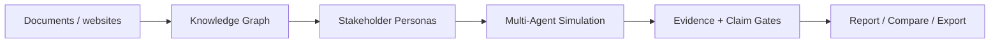
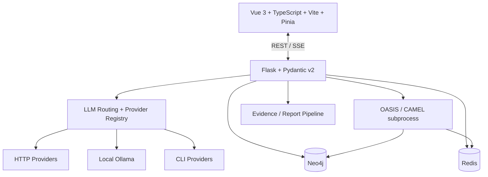

<p align="center">
  <strong>English</strong> · <a href="./README.de.md">Deutsch</a>
</p>

<div align="center">


# 🏛️ AGORA

### Evidence-oriented stakeholder, risk, and scenario analysis

**Documents → Knowledge Graph → Personas → Simulation → auditable report**

[](./VERSION)
[](./LICENSE)
[](https://doi.org/10.5281/zenodo.21830644)
[](https://www.python.org/)
[](https://vuejs.org/)
[](https://neo4j.com/)
[](./docs/STATUS.md)

[Demo](#demo) · [What Agora does](#what-agora-does) · [Pipeline](#pipeline) · [Quickstart](#quickstart) · [Architecture](#architecture) · [Current status](#current-status) · [Security](#security)

</div>

---

> [!IMPORTANT]
> **Agora does not predict human behavior.** Personas and simulations are synthetic model outputs. Agora is designed to surface plausible stakeholder reactions, conflicts, assumptions, evidence gaps, and alternative scenarios before decisions are made. It does not replace interviews, user research, expert review, or empirical validation.

## Demo

<p align="center">
  <a href="./media/agora-demo.mp4">
    
  </a>
</p>

<p align="center">
  <strong><a href="./media/agora-demo.mp4">▶ Open the 43-second demo</a></strong><br>
  <sub>A real Agora run for the fictional “LernKompass 2027” AI learning-assistant rollout.</sub>
</p>

## What Agora does

Agora is a local-first or controlled-hybrid analysis platform for complex stakeholder and decision scenarios. It turns source material into a knowledge graph, derives reviewable stakeholder personas, runs controlled multi-agent interactions, and produces an evidence-oriented report.

The report does not treat every plausible sentence as a fact. Claims, hypotheses, data gaps, source references, simulation evidence, and degradation states are tracked separately so that readers can inspect where a conclusion came from and where the system is uncertain.

Typical use cases include:

- stakeholder and acceptance analysis,
- pre-mortems and rollout-risk analysis,
- comparison of communication or policy variants,
- product and concept reviews,
- research and teaching around GraphRAG, multi-agent systems, and evidence gating.

## Pipeline


```mermaid
flowchart LR
    A[Documents / websites] --> B[Knowledge Graph]
    B --> C[Stakeholder Personas]
    C --> D[Multi-Agent Simulation]
    D --> E[Evidence + Claim Gates]
    E --> F[Report / Compare / Export]
```

### 1. Ingest and graph

Uploaded PDF, Markdown, and text sources are extracted, chunked, embedded, and mapped into Neo4j. Uploaded-file provenance is carried through ingestion and retrieval so report evidence can resolve back to concrete document/chunk anchors (ADR-0013).

### 2. Generate and review personas

Candidate entities pass type filtering, deduplication, eligibility checks, persona-kind rules, and identity alignment before profiles are created. Personas can be reviewed and edited before simulation.

### 3. Run the simulation

OASIS/CAMEL runs in a separate subprocess. Redis transports live state and events between the simulation runtime and the web application. A user stop is represented explicitly rather than being disguised as a crash.

### 4. Generate the report

The report pipeline plans sections, queries graph and simulation evidence, can interview personas again, extracts claims, binds evidence, verifies quantitative prose, and records degradations. Structurally incomplete or cancelled reports are marked `INCOMPLETE` rather than normal `COMPLETED`.

### 5. Compare and export

Reports and runs can be inspected, compared, and exported. Contract-invalid evidence is withheld or represented as `evidence_omitted` instead of being shipped as if it had passed validation.

## Provider and model routing

Agora separates provider definitions, connections, secrets, model references, and per-stage routes.

Supported transport classes are:

| Transport | Meaning | Example |
|---|---|---|
| `http` | remote or local HTTP API | OpenAI, Gemini, MiniMax, Bedrock Mantle |
| `local` | local HTTP service without API-key auth | Ollama |
| `cli` | local authenticated CLI subprocess | Codex CLI |

`codex_cli` is a first-class session transport: no HTTP base URL and no API key are expected. See [`docs/provider-runtime-settings.md`](./docs/provider-runtime-settings.md) for the current routing model.

Embedding configuration is intentionally separate from chat routing. A known runtime SSoT gap is tracked in [#1417](https://github.com/arn0ld87/agora/issues/1417).

## Architecture


```mermaid
graph TD
    UI[Vue 3 + TypeScript + Vite + Pinia] <-->|REST / SSE| API[Flask + Pydantic v2]
    API --> ROUTE[LLM Routing + Provider Registry]
    ROUTE --> HTTP[HTTP Providers]
    ROUTE --> LOCAL[Local Ollama]
    ROUTE --> CLI[CLI Providers]
    API --> NEO[(Neo4j)]
    API --> REDIS[(Redis)]
    API --> OASIS[OASIS / CAMEL subprocess]
    OASIS --> REDIS
    OASIS --> NEO
    API --> REPORT[Evidence / Report Pipeline]
```

| Area | Technology / responsibility |
|---|---|
| Frontend | Vue 3, TypeScript, Vite, Pinia, Zod |
| Backend | Flask, Python 3.14, Pydantic v2, `uv` |
| Contracts | Pydantic → generated JSON schemas → Zod mirrors |
| Knowledge graph | Neo4j 5.18+ |
| Event / live state | Redis |
| Simulation | OASIS / CAMEL in a separate subprocess |
| LLM layer | ProviderConnection, AiRoute/LlmRoute, `LLMClient` |
| Report | evidence collection, claim gates, degradation model, exports |

Production Gunicorn intentionally runs with **one web worker** while process-local job/monitor state still exists. Increasing the worker count is not a harmless performance setting.

For the actual architecture and its remaining debts, see [`docs/architecture.md`](./docs/architecture.md) and [`docs/STATUS.md`](./docs/STATUS.md).

## Quickstart

### Requirements

- Git
- Linux or macOS recommended
- Bun >= 1.3 and Node.js >= 20
- `uv`
- a configured LLM provider and embedding setup
- Docker for the full-stack container path

### Local setup

```bash
git clone https://github.com/arn0ld87/agora.git
cd agora
./install.sh
```

`install.sh` creates `.env` from the template and generates the four application secrets that can be generated locally:

- `SECRET_KEY`
- `AGORA_AUTH_TOKEN`
- `AGORA_SECRET_KEY`
- `AGORA_FERNET_KEY`

Configure `NEO4J_PASSWORD`/Neo4j connection details as required and add or activate the desired LLM/embedding provider. Then start the development stack:

```bash
bun run dev
```

### Docker setup

```bash
./install.sh --docker
```

Default service endpoints:

| Service | Address |
|---|---|
| Frontend | `http://localhost:5173` |
| Backend | `http://localhost:5001` |
| Liveness | `http://localhost:5001/health` |
| Readiness / diagnostics | `http://localhost:5001/api/status` |
| Neo4j Browser | `http://localhost:7474` in development setups where the port is exposed |

> [!WARNING]
> Agora is a **single-user Stability Beta**. Do not expose the development stack directly to the public internet. Use the hardened deployment guidance, TLS/VPN/reverse-proxy controls, and authentication described under [`docs/deployment-prod-like.md`](./docs/deployment-prod-like.md).

## Current status

**Current product version:** `0.9.5` Stability Beta.

The exact verified state, recent test evidence, known gaps, and current baseline are maintained in [`docs/STATUS.md`](./docs/STATUS.md). Release priorities and 0.10/1.0 gates are maintained in [`ROADMAP.md`](./ROADMAP.md). This README deliberately avoids embedding fast-aging test counters.

The main pre-1.0 work is currently concentrated on:

- restart-safe long-running Prepare/Report/Graph jobs ([#1472](https://github.com/arn0ld87/agora/issues/1472)),
- one canonical embedding runtime configuration ([#1417](https://github.com/arn0ld87/agora/issues/1417)),
- persona/entity coherence and role consistency ([#1470](https://github.com/arn0ld87/agora/issues/1470), [#1471](https://github.com/arn0ld87/agora/issues/1471), [#1323](https://github.com/arn0ld87/agora/issues/1323)),
- simulation fidelity and recommender reproducibility ([#1236](https://github.com/arn0ld87/agora/issues/1236)),
- stronger evidence semantics and clean evaluation fixtures ([#1345](https://github.com/arn0ld87/agora/issues/1345), [#1240](https://github.com/arn0ld87/agora/issues/1240)),
- complete manifests/replay and reproducibility ([#763](https://github.com/arn0ld87/agora/issues/763), [#1274](https://github.com/arn0ld87/agora/issues/1274)),
- proven backup/restore/upgrade/rollback and baseline evaluation ([#766](https://github.com/arn0ld87/agora/issues/766), [#765](https://github.com/arn0ld87/agora/issues/765)).

### Reproducibility boundary

Agora stores run and simulation metadata, including seed-related fields, but the current system **does not yet guarantee that the same stored seed reproduces the same experiment**. Full reproducibility requires all relevant random sources, prompts, inputs, routes, model responses, and feature flags to be frozen or recorded. That is 0.10 work, not a claim made by 0.9.5.

## Reference run

The current documented reference is **Reference run 7: AURORA with red-team review**, generated on 2026-08-17 for the fictional Städtischer Klinikverbund Falkenbrück / “Nexora Triage Assist” scenario.

It is intentionally a **reference artifact, not a proof of reproducibility or product validity**. Its documented strengths and failures are regression evidence for the report/evidence pipeline. The repository still lacks everything required to replay that run byte-for-byte from a fresh checkout.

[Read Reference run 7](./docs/reference-runs/2026-08-17-aurora-red-team/README.md) · [Reference-run index](./docs/reference-runs/README.md)

## Security

Current security foundations include:

- master-token and scoped workspace API-key authentication,
- signed short-lived tickets for browser URL-auth cases such as SSE/downloads,
- encrypted provider-secret and workspace-API-key stores,
- transport checks for credential-bearing HTTP endpoints,
- loopback-oriented production defaults and hardened Compose overrides,
- dependency scanning and an explicit dependency-risk register.

Prompt injection from untrusted model observations/source material remains an active hardening area ([#1224](https://github.com/arn0ld87/agora/issues/1224)).

See [`SECURITY.md`](./SECURITY.md), [`docs/auth.md`](./docs/auth.md), [`docs/security-threat-model.md`](./docs/security-threat-model.md), and [`docs/dependency-risk-register.md`](./docs/dependency-risk-register.md).

## Documentation

- [`docs/README.md`](./docs/README.md) — documentation index
- [`docs/STATUS.md`](./docs/STATUS.md) — verified current state
- [`ROADMAP.md`](./ROADMAP.md) — release sequence and gates
- [`CONTEXT.md`](./CONTEXT.md) — runtime/evidence orientation for agents and maintainers
- [`docs/architecture.md`](./docs/architecture.md) — current architecture
- [`AGENTS.md`](./AGENTS.md) — repository rules for agentic development

## License and origin

Agora is open source under the **AGPL-3.0** license. It originated as a fork of [MiroFish](https://github.com/666ghj/MiroFish) in March 2026 and has been developed independently since April 2026. See [`NOTICE`](./NOTICE) for attribution details.

Parts of the simulation runtime use the CAMEL-AI/OASIS ecosystem.
