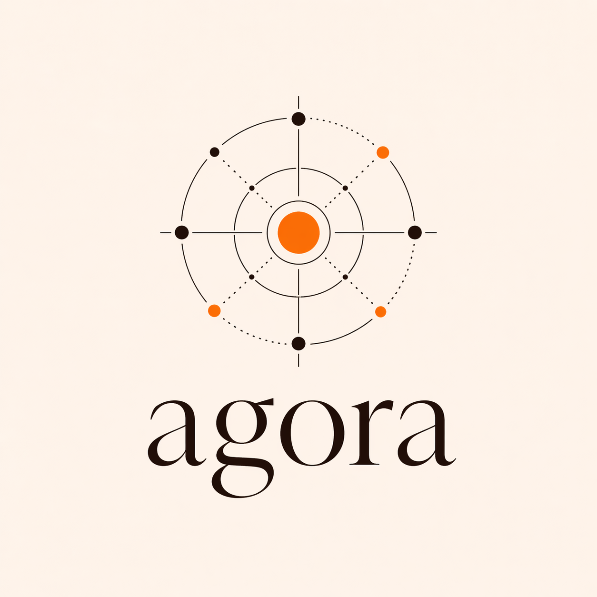
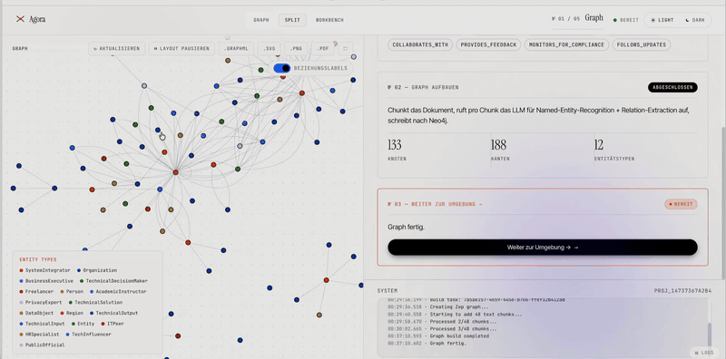

<div align="center">



# Agora

**Lokal-first Multi-Agent-Simulator für DACH-Zielgruppenreaktionen.**

Dokument hochladen, Wissensgraph extrahieren, Personas ableiten, Social-Media-Reaktionen simulieren und einen belegbaren DACH-Report erzeugen.

[](https://github.com/arn0ld87/agora)
[](./LICENSE)
[](https://neo4j.com/)
[](https://ollama.com/)
[](./CHANGELOG.md)

[Deutsch](#deutsch) · [English](#english) · [Status](./docu/STATUS.md) · [Security](./docu/security-hardening.md)

</div>

---

> ## Status: v0.9.1-dev auf `main`
>
> Letzter Tag: `v0.9.0` vom 2026-05-01 ([Release Notes](docu/2026-05-01-v0.9.0-release-notes.md)).
> Aktueller Stand laut [`docu/STATUS.md`](docu/STATUS.md): M9 und M10 abgeschlossen, M11 läuft. Rate-Limits für Ticket-, Upload-, Simulation-LLM- und Report-Trigger-Endpunkte sind umgesetzt und nach Gemini-Followups gehärtet.
>
> Agora ist ein **experimenteller Fork**. Graph-Build, Simulation und Report-Pipeline hängen stark an Modellqualität, JSON-Verhalten, Neo4j, Redis und OASIS-Subprozessen.
>
> **Nicht direkt ins öffentliche Internet stellen.** Agora v1 ist per [ADR-0001](docu/decisions/0001-auth-model.md) bewusst **Single-User-only**: Shared `AGORA_AUTH_TOKEN`, signed Tickets für SSE/Downloads, kein Multi-User-AuthN/AuthZ-Stack. Für Tailnet/LAN nur hinter Reverse-Proxy oder Tunnel betreiben.
>
> **Aktiv gepflegter Modellpfad:** `qwen3-coder-next:cloud` für LLMs und `qwen3-embedding:4b` mit `VECTOR_DIM=2560` für Embeddings. `nomic-embed-text` mit 768 Dimensionen bleibt als Fallback möglich.

---

## Deutsch

### Was ist Agora?

Agora ist ein lokal-first Resonanzlabor für Texte, Pläne und Dossiers. Du lädst ein Dokument hoch, Agora baut daraus einen Knowledge Graph, erzeugt daraus differenzierte Personas und lässt diese Personas in einer OASIS-Simulation auf den Inhalt reagieren. Am Ende steht kein Bauchgefühl, sondern ein Report mit Zitaten, Confidence-Scores und Provenance-Ankern.

Typische Einsätze:

- Kommunikations- und Kampagnenentwürfe gegen Zielgruppenreaktionen prüfen
- Stakeholder-Cluster, Einwände und Polarisierung früh erkennen
- Varianten von Narrativen, Produkttexten oder Policies vergleichen
- DACH-spezifische Sprache, Timing-Profile und Report-Tonalität nutzen

### Pipeline

1. **Upload**: PDF, Markdown oder Text hochladen und Fragestellung definieren.
2. **Graph Build**: Entitäten, Beziehungen und Attribute werden extrahiert und in Neo4j geschrieben.
3. **Persona Spawn**: Agora generiert Personas mit Rolle, Haltung, Aktivitätsmuster und optionalem Review-Gate.
4. **Simulation**: OASIS läuft als Subprozess; Status, Aktionen und Logs laufen über Redis/File-IPC und SSE.
5. **Report**: ReportAgent verbindet Graph, Simulation, Interviews und optional Webtools zu einem belegbaren DACH-Report.
6. **Compare**: Graph-Diff, Branch-Compare und Runs Dashboard zeigen Drift, Verstärkung und Status über Runs hinweg.

<p align="center">
  <a href="./media/screenshots/graph-build.mp4">
    
  </a>
  <br/>
  <sub><a href="./media/screenshots/graph-build.mp4">Graph-Build als MP4 öffnen</a></sub>
</p>

### Highlights seit v0.9.0

- **Compare- und Diff-Stack**: Graph-Diff API/UI, Simulation-Compare API/UI und Runs Dashboard.
- **Persona-Entity-Kontext**: Backend-API zeigt, welche Graph-Entity in eine Persona eingeflossen ist.
- **ReportAgent-Refactor**: der frühere Monolith ist in ein Package aufgeteilt.
- **Frontend-TypeScript-Migration**: API, Stores, Composables und kritische Views sind in TypeScript/Zod abgesichert.
- **Production-Hardening**: Reverse-Proxy-Sidecar, gevent, Bundle-Token-Gate, signed Tickets, Prod-Smoke auf `main`/Tags/`workflow_dispatch`.
- **M10.5 Rate-Limits**: app-seitige Fixed-Window-Limits für `/api/auth/ticket`, `/api/graph/ontology/generate`, `/api/simulation/generate-profiles`, `/api/simulation/prepare`, `/api/report/generate`, `/api/report/chat`.
- **Security-Watchlist**: CVE-Monitor, Hardstop 2026-07-30 und Dependency Risk Register.
- **Coverage-Gates**: Backend- und Frontend-Coverage-Gates sind aktiv; Zielwerte werden in M11 schrittweise angehoben.

### Architektur auf einen Blick

```text
Vue 3 + Pinia + Zod + Vite
  └─ Frontend-Wizard, Runs Dashboard, Graph/Compare UI, Report UI

Flask API + Pydantic v2
  ├─ contracts/          Single Source of Truth für API-Verträge
  ├─ api/                Auth, Graph, Simulation, Report, Runs, Status
  ├─ services/           Graph Build, Personas, Simulation, Reports, Metrics
  ├─ storage/            Neo4j, Embeddings, NER, Search
  └─ scripts/            OASIS-Subprozess-Runner

Runtime
  ├─ Neo4j 5.18+         Knowledge Graph
  ├─ Redis               Pub/Sub-IPC im Compose-Default
  ├─ Ollama/OpenAI-API   LLM- und Embedding-Endpunkte
  └─ OASIS/CAMEL         Multi-Agent-Simulation
```

### Engineering-Status

Verbindliche Testzahlen, Coverage und Milestone-Status stehen in [`docu/STATUS.md`](docu/STATUS.md). Diese README kopiert keine Test-Counts inline.

| Layer | Inhalt | Status |
|---|---|---|
| 0 | Pydantic-Contracts + Zod-Spiegel + JSON-Schema-Dump | grün |
| 1 | Backend-Hardening, Quoten, Evidence-Dedup, Confidence | grün |
| 2 | DACH-Voice + Glossar v1 | grün |
| 3 | Reader-Honesty: Quotes, Provenance, Section-Dedup | grün |
| 4 | Frontend strict-Zod, Diff/Confidence-UI, Quoten | grün |
| 5 | Eval/Baseline-Suite + Snapshots | grün |
| 6 | Frontend-TypeScript-Migration | grün |
| 7 | Graph / Runs / Compare | weitgehend grün |
| 8 | Persona Review + Persona-Entity-Kontext | teilweise |
| 9 | Production Deployment | grün mit bewusst pausiertem PR-Smoke |
| 10 | Security Watchlist | grün |

### Schnellstart

Vollständige Guides:
[`docu/deployment-dev.md`](./docu/deployment-dev.md) · [`docu/deployment-prod-like.md`](./docu/deployment-prod-like.md)

#### Voraussetzungen

- Node.js 18+
- Python 3.11+
- `uv`
- Neo4j 5.18+
- Ollama lokal oder ein OpenAI-kompatibler Endpoint

```bash
git clone https://github.com/arn0ld87/agora.git
cd agora
cp .env.example .env

# Modelle auf dem Host vorbereiten
ollama pull qwen2.5:32b
ollama pull qwen3-embedding:4b

# Dev-Stack: Agora + Neo4j + Redis
docker compose up -d --build
```

Endpoints:

| Dienst | URL |
|---|---|
| Frontend | <http://localhost:5173> |
| Backend Health | <http://localhost:5001/health> |
| Neo4j Browser | <http://localhost:7474> |

#### Lokal ohne Docker

```bash
npm run setup:all
npm run dev
```

#### Rebuild nach größeren Änderungen

```bash
docker compose -f docker-compose.yml -f docker-compose.prod.yml down --remove-orphans
docker compose -f docker-compose.yml -f docker-compose.prod.yml build --no-cache agora
docker compose -f docker-compose.yml -f docker-compose.prod.yml up -d --force-recreate --remove-orphans
docker compose -f docker-compose.yml -f docker-compose.prod.yml ps
```

Named Volumes für Neo4j und Redis bleiben dabei erhalten.

### Wichtige Konfiguration

```env
# LLM / Ollama oder OpenAI-kompatibler Endpoint
LLM_API_KEY=ollama
LLM_BASE_URL=http://localhost:11434/v1
LLM_MODEL_NAME=qwen2.5:32b

# Embeddings
EMBEDDING_MODEL=qwen3-embedding:4b
EMBEDDING_BASE_URL=http://localhost:11434
VECTOR_DIM=2560

# Neo4j
NEO4J_URI=bolt://localhost:7687
NEO4J_USER=neo4j
NEO4J_PASSWORD=<setzen>

# Sprache / Region
AGENT_LANGUAGE=de
REPORT_LANGUAGE=German
TIME_PROFILE=dach_default

# Optional
PERSONA_REVIEW_ENABLED=false
ENABLE_AGENT_TOOLS=false
ENABLE_WEB_TOOLS=false
```

Embedding-Modell und `VECTOR_DIM` müssen zusammenpassen:

| Modell | VECTOR_DIM |
|---|---:|
| `nomic-embed-text` | 768 |
| `embeddinggemma:300m` | 768 |
| `qwen3-embedding:4b` | 2560 |
| `qwen3-embedding:8b` | 4096 |

### Sicherheit

Agora reduziert die Angriffsfläche bewusst, ersetzt aber keinen Multi-User-Sicherheitsstack.

- `AGORA_AUTH_TOKEN` schützt `/api/*`.
- `?token=` ist im Non-Debug-Modus blockiert; SSE/Downloads nutzen signed Tickets.
- Rate-Limits schützen Ticket-, Upload-, Simulation-LLM- und Report-Trigger-Endpunkte.
- `ProxyFix` ist opt-in und wird im Repo-nginx-Sidecar mit genau einem trusted Proxy konfiguriert.
- Secrets werden nicht in Simulation-Artefakte serialisiert.
- Non-Debug-Start verlangt echte Werte für `SECRET_KEY`, `NEO4J_PASSWORD` und `AGORA_AUTH_TOKEN`.

Secret erzeugen:

```bash
python -c "import secrets; print(secrets.token_urlsafe(32))"
```

Details:
[`docu/security-hardening.md`](./docu/security-hardening.md) ·
[`docu/auth.md`](./docu/auth.md) ·
[`docu/decisions/0001-auth-model.md`](./docu/decisions/0001-auth-model.md) ·
[`docu/dependency-risk-register.md`](./docu/dependency-risk-register.md)

### Entwicklung

```bash
npm run setup:all
npm run dev
npm run check

cd backend && uv run pytest
cd backend && uv run ruff check app/ tests/
cd backend && uv run python -m app.contracts.dump_schemas

cd frontend && npm run check
```

Wichtige Doku:

- [`docu/STATUS.md`](./docu/STATUS.md) — Single Source of Truth für Status, Tests, Coverage
- [`PLAN.md`](./PLAN.md) — operativer Findings- und Maßnahmenplan
- [`AGENTS.md`](./AGENTS.md) / [`CLAUDE.md`](./CLAUDE.md) — Agent-Runbooks
- [`docu/target-architecture.md`](./docu/target-architecture.md) — Zielarchitektur
- [`docu/glossary-wording.md`](./docu/glossary-wording.md) — DACH-Wording-Glossar
- [`CHANGELOG.md`](./CHANGELOG.md) — Release-Notizen

### Herkunft und Lizenz

Agora ist ein Fork / Derivat von [nikmcfly/MiroFish-Offline](https://github.com/nikmcfly/MiroFish-Offline), basierend auf [666ghj/MiroFish](https://github.com/666ghj/MiroFish). Die Simulations-Engine nutzt [OASIS](https://github.com/camel-ai/oasis) von CAMEL-AI.

Lizenz: AGPL-3.0, siehe [LICENSE](./LICENSE).

---

## English

### What is Agora?

Agora is a local-first multi-agent simulator for DACH audience response. Upload a document, extract a knowledge graph, derive personas, run an OASIS simulation, and generate a report with quotes, confidence scores, and provenance anchors.

It is built for careful local experimentation: Neo4j for graph memory, Flask/Pydantic for contracts, Vue/Pinia/Zod for the UI, Redis/File IPC for simulation state, and Ollama or OpenAI-compatible endpoints for LLMs.

### Current status

`main` is at `v0.9.1-dev`. M9 and M10 are complete; M11 is active. Rate limits, signed tickets, reverse-proxy hardening, CVE monitoring, coverage gates, and the production smoke path are documented in [`docu/STATUS.md`](docu/STATUS.md).

Agora v1 is **single-user-only** by architecture decision. Do not expose it directly to the public internet.

### Core workflow

1. Upload a PDF, Markdown file, or plain text.
2. Build a Neo4j knowledge graph from entities, relations, and attributes.
3. Generate personas from the graph.
4. Run OASIS as a subprocess and stream simulation state.
5. Generate a report from graph evidence, simulation traces, interviews, and optional web context.
6. Compare runs through graph diff, branch compare, and the runs dashboard.

### Quick start

```bash
git clone https://github.com/arn0ld87/agora.git
cd agora
cp .env.example .env

ollama pull qwen2.5:32b
ollama pull qwen3-embedding:4b

docker compose up -d --build
```

Open:

- Frontend: <http://localhost:5173>
- Backend health: <http://localhost:5001/health>
- Neo4j Browser: <http://localhost:7474>

Local development:

```bash
npm run setup:all
npm run dev
npm run check
```

### License and attribution

Agora is an AGPL-3.0 fork/derivative of [nikmcfly/MiroFish-Offline](https://github.com/nikmcfly/MiroFish-Offline), based on [666ghj/MiroFish](https://github.com/666ghj/MiroFish). The simulation engine uses [OASIS](https://github.com/camel-ai/oasis) by CAMEL-AI.
