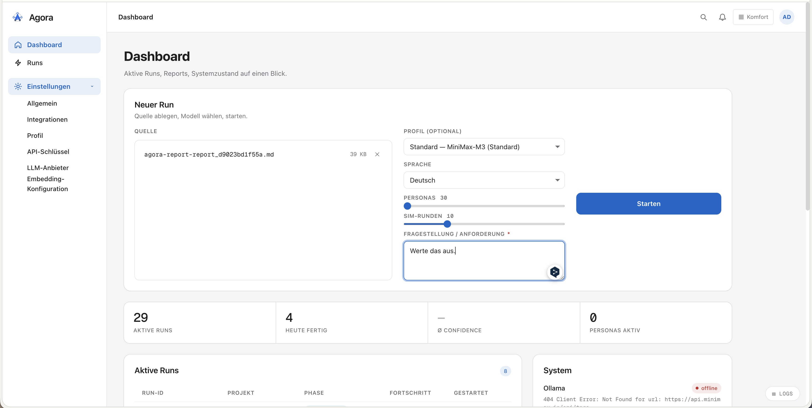
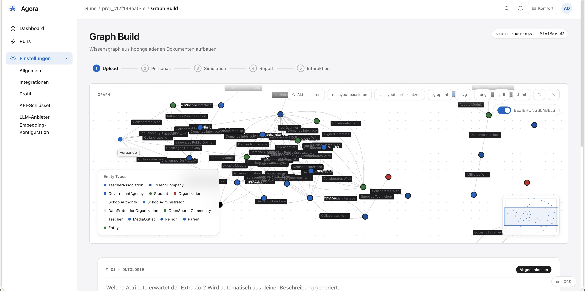
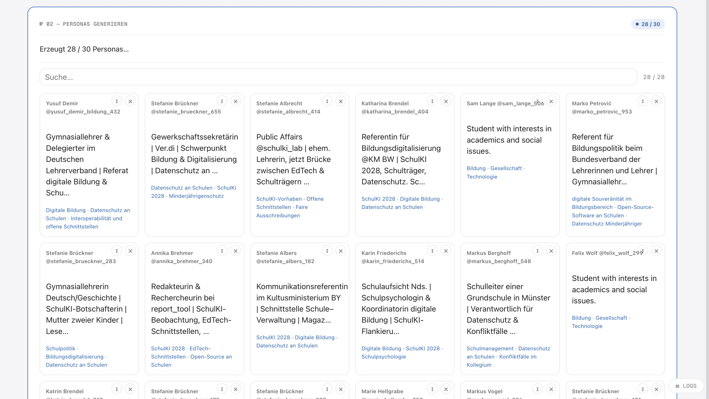
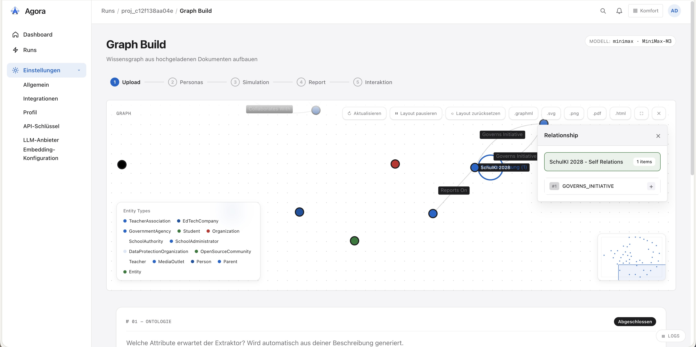
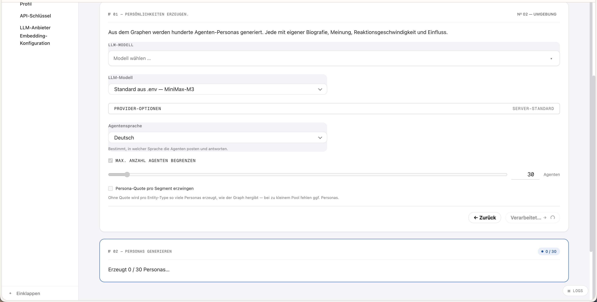
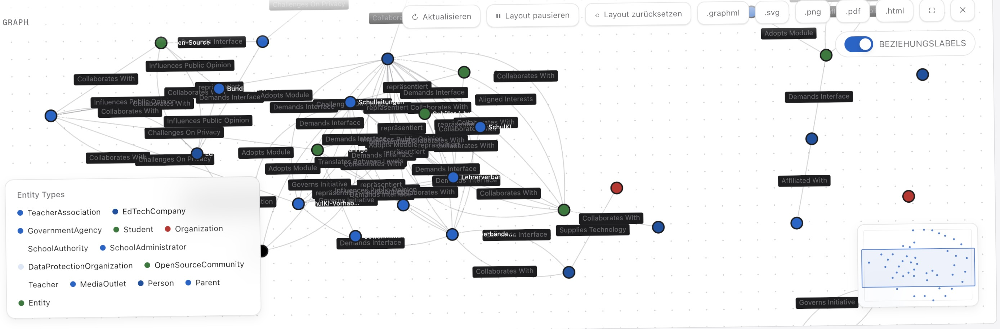
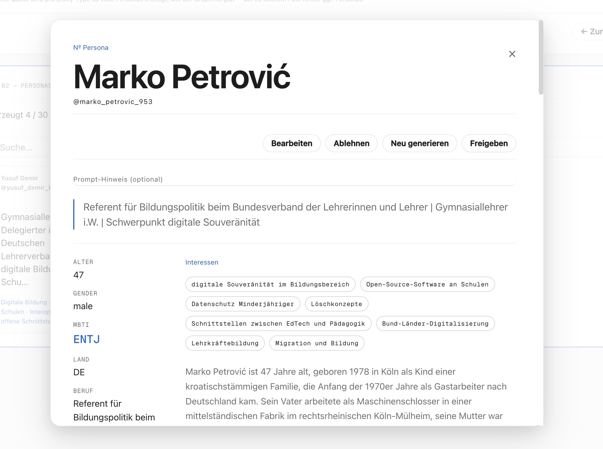
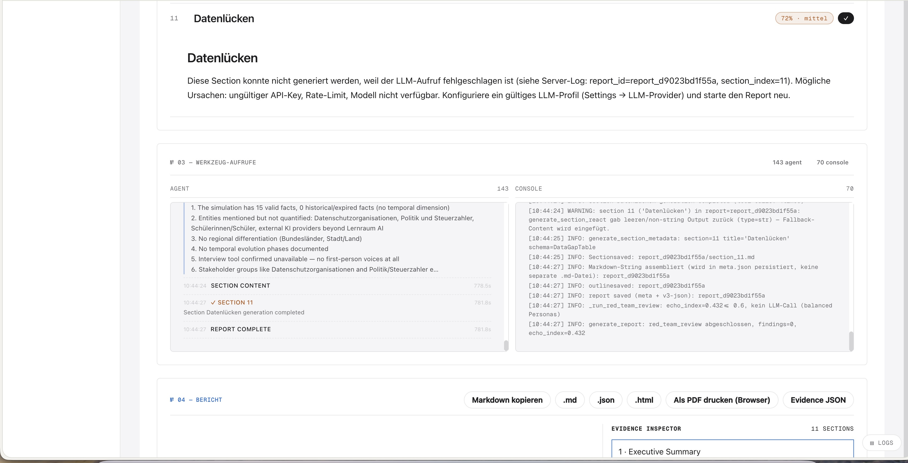
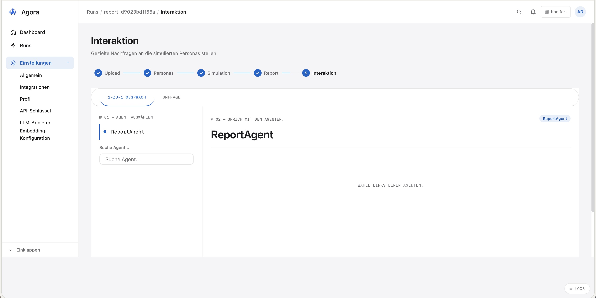
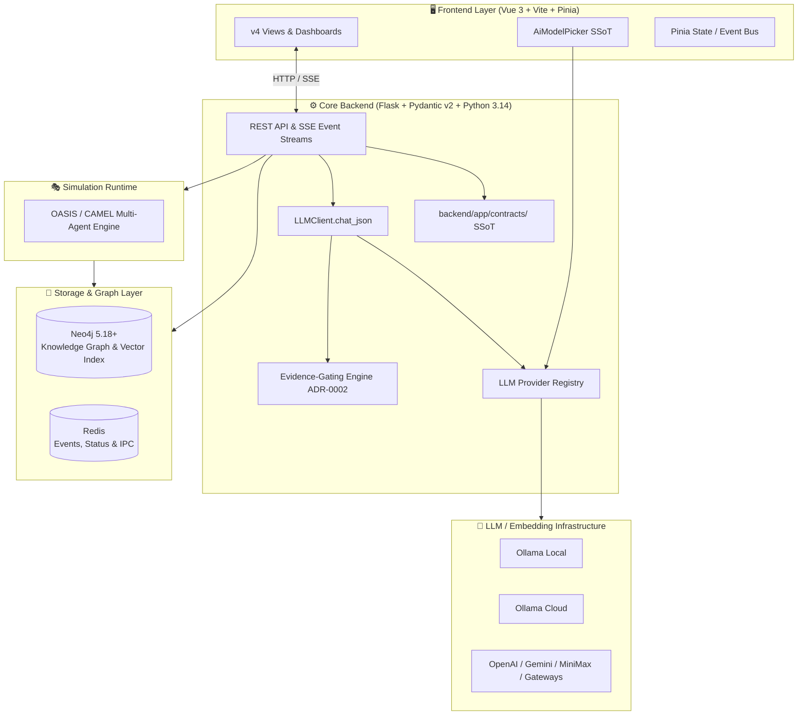

<div align="center">


# 🏛️ AGORA

### Evidenzorientierte Multi-Agenten-Analyseplattform für simulierte Zielgruppen-, Stakeholder- und Marktreaktionen

*Strukturiert komplexe Dokumente, Webseiten und Fragestellungen in wissensgraphen-gestützte Multi-Agenten-Simulationen mit transparenter Evidenzbindung, Confidence-Bewertung und Datenlücken-Analyse.*

---

[](https://github.com/arn0ld87/agora)
[](./LICENSE)
[](./VERSION)
[](https://www.python.org/)
[](https://vuejs.org/)
[](https://neo4j.com/)
[](./docs/STATUS.md)

[⚡ Schnellstart](#-schnellstart) • [✨ Kernfunktionen](#-was-ist-agora) • [🔄 Pipeline](#-pipeline--datenfluss) • [🏗️ Architektur](#-architektur--stack) • [📊 Status & Qualität](#-aktueller-produktstatus-080) • [🗺️ Roadmap](#-release-weg-bis-100) • [🔒 Security](#-sicherheit--betrieb)

</div>

---

> [!WARNING]
> **Aktueller Reifegrad: `0.8.0` Technical Preview**
>
> **Ehrlicher Ist-Zustand des Repositories:**
> - 🟢 **E2E-Verifizierung:** 6 von 6 E2E-Kern-Smokes laufen in CI durchgehend grün (20/20 erfolgreiche Läufe in Folge). **Offen:** `main` hat aktuell keine Branch-Protection; die Erzwingung als verpflichtender PR-Check steht aus.
> - 🟡 **Frontend-Status:** Vue 3 (v4-Routes) ist die **einzige ausgelieferte Produkttechnologie**. `/home` lädt noch `Home.vue` statt Redirect auf `/dashboard` ([#915](https://github.com/arn0ld87/agora/issues/915)); v3-Inhaltskomponenten laufen über v4-Wrapper ([#922](https://github.com/arn0ld87/agora/issues/922)).
> - 🔵 **React/Lovable-Prototyp:** Ein externer Prototyp existiert in einem separaten Repo, ist jedoch **nicht freigegeben, unveröffentlicht und nicht im Build/Docker verdrahtet**.
> - 🔒 **Betriebsmodell:** Agora ist ein experimentelles **Single-User-System**. Nicht ungeschützt im öffentlichen Internet betreiben (Tailscale, VPN oder Reverse Proxy nutzen).

---

## 💡 Was ist Agora?

Agora ist eine lokal oder hybrid betreibbare Analyse- und Simulationsplattform. Sie dient **nicht** dazu, die Zukunft vorherzusagen oder klassische Marktforschung zu ersetzen. Stattdessen strukturiert Agora mögliche Reaktionen, Einwände, Stakeholder-Risiken und Wissenslücken auf Basis geladener Dokumente, Webseiten und konfigurierter LLM-Agenten.

### 🎯 Wofür Agora gedacht ist (Pre-Mortem & Varianten-Test)

| Anwendungsfall | Beschreibung | Nutzen |
|---|---|---|
| 📣 **Kommunikation & Kampagnen** | Vorab-Test von Botschaften, Narrativen und PR-Strategien | Frühzeitiges Erkennen von Missverständnissen und Bedenken |
| 👥 **Stakeholder & Polarisierung** | Simulation von Bedenken verschiedener DACH-Zielgruppen | Sichtbarmachen von Konfliktlinien und Cluster-Meinungen |
| 🧪 **Produkt & Positionierung** | Vergleich von Landingpages, Pitches, Values & Value Props | Variantenvergleich vor echten Nutzertests oder Go-To-Market |
| 🔍 **Evidenz & Datenlücken** | Automatische Analyse von Aussagen auf Quellenbelege | Identifikation unbelegter Annahmen & Hypothesen für Research |

### ⚠️ Grenzen

- **Personas sind simuliert:** Persona-Aussagen sind keine echten Kundenmeinungen oder Testergebnisse.
- **Confidence ≠ Wahrheit:** Der Confidence-Wert bewertet die interne Evidenzbindung im Graph, keine reale Welt-Wahrheit.
- **Abhängig von Inputs:** Ergebnisse hängen von Eingangsdaten, Modellen, Prompts und Seeds ab — kleine Modell- oder Prompt-Änderungen können Aussagen deutlich verschieben.
- **Modell-Größe zählt:** Kleine Modelle erzeugen schneller generische oder schlecht belegte Aussagen.
- **Cloud-Trade-offs:** Externe Provider bringen Datenschutz-, Compliance- und Kostenfragen mit — Hosting und Datenflüsse bewusst wählen.
- **Ein Run ist kein Sample:** Ein einzelner Lauf zeigt keine statistisch belastbare Verteilung; belastbare Aussagen erfordern mehrere Varianten, Seeds oder Reviews.

Agora ist am stärksten, wenn das Ergebnis anschließend durch echte Interviews, Fachreviews, Nutzertests oder vorhandene Vergleichsdaten geprüft wird.

---

## 🔄 Pipeline & Datenfluss

Der Analyseprozess in Agora verläuft über 10 strukturierte Phasen:

```mermaid
flowchart LR
    classDef input fill:#2b3a42,stroke:#4f9da6,color:#fff
    classDef core fill:#1e293b,stroke:#3b82f6,color:#fff
    classDef output fill:#1d3528,stroke:#10b981,color:#fff

    A[📥 1. Onboarding & Input<br/>PDF, Web, Text] :::input --> B[🕸️ 2. Knowledge Graph<br/>Extraction into Neo4j] :::core
    B --> C[👥 3. Persona Spawn<br/>Haltungen & Profile] :::core
    C --> D[🔍 4. Persona Review<br/>Anpassen & Regenerieren] :::core
    D --> E[🎭 5. OASIS Simulation<br/>Multi-Agenten-Diskussion] :::core
    E --> F[📊 6. Aggregation<br/>Graph- & Event-Daten] :::core
    F --> G[📜 7. Report Generation<br/>Claims & Evidence] :::output
    G --> H[⚖️ 8. Compare & Diff<br/>Runs & Varianten] :::output
    H --> I[🔄 9. Replay & Export<br/>Audit & Re-Index] :::output
    I --> J[🧬 10. Re-Embedding & Migration<br/>Versionierte Re-Indexierung] :::output
```

<details>
<summary><b>🔍 Phasen im Detail anzeigen</b></summary>

1. **Onboarding & Configuration:** Profil, LLM-Provider, Secret Store, Routing und Embeddings einrichten.
2. **Knowledge Acquisition:** Dokumente (PDF, MD, TXT) oder URLs parsen, Sätze und Sinneinheiten strukturiert aufnehmen.
3. **Graph Building:** Extraktion von Entitäten, Beziehungen, Behauptungen und Fakten in den Neo4j Knowledge Graph.
4. **Persona Generation:** Ableitung differenzierter Zielgruppen- und Stakeholder-Personas mit DACH-spezifischen Tonalitäten und Interessen.
5. **Persona Review:** Interaktive Prüfung, Anpassung oder gezielte Regeneration von Personas vor dem Simulationslauf.
6. **Multi-Agent Simulation:** Ausführung der Interaktionen über die integrierte OASIS/CAMEL-Engine mit Redis-Eventbus.
7. **Graph & Event Aggregation:** Zusammenführung von Interaktionsgraphen, Metriken, Polarisierungsgraden und Sentimentverläufen.
8. **Evidence-Gating Report:** Generierung synthetisierter Berichte mit hartgeankerter Evidenzbindung (ADR-0002) und Confidence-Scores.
9. **Run Comparison:** Vergleichende Gegenüberstellung verschiedener Runs, Prompts, Modelle oder Eingabe-Varianten.
10. **Re-Embedding & Migration:** Fortsetzbare, versionierte Re-Indexierung von Vektor-Embeddings im Wissensgraphen.

</details>

---

## 📸 Prozess im UI

Die Pipeline in der Agora-Weboberfläche folgt fünf aufeinander aufbauenden Schritten — Upload, Personas, Simulation, Report und Interaktion. Die folgenden Screenshots zeigen einen realen Lauf (`proj_c12f138aa04e` zum Thema SchulKI) von der Quelldatei bis zum 1‑zu‑1‑Gespräch mit den generierten Personas:

### 1. Run starten — Quelle wählen, Modell konfigurieren

Im Dashboard wird ein neuer Run angelegt: Quelldatei ablegen, Modellprofil und Sprache auswählen, Anzahl der Personas und Simulationsrunden einstellen, dann starten.



### 2. Upload — Wissensgraph aus Dokumenten aufbauen

Direkt nach dem Start extrahiert Agora aus den hochgeladenen Dokumenten Entitäten und Beziehungen und zeigt sie als interaktiven Graphen. Beziehungs‑Labels sind ein‑ und ausblendbar, der Graph ist als `.graphml`, `.svg`, `.png`, `.pdf` oder `.html` exportierbar.

| Frisch hochgeladen | Vollständig aufgebaut |
|---|---|
|  |  |

Über den Relationship‑Inspector lässt sich jeder Knoten anklicken — die Beziehungen und Selbst‑Referenzen werden in einem seitlichen Panel sichtbar.



### 3. Personas — Zielgruppen aus dem Graphen generieren

Aus dem Wissensgraphen werden hunderte Personas abgeleitet. Vor der Generierung werden LLM‑Modell, Agentensprache und die maximale Anzahl Agenten konfiguriert.



Während der Generierung füllt sich eine Karten‑Übersicht mit Name, Rolle, Interessen und Tags. Jede Persona lässt sich vor dem Simulationslauf einzeln prüfen, bearbeiten, neu generieren oder freigeben.

| Generierte Personas | Persona-Detailansicht |
|---|---|
|  |  |

### 4. Report — Evidence-Gating & Section-Generierung

Während der Simulation laufen die Agenten‑ und Werkzeug‑Aufrufe parallel. Jede Report‑Section wird mit Evidenzbindung (ADR‑0002), Confidence und Quellenverweisen erzeugt; bei fehlgeschlagenem LLM‑Call liefert die Section stattdessen eine nachvollziehbare Fehlermeldung mit Verweis auf den Server‑Log.



### 5. Interaktion — gezielte Nachfragen an die Personas

Nach Abschluss des Reports lassen sich einzelne Personas direkt ansprechen — entweder im 1‑zu‑1‑Gespräch oder als Umfrage. So können hypothesengetriebene Nachfragen gestellt und Evidenzlücken gezielt geschlossen werden.



---

## 🏗️ Architektur & Stack


```mermaid
graph TD
    subgraph Frontend ["🖥️ Frontend Layer (Vue 3 + Vite + Pinia)"]
        UI[v4 Views & Dashboards]
        ModelPicker[AiModelPicker SSoT]
        PiniaStore[Pinia State / Event Bus]
    end

    subgraph Backend ["⚙️ Core Backend (Flask + Pydantic v2 + Python 3.14)"]
        API[REST API & SSE Event Streams]
        Contracts[backend/app/contracts/ SSoT]
        Registry[LLM Provider Registry]
        ChatJSON[LLMClient.chat_json]
        EvidenceEngine[Evidence-Gating Engine ADR-0002]
    end

    subgraph Storage ["💾 Storage & Graph Layer"]
        Neo4jDB[(Neo4j 5.18+\nKnowledge Graph & Vector Index)]
        RedisDB[(Redis\nEvents, Status & IPC)]
    end

    subgraph SimEngine ["🎭 Simulation Runtime"]
        OASIS[OASIS / CAMEL Multi-Agent Engine]
    end

    subgraph Providers ["🤖 LLM / Embedding Infrastructure"]
        OllamaLocal[Ollama Local]
        OllamaCloud[Ollama Cloud]
        OpenAIComp[OpenAI / Gemini / MiniMax / Gateways]
    end

    UI <-->|HTTP / SSE| API
    ModelPicker --> Registry
    API --> Contracts
    API --> ChatJSON
    ChatJSON --> Registry
    Registry --> Providers
    API --> Storage
    API --> SimEngine
    SimEngine --> Storage
    ChatJSON --> EvidenceEngine
```

### 🛠️ Technologie-Stack

| Komponente | Technologie | Beschreibung / Rolle |
|---|---|---|
| **Frontend** | Vue 3, Vite, Pinia, TypeScript, Zod | Single Page Application (v4 Routing Architecture) |
| **Backend API** | Flask, Pydantic v2, Python 3.14, `uv` | REST API, SSE Streaming, Strict Contract Validation |
| **Knowledge Graph** | Neo4j 5.18+ | Entitäten, Relationen, Claims, Vektor-Embeddings |
| **Event Bus & IPC** | Redis 5.0+ | Status, Pub/Sub Events, Simulations-Laufzeit |
| **Multi-Agent Engine** | OASIS / CAMEL AI | Agenten-Orchestrierung, Diskussionsstränge, Rollen |
| **LLM Integration** | Pydantic `chat_json`, Provider Registry | Multi-Provider (Ollama, OpenAI, Gemini, MiniMax) |

---

## ⚡ Schnellstart

### 1. Repository klonen & Setup ausführen

```bash
git clone https://github.com/arn0ld87/agora.git
cd agora
./install.sh
```

### 2. Umweltvariablen konfigurieren & Starten

```bash
cp .env.example .env
# Passen Sie .env an (LLM Endpunkte, Secrets)
bun run dev
```

### 3. Docker-Variante (Vollständiger Stack)

```bash
./install.sh --docker
```

| Dienst | URL | Funktion |
|---|---|---|
| **Frontend UI** | `http://localhost:5173` | Hauptoberfläche (Vue 3 v4) |
| **Backend API** | `http://localhost:5001` | REST API & SSE Gateway |
| **Health Check** | `http://localhost:5001/readyz` | Backend Readiness Probe |
| **Neo4j Browser** | `http://localhost:7474` | Wissensgraph & Cypher Console |

---

## 📊 Aktueller Produktstatus (`0.8.0`)

| Qualitätsbereich | Status | Detail / Verifikation |
|---|---|---|
| **Backend Unit & Contract Tests** | 🟢 3.690+ Tests | `cd backend && uv run pytest` |
| **Frontend Test Files** | 🟢 171 Test-Files | `cd frontend && bun run test` |
| **E2E-Kern-Pipeline Smokes** | 🟢 20/20 Grün | 6/6 Kern-Smokes durchgehend stabil in CI |
| **Branch Protection `main`** | 🟡 Offen | E2E-Smokes laufen in CI, aber noch nicht als verpflichtender Check erzwungen |
| **Frontend v4 Migration** | 🟡 In Arbeit | Vue v4 ist Standard-UI; `/home` Redirect ([#915](https://github.com/arn0ld87/agora/issues/915)) & Component Wrapper ([#922](https://github.com/arn0ld87/agora/issues/922)) offen |
| **React / Lovable Prototype** | 🔵 Archiviert / Unfreigegeben | Prototyp existiert separat; kein Produktbestandteil vor 1.0 |

### 🛠️ Lokale Quality Gates ausführen

```bash
# Vollständiges Pre-Push-Gate (Backend + Frontend + Schemas)
bash scripts/pre-push-gate.sh

# Scope-spezifische Gates
bash scripts/pre-push-gate.sh backend
bash scripts/pre-push-gate.sh frontend
bash scripts/pre-push-gate.sh schemas
```

---

## 🗺️ Release-Weg bis 1.0.0

| Version | Entwicklungsstufe | Meilensteine & Freigabekriterien | Status |
|---|---|---|---|
| **`0.8.0`** | **Technical Preview** | Kern-Pipeline voll funktionsfähig; Provider- & Secret-SSoTs abgeschlossen; E2E-Smokes stabil grün. | 🟢 **Aktuell** |
| **`0.9.0`** | **Stability Beta** | E2E als Required Check aktiviert; Vue v4 als einziges Frontend abgeschlossen (#760); Coverage-Baseline erneuert. | 🟡 Geplant |
| **`0.10.0`** | **Release Candidate** | Reproduzierbare Runs & Replay; Token-, Kosten- & Zeitbudgets; Backup/Restore-Runbooks. | ⚪ Geplant |
| **`1.0.0`** | **Stable Single-User** | Stabile Verträge & Migrationen; deterministischer Referenzlauf; nachgewiesener Produktnutzen. | ⚪ Geplant |

---

## 🔒 Sicherheit & Betrieb

Agora folgt einem klaren Security-First-Ansatz für On-Premise & Hybrid-Betrieb:

- 🔑 **Auth-Token:** API-Zugriff über `AGORA_AUTH_TOKEN` geschützt.
- 🎟️ **Signed Tickets:** SSE-Streams und Dateidownloads nutzen zeitbegrenzte, signierte URL-Tickets (keine Plaintext-Tokens in URLs).
- 🔐 **Secret Safety:** API-Keys & Secrets werden niemals in Berichte, Logs, Graph-Knoten oder Simulations-Artefakte serialisiert.
- 🛡️ **Isolation:** Betrieb im lokalen Netz, via Tailscale, WireGuard-VPN oder HTTPS Reverse Proxy.

Detail-Dokumentation:
- 📖 [`SECURITY.md`](./SECURITY.md) — Vulnerability Disclosure & Guidelines
- 📖 [`docs/security-hardening.md`](./docs/security-hardening.md) — Hardening & Network Setup
- 📖 [`docs/dependency-risk-register.md`](./docs/dependency-risk-register.md) — Dependency CVE Tracking & Hardstops

---

## 📚 Dokumentationsarchitektur

Verbindliche Hierarchie für Mitwirkende und KI-Agenten:

1. 📄 **[`README.md`](./README.md)** — Produkt-Übersicht, Einstieg, Grenzen & Release-Linie
2. 📊 **[`docs/STATUS.md`](./docs/STATUS.md)** — Verifizierter, ehrlicher Ist-Zustand
3. 🗺️ **[`ROADMAP.md`](./ROADMAP.md)** — Strategische Release-Stufen & Kriterien
4. 🎯 **[GitHub Issues](https://github.com/arn0ld87/agora/issues)** — Konkrete, ausführbare Arbeitspakete

Für Entwickler & Agenten:
- 🤖 [`AGENTS.md`](./AGENTS.md) — Agent-Richtlinien & Tool-Pipelines
- 💬 [`CLAUDE.md`](./CLAUDE.md) — Claude Code Konfiguration & Task-Workflows
- 🏛️ [`docs/architecture.md`](./docs/architecture.md) — Tiefgehende Systemarchitektur
- 📖 [`docs/runbooks/`](./docs/runbooks/) — Operational Playbooks & Gates

---

<div align="center">

### ⚖️ Lizenz & Herkunft

Agora ist Open Source unter der **AGPL-3.0 Lizenz** ([`LICENSE`](./LICENSE)).  
Entstanden aus *MiroFish-Offline*, grundlegend weiterentwickelt für professionelle DACH-Simulationen.  
OASIS-Komponenten basieren auf dem *CAMEL-AI* Ökosystem.

*Entwickelt von [Alexander Schneider](https://alexle135.de)*

</div>
