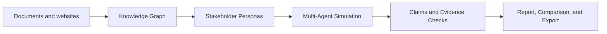
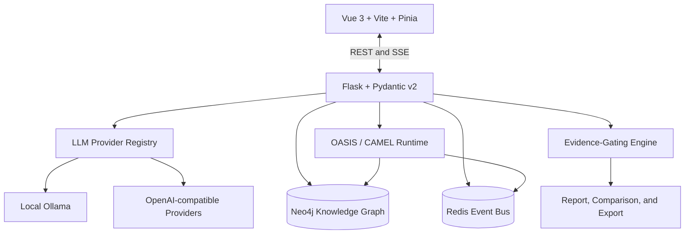

<p align="center">
  <strong>English</strong> · <a href="./README.de.md">Deutsch</a>
</p>

<div align="center">


# 🏛️ AGORA

### Evidence-oriented multi-agent analysis for stakeholders, target groups, and complex decisions

**Documents → Knowledge Graph → Personas → Simulation → auditable report**

[](./VERSION)
[](./LICENSE)
[](https://doi.org/10.5281/zenodo.21830644)
[](https://www.python.org/)
[](https://vuejs.org/)
[](https://neo4j.com/)
[](./docs/STATUS.md)
[](./docs/STATUS.md)

[Demo](#demo) · [What is Agora?](#what-is-agora) · [How it works](#how-it-works) · [UI workflow](#-ui-workflow) · [Quickstart](#quickstart) · [Architecture](#architecture) · [Status](#project-status) · [Security](#security) · [Contributing](#support-the-project)

</div>

---

> [!IMPORTANT]
> **Agora does not predict human behavior.** The platform generates auditable scenarios, possible objections, conflict lines, and data gaps. Simulation results do not replace interviews, user tests, or empirical research.

## Demo

<p align="center">
  <a href="./media/agora-demo.mp4">
    
  </a>
</p>

<p align="center">
 <strong><a href="./media/agora-demo.mp4">▶ Open the full 43-second demo</a></strong><br>
  <sub>Real run for the planned introduction of the “LernKompass 2027” AI learning assistant.</sub>
</p>

The demo shows:

1. a running multi-agent simulation with status and resource usage,
2. simulated reactions and technical runtime data,
3. a structured report with risks, conflicts, and data gaps,
4. export of the result as a PDF.

---

## Reference run

The current reference is **Reference run 7: AURORA with red-team review**, a decision report for the fictional Städtischer Klinikverbund Falkenbrück about the planned rollout of the AI-assisted triage and documentation system **Nexora Triage Assist**. The report was generated on **2026-08-17** as `report_b259e254ee3f` from the 24-round simulation `sim_c2108c7f543e`.

Two pipeline stages are new in this run. A **separate red-team review** runs after the report and returns 9 findings — unresolved tension between sections, unsupported effect claims, and missing counter-positions from individual stakeholder groups — alongside an echo index of 0.703 that quantifies how strongly the report repeats its input wording. And unsupported precision is no longer only softened: across five of seven sections, **10 factual statements were removed from the prose and carried forward as hypotheses**.

The report assesses four rollout variants separately and recommends a **reversible pilot at Falkenbrück-Mitte only**, tied to seven named pieces of proof before approval, with a full delay of the go-live as the fallback.

| Metric | Value |
|---|---|
| Simulation | `sim_c2108c7f543e`, 24 of 24 rounds |
| Report runtime | 16:46 min for 7 sections, plus 13 s red-team review |
| Agent interviews | `interview_agents` in all 7 sections, 6–8 personas each, 49 responses |
| Evidence records | 116 (49 interview responses, 31 seed documents, 28 graph relations, 8 simulation actions) |
| Claims | 29, each with at least one evidence reference — all at `low` confidence |
| Hypotheses / data gaps | 136 / 126 |
| Red-team findings | 9, echo index 0.703 |
| Export ids | section-qualified and collision-free (29/29 claims, 126/126 data gaps, 136/136 hypotheses) |

> [!NOTE]
> This is deliberately a **reference run, not a polished showcase**. It closes one regression expectation from run 6 — all 24 simulated persona quotes now resolve to a concrete `ev_` evidence id instead of a generic seed anchor — while documenting open trust boundaries as regression targets: all 29 claims stay at `low` confidence even where several stakeholder groups support the same statement; 92 of 116 evidence records are collected and displayed but bound to no claim; all 126 data gaps carry the same `medium` severity; and runtime rose against run 6 (16:46 min versus 8:19 min), which is not a like-for-like reporter comparison because the simulation differs. The repository does not contain every artifact and replay input needed to reproduce the run from a fresh checkout.

**[→ Read the full Reference run 7 notes](./docs/reference-runs/2026-08-17-aurora-red-team/README.md)**

Earlier runs: [reference run 6](./docs/reference-runs/2026-08-14-aurora-report/README.md) (same-simulation reporter regression) · [reference run 5](./docs/reference-runs/2026-08-12-domain-migration-20-runden/README.md) (trust-pipeline reference) · [reference run 4](./docs/reference-runs/2026-08-11-ki-lernassistent-20-runden/README.md) (first evidence-binding-at-scale run; richer simulation dynamics) · [run 3](./docs/reference-runs/2026-08-11-ki-lernassistent/README.md) · [run 2](./docs/reference-runs/2026-08-09-domain-migration-v2/README.md) · [run 1](./docs/reference-runs/2026-08-09-domain-migration/README.md)

---

## What is Agora?

Agora is an analysis platform that can be operated locally or in a hybrid setup. It processes documents, websites, and research questions into a knowledge graph, derives auditable stakeholder personas, and lets them interact in a controlled multi-agent simulation.

The resulting report separates document-supported statements from hypotheses, unsupported claims, and missing information. Instead of merely producing plausible LLM prose, Agora attempts to trace each relevant statement back to sources, graph objects, and simulation events.

### Core value

| Problem | Agora approach |
|---|---|
| Critical stakeholders are considered too late | Explore conflict lines and objections before a decision is made |
| LLM reports mix facts and speculation | Classify claims by evidence strength and link them to sources |
| Variants are compared mainly by intuition | Compare runs, prompts, models, and input variants |
| Decisions are based on incomplete material | Surface data gaps and underrepresented groups |
| Sensitive data should remain inside your own network | Run locally with Neo4j, Redis, and Ollama |

### Suitable use cases

- **Stakeholder and acceptance analysis:** structure possible resistance, interests, and communication problems.
- **Pre-mortem:** investigate why a project could fail before it is implemented.
- **Communication variants:** compare messages, narratives, and positioning strategies.
- **Product and concept review:** identify assumptions, risks, and overlooked target groups.
- **Research and teaching:** inspect multi-agent, GraphRAG, and evidence-gating workflows in a traceable way.

---

## How it works


```mermaid
flowchart LR
    A[Documents and websites] --> B[Knowledge Graph]
    B --> C[Stakeholder Personas]
    C --> D[Multi-Agent Simulation]
    D --> E[Claims and Evidence Checks]
    E --> F[Report, Comparison, and Export]
```

### 1. Ingest knowledge

PDF, Markdown, and text files as well as websites are extracted and segmented. For **uploaded files**, each segment carries document and chunk provenance through ingestion, graph construction, and retrieval (ADR-0013), and that provenance reaches the report as a resolvable evidence anchor — see step 5. Live-fetched websites do not use this path: they enter the report as research results and do not receive document or chunk IDs.

### 2. Build the knowledge graph

Neo4j stores entities, relationships, claims, source fragments, and vector embeddings. This allows semantic search and graph relationships to be used together.

### 3. Generate and review personas

Agora derives stakeholder personas from the knowledge graph. Roles, interests, and positions can be reviewed, edited, regenerated, or approved before the run.

### 4. Run the simulation

The OASIS/CAMEL runtime orchestrates the agents. Redis transports status, events, and runtime data between the simulation, backend, and UI.

### 5. Generate an evidence-oriented report

The report processes graph and simulation data into structured claims. Source type, confidence, and data gaps are shown separately; every EvidenceItem identifies its source class (agent quote, agent action, graph relation, web source, seed corpus). A seed-corpus EvidenceItem carries a resolvable anchor to the concrete location in the source document ([#1154](https://github.com/arn0ld87/agora/issues/1154)); a graph fact without documented provenance stays a graph relation rather than receiving a guessed anchor.

Confidence states its own scope: it separates simulation consensus from source binding, and `verified` requires an entailment check on the same evidence item, not merely a similarity score. A claim that is downgraded after the fact keeps the wording it was written under and discloses that fact in the claim table. The report header states which simulation state it is based on — completed rounds, planned total, and whether the simulation was still running when report generation started.

### 6. Compare variants and export

Runs can be compared by model, prompt, and input variant and exported into multiple formats (JSON, Markdown, CSV, ZIP). Every export carries the same contract-validated evidence view as the read path; evidence that fails the contract is withheld with a machine-readable reason instead of shipping as an apparently checked file.

The stochastic part of a simulation run is seeded and therefore repeatable. A full replay — same seed, same report — additionally requires a recording of the model responses and is still open ([#763](https://github.com/arn0ld87/agora/issues/763)).

---

## 📸 UI workflow

The Agora web interface follows five connected steps: start a run, upload material, review personas, generate the report, and interact with the personas. The screenshots below show a real run (`proj_c12f138aa04e`, topic: SchulKI) from source upload to a one-on-one conversation with generated personas.

### 1. Start a run — choose source and configure the model

Create a new run from the dashboard: add source files, select a model profile and language, configure the number of personas and simulation rounds, then start the run.


### 2. Upload — build a knowledge graph from documents

Immediately after the run starts, Agora extracts entities and relationships from uploaded documents and displays them as an interactive graph. Relationship labels can be toggled, and the graph can be exported as `.graphml`, `.svg`, `.png`, `.pdf`, or `.html`.

| Freshly uploaded | Fully built |
|---|---|
|  |  |

The Relationship Inspector lets you select any node and inspect relationships and self-references in a side panel.


### 3. Personas — generate target groups from the graph

Hundreds of personas can be derived from the knowledge graph. Before generation, configure the LLM model, agent language, and maximum number of agents.


During generation, the card view fills with names, roles, interests, and tags. Every persona can be reviewed, edited, regenerated, or approved before the simulation starts.

| Generated personas | Persona detail view |
|---|---|
|  |  |

### 4. Report — evidence gating and section generation

During the simulation, agent and tool calls run in parallel. Each report section is generated with evidence binding (ADR-0002), confidence, and source references; if an LLM call fails, the section instead provides a traceable error message pointing to the server log.


### 5. Interaction — ask targeted follow-up questions

After the report is complete, individual personas can be addressed directly, either in a one-on-one conversation or through a survey. This allows hypothesis-driven follow-up questions and targeted work on evidence gaps.


---

## 🏗️ Architecture


```mermaid
graph TD
    UI[Vue 3 + Vite + Pinia] <-->|REST and SSE| API[Flask + Pydantic v2]

    API --> REG[LLM Provider Registry]
    REG --> LOCAL[Local Ollama]
    REG --> CLOUD[OpenAI-compatible Providers]

    API --> NEO[(Neo4j Knowledge Graph)]
    API --> REDIS[(Redis Event Bus)]
    API --> OASIS[OASIS / CAMEL Runtime]

    OASIS --> REDIS
    OASIS --> NEO
    API --> EVIDENCE[Evidence-Gating Engine]
    EVIDENCE --> REPORT[Report, Comparison, and Export]
```

### Technology stack

| Area | Technology | Purpose |
|---|---|---|
| Frontend | Vue 3, Vite, Pinia, TypeScript, Zod | UI, status display, and event processing |
| Backend | Flask, Pydantic v2, Python 3.14, `uv` | REST API, SSE, contracts, and orchestration |
| Knowledge Graph | Neo4j 5.18+ | Entities, relationships, claims, and vector indexes |
| Event Bus | Redis 5.0+ | Status, Pub/Sub, IPC, and simulation events |
| Simulation | OASIS / CAMEL AI | Multi-agent interactions and role orchestration |
| LLM layer | Provider Registry and `chat_json` | Ollama and OpenAI-compatible providers |
| Quality | Pytest, frontend tests, E2E smokes, GitHub Actions | Contracts, migrations, and core-flow validation |

---

## ⚡ Quickstart

### Requirements

- Git
- Linux or macOS recommended
- a configured LLM and embedding provider
- Docker for the full stack

### Local setup

```bash
git clone https://github.com/arn0ld87/agora.git
cd agora
./install.sh

cp .env.example .env
# Configure LLM endpoints and secrets in .env
bun run dev
```

### Docker setup

```bash
./install.sh --docker
```

| Service | Address | Purpose |
|---|---|---|
| Frontend | `http://localhost:5173` | Agora web interface |
| Backend | `http://localhost:5001` | REST API and SSE gateway |
| Readiness | `http://localhost:5001/readyz` | Backend status |
| Neo4j Browser | `http://localhost:7474` | Graph and Cypher console |

> [!WARNING]
> Agora is currently an experimental single-user system. Do not expose the application directly to the public internet. Use Tailscale, WireGuard, a VPN, or a correctly configured HTTPS reverse proxy.

---

## 📊 Project status

**Current version:** `0.9.5` Stability Beta

| Area | Status |
|---|---|
| Backend | more than 5,300 collected tests (`uv run pytest --co -q`) |
| Frontend | 196 test files (`bun run test`) |
| E2E | 20 green scenarios, including 6 mandatory core smokes |
| Main branch | protected by 17 required status checks |
| Product frontend | Vue-v4 routes are the only shipped UI |
| Operating model | stabilized single-user operation, not yet generally production-ready |

### Release path

| Version | Goal | Status |
|---|---|---|
| `0.8.0` | functional technical preview | completed |
| `0.9.x` | stabilization, security, and readiness gates | current |
| `0.10.0` | reproducible runs, replay, budgets, backup/restore | planned |
| `1.0.0` | stable contracts, reference run, and demonstrated product value | planned |

The verified current state is documented in [`docs/STATUS.md`](./docs/STATUS.md). The binding next steps are listed in [`ROADMAP.md`](./ROADMAP.md).

---

## ⚠️ Limitations and responsible use

- **Personas are simulated.** Their statements are not real customer or citizen opinions.
- **Confidence is not a truth score.** It describes the internal evidence binding of a claim.
- **Inputs shape the results.** Data quality, prompt, model, and seed can materially change a run.
- **One run is not a sample.** More robust conclusions require multiple variants and external review.
- **Smaller models reduce cost but often reduce quality.** Structured output and evidence assignment are particularly sensitive.
- **Cloud providers introduce privacy and cost risks.** Data flows and processing agreements must be reviewed in advance.

Agora is most useful as **decision support before real interviews, expert reviews, user tests, or pilot projects**.

---

## 🔒 Security

- API access via `AGORA_AUTH_TOKEN`
- time-limited signed tickets for SSE and downloads
- secrets are not serialized into reports, logs, or graph objects
- HTTPS required for credential-bearing LLM and embedding endpoints
- recommended operation on a local network, over VPN, or behind a reverse proxy

Further documentation:

- [`SECURITY.md`](./SECURITY.md)
- [`docs/security-hardening.md`](./docs/security-hardening.md)
- [`docs/dependency-risk-register.md`](./docs/dependency-risk-register.md)

---

## 🤝 Support the project

Agora is currently between a functional Stability Beta and a robust version 1.0. Repeated LLM runs, hardware for local models, reproducible reference simulations, and expert evaluation are particularly resource-intensive.

We are looking for:

- **research and evaluation partners** who can methodically review multi-agent results,
- **compute and hardware sponsors** for repeatable local-model runs,
- **pilot partners** with real, documented stakeholder questions,
- **open-source contributors** for testing, UX, security, and release engineering,
- **funding and cooperation partners** for the path to version 1.0.

Contact and contribution:

- [GitHub Issues](https://github.com/arn0ld87/agora/issues)
- [Developer project page](https://alexle135.de)
- [`AGENTS.md`](./AGENTS.md) for agentic development workflows
- [`CLAUDE.md`](./CLAUDE.md) for Claude Code tasks

---

<div align="center">

### ⚖️ License and origin

Agora is open source under the **AGPL-3.0 license** ([`LICENSE`](./LICENSE)).  
Originally created as a fork of [MiroFish](https://github.com/666ghj/MiroFish) (AGPL-3.0) in March 2026, Agora has been developed independently since April 2026 for professional DACH-region simulations — see [`NOTICE`](./NOTICE) for details.  
Parts of the simulation runtime are based on the *CAMEL-AI/OASIS ecosystem*.

*Developed by [Alexander Schneider](https://alexle135.de)*

</div>