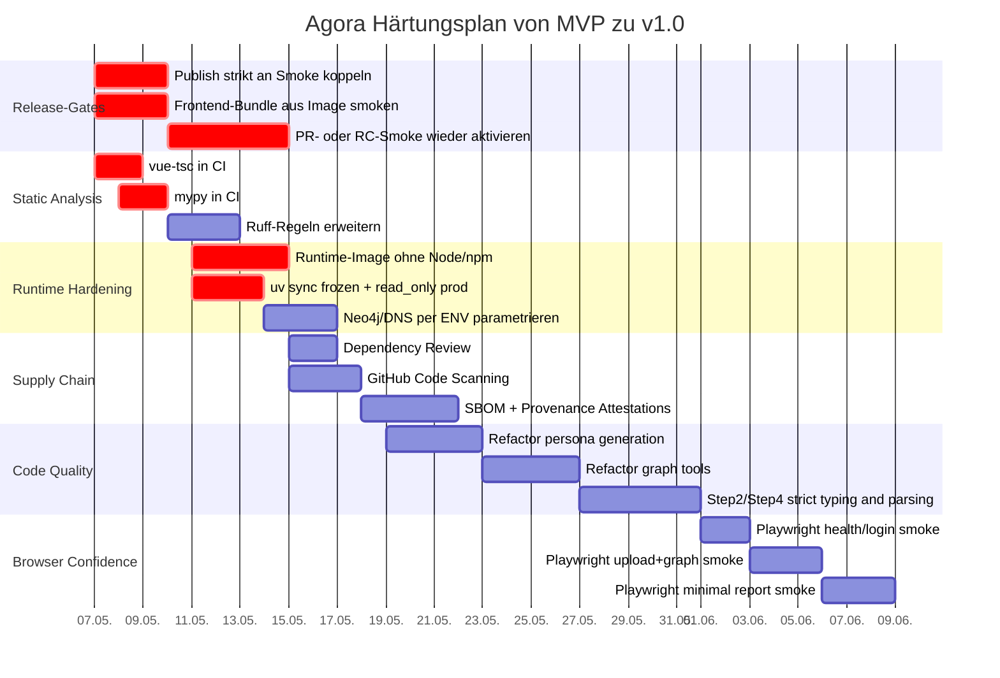

# Agora Deep Research Report

## Executive Summary

Das Repository steht aus meiner Sicht in einer **späten MVP- beziehungsweise Pre-v1.0-Phase**. Das ist kein Rohprototyp mehr: Laut Status sind M9 und M10 abgeschlossen, der aktuelle Fokus liegt auf M11 mit Coverage-Gates, Playwright-Smokes und dem finalen Release-Gate. Gegenüber der letzten Review sind mehrere der damals kritischen Punkte inzwischen sichtbar verbessert worden: Contract-Gates sind jetzt hart, der CVE-Monitor läuft mit Hardstop-Datum, das Single-User-Auth-Zielbild ist per ADR entschieden, zentrale Rate-Limits sind eingebaut, der frühere `report_agent`-Monolith wurde in ein Package zerlegt, und `Step2EnvSetup.vue` wurde massiv verkleinert.

Für **v1.0 im eigenen Scope** — also local-first, single-user, Tailnet/Reverse-Proxy, nicht Public-Internet-SaaS — fehlen aber noch einige harte Engineering-Schritte. Die wichtigsten Blocker sehe ich in vier Bereichen: Erstens ist das Release-Gating noch zu weich, weil der teure Docker-Smoke für PRs bewusst pausiert wurde und Tag-Publishes aktuell auch bei rotem Smoke noch durchlaufen können. Zweitens fehlen echte Typ-Gates in CI; das Frontend nutzt zwar `strict: true`, aber `vue-tsc` läuft in CI nicht, und im Backend ist `mypy` konfiguriert, aber ebenfalls nicht im Gate. Drittens ist der Prod-Containerpfad noch nicht vollständig deterministisch und gehärtet, unter anderem wegen `uv sync --no-dev` ohne `--frozen`, `read_only: false` im Compose-Pfad und eines Smokes, der nicht das exakt im Image enthaltene Frontend-Bundle validiert. Viertens sind wichtige Contract-/Schema-Sicherungen noch manuell gespiegelt statt generiert.

Wenn ich das auf eine klare Produktreife-Aussage reduziere: **produktseitig MVP+, betrieblich noch kein sauberes v1.0-Release**. Die Architektur- und Sicherheitsrichtung ist gut. Was jetzt fehlt, ist weniger Feature-Bau als vielmehr **Release-Engineering, Supply-Chain-Härtung, Typisierung und Testtiefe**.

| Dimension | Urteil | Beleg |
|---|---|---|
| Produktstatus | Späte MVP-/Pre-v1.0-Phase | |
| Fortschritt seit letzter Review | Deutlich sichtbar | |
| CI/CD-Reife | Mittel, aber noch nicht release-hart | |
| Docker/Deploy-Reife | Gut für Dev/Tailnet, noch nicht ganz prod-strikt | |
| Codequalität | Positiver Trend, aber noch ungleichmäßig | |
| Sicherheitslage | Solide Baseline, noch keine vollständige Supply-Chain-Reife | |

## Projektstand und Fortschritt seit der letzten Review

Die wichtigste positive Beobachtung ist: Das Projekt arbeitet erkennbar **nicht mehr an Grundsatz-Hardening, sondern an Reifegrad-Hardening**. `docu/STATUS.md` setzt M9 und M10 als abgeschlossen und benennt für die nächsten Slices explizit Coverage-Gates, Playwright-Smokes und das finale Release-Gate. Das ist genau der typische Übergang von „funktioniert in der Entwicklung“ zu „ist kontrolliert veröffentlichbar“.

Die Fortschritte seit der letzten Review sind konkret. Der Changelog dokumentiert die Aufspaltung von `backend/app/services/report_agent.py` in ein dediziertes Package, die weitere Zerlegung von `Step2EnvSetup.vue` über mehrere Sub-Slices bis auf 667 LOC, die Einführung app-seitiger Rate-Limits auf mehrere missbrauchsrelevante Endpunkte sowie die Pausierung des teuren PR-Docker-Smokes zugunsten von `main`/Tag-/Manual-Runs. Zusammen mit dem akzeptierten Auth-ADR und dem aktiven CVE-Monitor ergibt das ein Bild von systematischer, nicht nur kosmetischer Weiterentwicklung.

Was mir zugleich auffällt: Die **Projektsteuerung ist gut**, aber die **Status-Synchronisierung ist noch nicht sauber genug**. `docu/STATUS.md` bezeichnet sich als „Single Source of Truth“ und sagt, sie werde via `scripts/sync-status.sh` aktualisiert; trotzdem stehen dort für Backend, Frontend und Root noch `0.9.0`, während die tatsächlichen Manifest-Dateien bereits `0.9.1-dev` tragen. Das ist klein im Runtime-Sinne, aber groß im Governance-Sinne: Wenn Status-Dateien nicht exakt stimmen, verlieren sie als Entscheidungsgrundlage an Wert.

Es gibt noch einen zweiten Doku-Drift derselben Art: In `STATUS.md` wird die Backend-Coverage-Schwelle der CI dem `pyproject.toml` zugeschrieben, während `pyproject.toml` explizit erklärt, dass Coverage-Flags gerade **nicht** in `addopts` liegen sollen und stattdessen im CI-Workflow gesetzt werden. Das ist kein Code-Defekt, aber ein Indiz dafür, dass die Dokumentationsautomation noch nachgezogen werden muss.

| Bereich | Seit der letzten Review klar besser | Was daran gut ist | Was noch offen bleibt | Beleg |
|---|---|---|---|---|
| Report-Engine | `report_agent` wurde aus dem Monolithen in ein Package zerlegt | bessere Modulgrenzen, weniger Änderungsangst | Coverage und interne Typisierung bleiben trotzdem Thema | |
| Frontend-Hotspot | `Step2EnvSetup.vue` wurde stark zerlegt | du bist erkennbar vom Monster-Component-Muster weggegangen | zentraler Wizard ist immer noch JS statt TS | |
| Auth-Modell | Single-User-v1 ist entschieden und dokumentiert | Scope-klarheit statt halbgares Multi-User-Versprechen | bewusst kein Public-Internet-/Multi-User-v1 | |
| Security-Watch | CVE-Monitor + Risk-Register + Hardstop sind da | gutes Engineering-Pattern für bewusste Risikoakzeptanz | neun Ignore-Fälle sind noch offen | |
| CI-Reife | Coverage-Gates und Contract-Gates sind aktiv | Regressionen werden früher sichtbar | Typ-Gates und Browser-Smokes fehlen | |
| Release-Gating | Docker-Smoke ist funktional vorhanden | prinzipiell richtige Reihenfolge Build → Smoke → Publish | PR-Smoke pausiert, Tag-Publish derzeit zu lax | |

## CI/CD und GitHub Actions

Die im Repository inspizierten Workflow-Dateien zeigen eine klare Struktur über Actions: `ci.yml` für Sicherheits-, Backend- und Frontend-Prüfungen, `contract-gates.yml` für Schema-/Contract-/Evidence-/Voice-Gates, `cve-monitor.yml` für das wöchentliche Watchlist-Audit und `docker-image.yml` für Image-Build, Reverse-Proxy-Smoke und Publish. Dazu kommt ein ordentliches `dependabot.yml` für Python, npm, Docker und GitHub Actions. Das ist für ein Einzelmaintainer-/MVP-Repo bereits ein überdurchschnittlich strukturierter Stand.

`ci.yml` ist inhaltlich sinnvoll aufgebaut. Gut sind die Trennung nach `security`, `backend` und `frontend`, der Einsatz von `pip-audit`, `npm audit`, Gitleaks, Coverage-Artefakten und reproduzierbaren Installpfaden mit `uv` beziehungsweise `npm ci`. Weniger gut ist der statische Analyseumfang: Im Backend ist `mypy` zwar konfiguriert, aber nicht Teil der CI; im Frontend existiert mit `vue-tsc --noEmit` ebenfalls ein Typ-Check-Script, aber die CI ruft nur `npm run lint`, `npm run test:coverage` und `npm run build` auf. Dazu kommt, dass ESLint in `.vue`-Dateien bewusst **keinen** TypeScript-Parser verwendet; die komplette TS-Korrektheit hängt also an `vue-tsc`, das derzeit gar nicht gate’t. Praktisch heißt das: Du hast Linting, aber noch kein hartes **Type-Gating**.

`contract-gates.yml` ist einer der stärksten Teile des Repos. Der Workflow verhindert Schema-Drift per JSON-Schema-Dump aus Pydantic, fährt dedizierte Contract-Tests, erzwingt den Evidence-Quality-Gate gegen Good-Case-Fixtures, führt einen Frontend-Zod-Mirror-Test aus und hat zusätzlich einen Voice-Lint. Das ist deutlich reifer als das, was in vielen MVP-Repos üblich ist. Die Schwäche liegt nicht im Gate-Prinzip, sondern im Spiegelungsmodell: `frontend/src/contracts/reportContract.ts` sagt selbst explizit, dass der Zod-Vertrag **hand-gepflegt** ist und „1:1“ zum JSON-Schema gehalten werden soll. Die aktuelle Sicherung ist also „manuell, aber getestet“, nicht „generiert und dadurch strukturell driftarm“. Das reduziert das Risiko stark, eliminiert es aber nicht.

Am kritischsten sehe ich `docker-image.yml`. Positiv ist die Grundidee: erst bauen, dann Smoke, dann publizieren. Negativ ist die aktuelle Publikationslogik: Der PR-Smoke ist laut Status bewusst pausiert, und der `publish`-Job darf bei Tags auch dann laufen, wenn `prod-proxy-smoke` fehlgeschlagen ist, weil die Bedingung `success() || github.ref_type == 'tag'` gesetzt ist. Für `main` ist das noch akzeptabel; für Release-Tags ist es zu weich. Zusätzlich vergibt der Workflow `packages: write` bereits global auf Workflow-Ebene, obwohl nur der Publish-Job diese Berechtigung braucht. GitHub empfiehlt für Actions ausdrücklich Least Privilege und das Pinnen von Drittanbieter-Actions auf volle Commit-SHAs; im Repo sind die Actions derzeit auf bewegliche Major-Tags wie `@v6`, `@v5` und `@v4` referenziert. Das ist üblich, aber nicht die härteste Variante.

`cve-monitor.yml` ist konzeptionell sauber. Besonders gut finde ich, dass es zwischen aktuell tolerierter Baseline und künftigem Hardstop unterscheidet, die Findings im Summary dokumentiert und das Risk Register als organisatorisches Gegenstück mitführt. Das ist erwachsenes Risiko-Engineering statt Wegignorieren. Die Kehrseite ist offensichtlich: Es bleiben aktuell neun bewusst ignorierte CVEs, und der Hardstop ist damit kein „nice to have“, sondern eine echte Frist für Upstream-Entscheidungen.

### Bewertung der Workflows

| Workflow | Aktueller Zustand | Hauptproblem | Empfehlung | Beleg |
|---|---|---|---|---|
| `ci.yml` | Security, Backend, Frontend sauber getrennt; Coverage-Artefakte vorhanden | kein `mypy`, kein `vue-tsc`, Frontend-Lint ohne TS-Parsing in Vue-SFCs | `mypy` und `vue-tsc --noEmit` als Pflicht-Jobs ergänzen; optional Root-`check` vereinheitlichen | |
| `contract-gates.yml` | stark: Schema-Diff, Contract-Tests, Evidence-Gate, Voice-Lint | Frontend-Zod bleibt Handspiegel | Zod/TS-Typen aus `schemas/*.json` generieren statt nur manuell spiegeln | |
| `cve-monitor.yml` | vorbildlich dokumentierter Watchlist-/Hardstop-Flow | Baseline noch nicht klein genug | Hardstop beibehalten, aber parallel Exit-Strategie für `camel-oasis`/`camel-ai` vorbereiten | |
| `docker-image.yml` | Build → Smoke → Publish ist richtig gedacht | Tag-Publish kann fehlenden Smoke übergehen; PR-Smoke pausiert; globale `packages: write`-Permission | Publish nur nach grünem Smoke; Job-Level-Permissions; `latest` nur auf Default-Branch; PR-Smoke mindestens für RCs wieder aktivieren | |
| Actions allgemein | Dependabot für Actions ist vorhanden | Actions nicht auf SHA gepinnt | SHA-Pinning mit Kommentar auf Tag/Release, damit Dependabot weiter aktualisieren kann | |
| Supply Chain allgemein | Audits vorhanden | keine Dependency-Review-Action, kein Code Scanning, keine Attestations/SBOM im Workflow | Dependency Review, GitHub Code Scanning und Build-Provenance/SBOM ergänzen | |

### Kritischer Workflow-Fix

Der wichtigste operative Fix ist: **Image-Publish nur nach grünem Smoke** und **Permissions nur jobweise** vergeben.

```yaml
name: Build and push Docker image

permissions:
  contents: read

on:
  push:
    branches: [main]
    tags: ["v*"]
  workflow_dispatch:
    inputs:
      force_publish:
        description: "Publish trotz rotem Smoke explizit erlauben"
        type: boolean
        default: false

jobs:
  build-only:
    permissions:
      contents: read

  prod-proxy-smoke:
    permissions:
      contents: read

  publish:
    needs: [prod-proxy-smoke]
    if: needs.prod-proxy-smoke.result == 'success' || (github.event_name == 'workflow_dispatch' && inputs.force_publish)
    permissions:
      contents: read
      packages: write
      id-token: write
      attestations: write
    steps:
      - uses: actions/checkout@<FULL_SHA> # pinned release
      - uses: docker/setup-buildx-action@<FULL_SHA> # pinned release
      - uses: docker/login-action@<FULL_SHA> # pinned release
      - uses: docker/build-push-action@<FULL_SHA> # pinned release
      - uses: actions/attest-build-provenance@<FULL_SHA> # pinned release
```

Diese Änderung beseitigt nicht nur das Tag-Bypass-Problem, sondern schafft zugleich die Grundlage für Provenance/SBOM im selben Pfad. GitHub empfiehlt sowohl Least Privilege beim `GITHUB_TOKEN` als auch das Pinnen von Third-Party-Actions auf volle Commit-SHAs.

## Docker, Compose und Deployment-Readiness

Im Deployment-Pfad ist das Repo insgesamt in guter Richtung unterwegs. Positiv sind der Multi-Stage-Aufbau im-Image, ein klarer Unterschied zwischen Dev- und Prod-Target, das nicht-root Laufzeitmodell mit User `agora`, Healthchecks, `no-new-privileges`, `cap_drop: ALL`, tmpfs-Mounts sowie ein eigener Nginx-Sidecar für den Reverse-Proxy. Auch die Tatsache, dass der v1-Auth-Scope bewusst auf Single-User/local-first begrenzt wurde, ist hier eher Stärke als Schwäche, weil der Betriebsmodus damit ehrlich formuliert ist.

Trotzdem hat der Prod-Pfad noch echte Lücken. Die größte davon ist die Runtime-Basis: `Dockerfile` installiert `nodejs`, `npm` und `curl` bereits im gemeinsamen `base`-Stage, und der finale `prod`-Stage erbt genau diesen Base-Stage. Das heißt: Das Laufzeitimage trägt Node/npm mit, obwohl es sie zur Laufzeit gar nicht braucht. Das vergrößert Image, Angriffsfläche und Update-Last unnötig. Dazu kommt, dass der Prod-Stage `uv sync --no-dev` **ohne** `--frozen` ausführt; das schwächt die Reproduzierbarkeit gegenüber dem sonst sauber gepflegten Lockfile-Modell.

Die zweite signifikante Lücke ist die tatsächliche Root-FS-Härtung. In `docker-compose.yml` steht für `agora` explizit `read_only: false`, und `docker-compose.prod.yml` überschreibt das nicht. Das ist deswegen relevant, weil mehrere Kommentare im Compose-File und in den Environment-Variablen bereits von einer „read-only rootfs“-Annahme sprechen. Faktisch ist der Containerpfad aktuell also **weniger hart** als die Kommentare suggerieren. Für einen lokalen MVP ist das nicht dramatisch; für v1.0 sollte der Prod-Pfad hier konsistent werden.

Die dritte und für mich wichtigste Deployment-Beobachtung betrifft den Smoke-Test. Im Docker-Workflow wird das Frontend-Bundle im Smoke-Job **neu auf dem Runner gebaut** und dann per Host-Bind-Mount in den Nginx-Container gereicht, weil `deploy/compose/docker-compose.prod-with-proxy.yml` genau diesen Hostpfad mountet. Das bedeutet: Der Smoke validiert das Backend-Image, aber **nicht das exakt im gebauten Prod-Image enthaltene Frontend-Bundle**. Für ein Release-Gate ist das ein struktureller Mismatch. Wenn Build-Toolchain oder Bundling-Inputs divergieren, kann der Smoke grün sein, obwohl das tatsächliche Image-Artefakt ein anderes Frontend enthält.

Ein weiterer praxisrelevanter Punkt für ein budget-sensibles local-first Projekt: `docker-compose.yml` hardcodiert für die App öffentliche DNS-Resolver und setzt für einen Heap von 2 GB plus 4 GB Pagecache. Das ist auf kleinen VPS- oder Heimserver-Setups schnell zu aggressiv und kann lokale Resolver-/Split-DNS-Szenarien beschädigen. Wenn du Tailnet-, Homelab- oder kleine VPS-Deployments ernst meinst, sollten DNS und Memory klar per Environment steuerbar sein statt im Repo starr zu stehen. Auch der compose-private-Pfad ist okay, aber eher implizit als explizit gehärtet.

### Docker- und Deployment-Vergleich

| Thema | Aktuell | Risiko | Empfehlung | Beleg |
|---|---|---|---|---|
| Prod-Image-Basis | `prod` erbt Node/npm/curl aus `base` | unnötige Größe und Angriffsfläche | `python-runtime` separat; Node nur in `dev` und `prod-builder` | |
| Lockfile-Determinismus | `uv sync --no-dev` ohne `--frozen` im Prod-Stage | weniger reproduzierbare Builds | `uv sync --no-dev --frozen` | |
| Root-FS-Härtung | `read_only: false`, Prod-Override ändert nichts | schreibbares Laufzeit-Rootfs | Prod-Compose auf `read_only: true`, nur Schreibpfade via tmpfs/Volumes | |
| Smoke-Artefakt | Frontend wird im Runner neu gebaut | Smoke validiert nicht das exakte Image-Artefakt | `dist` aus gebautem Image extrahieren oder eigenes proxy-smoke-Image bauen | |
| DNS | harte Google-DNS-Einträge | Probleme bei Home-/Tailnet-/Corporate-DNS | DNS standardmäßig nicht überschreiben | |
| Neo4j-Ressourcen | Heap/Pagecache fest 512m/2g/4g | zu schwer für kleine Systeme | Env-gesteuerte Memory-Defaults | |
| TLS-Story | Nginx auf `:80`, TLS extern vorausgesetzt | okay, aber nur mit sauberer Doku/Proxy | v1-Doku klar auf „TLS davor“ und Supported Topologies begrenzen | |
| Healthchecks | vorhanden für App, Nginx, Neo4j, Redis | gut | beibehalten; zusätzlich Browser-E2E-Smoke ergänzen | |

### Kritischer Smoke-Fix

Wenn du den bestehenden Compose-/Nginx-Sidecar-Weg behalten willst, würde ich im Smoke **nicht neu builden**, sondern das Bundle direkt aus dem bereits gebauten Image extrahieren:

```yaml
- name: Frontend-Bundle aus gebautem Image extrahieren
  run: |
    rm -rf frontend/dist
    mkdir -p frontend
    cid=$(docker create agora-agora:ci-${{ github.sha }})
    docker cp "$cid:/app/frontend/dist" ./frontend/dist
    docker rm "$cid"
```

Damit prüft der Reverse-Proxy-Smoke endlich dasselbe Frontend-Artefakt, das im Prod-Image steckt. Das ist aus meiner Sicht der sauberste kleine Fix mit hohem Nutzen.

## Contracts, Tests und Codequalität

Die stärkste Codequalitäts-Seite des Repos ist die **Boundary-Disziplin**. Pydantic-Verträge werden nach `schemas/` gedumpt, Contract-Tests gegen diese Modelle sind da, der Frontend-Zod-Vertrag enthält nicht nur Oberflächenformate, sondern auch inhaltliche Regeln wie verbotene Evidence-Typen oder Mindestanforderungen für verifizierte Claims, und der Evidence-Quality-Gate ist als eigener Workflow-Hardstop ausgeprägt. Das ist für ein Projekt dieser Größe klar über dem typischen MVP-Niveau.

Die Test-/Coverage-Lage ist transparent, aber noch nicht stark genug, um von „v1.0-reif“ zu sprechen. Backend-Gesamtcoverage liegt laut Status bei rund 55 %, Frontend-Branches bei rund 26,7 %; die aktiven Gates von 53 % beziehungsweise 24 % sind explizit als Startwerte gesetzt. Die schwächsten Backend-Hotspots sind `app/services/simulation_runner.py` mit 22 % und `app/services/graph_tools.py` mit 19 %; im Frontend fallen mehrere Views sowie `Step2EnvSetup.vue` branch-seitig stark ab. Das ist kein Alarmzeichen, aber ein eindeutiger Hinweis darauf, dass die aktuellen Gates **Mindestschutz** sind, nicht Vertrauensniveau.

Bei der statischen Analyse ist die Lage gemischt. Im Backend ist `ruff` auf `E` und `F` begrenzt, `mypy` läuft nicht in CI und ist mit `ignore_missing_imports = true` und `follow_imports = "silent"` relativ weich konfiguriert. Im Frontend ist `tsconfig.json` zwar auf `strict: true` gesetzt, erlaubt aber gleichzeitig JavaScript-Dateien mit `allowJs: true` und prüft sie nicht (`checkJs: false`). Dazu kommt: `frontend/src/components/Step2EnvSetup.vue` nutzt immer noch schlicht `<script setup>` statt `<script setup lang="ts">`. Das heißt: Die Architektur bewegt sich in Richtung Type Safety, aber die Typ-Sicherheit ist **noch keine harte Betriebseigenschaft**.

`Step4Report.vue` zeigt einen ähnlichen Zwischenzustand. Positiv: `ReportSchema`, `ReportOutlineSchema`, `EvidenceMapSchema` und `parseReportContract()` werden verwendet, und Schemafehler werden sichtbar gemacht. Nicht ganz so positiv: Die Live-Status-Payload hält `sections` weiterhin als loses `Record<string, unknown>`, und beim Rendern wird recht tolerant aus den Objekten `content` herausgezogen. Strikte Guardrails sind also vorhanden, aber noch nicht komplett auf allen Live-Pfaden durchgezogen. Damit würde ich die Claim „strict Zod überall“ derzeit noch als **nahe dran, aber nicht vollständig** bewerten.

### Tests und statische Analyse im Vergleich

| Bereich | Aktuell | Warum das noch nicht reicht | Empfehlung | Beleg |
|---|---|---|---|---|
| Backend-Coverage | 55 %, Gate 53 % | guter Start, aber Hotspots noch sehr dünn | Integrationsnahe Tests für `graph_tools`/`simulation_runner`; Gate monatlich anheben wie geplant | |
| Frontend-Coverage | Branches 26,70 %, Gate 24 % | Browser-/Canvas-/View-Pfade fehlen fast komplett | Playwright-Smokes + gezielte View-Tests; erst dann Schwelle hochziehen | |
| Backend-Lint | Ruff aktiv, aber nur `E/F` | wenig Semantik-/Maintainability-Regeln | `B`, `I`, `UP`, `SIM`, optional `C90` ergänzen | |
| Backend-Typisierung | `mypy` konfiguriert, nicht in CI | keine harte Regression-Sperre | `mypy` als eigener CI-Job | |
| Frontend-Lint | ESLint ignoriert TS-Syntaxprüfung in Vue-SFCs | Template-Regeln ja, Typregeln nein | `vue-tsc --noEmit` verpflichtend in CI; mittelfristig mehr `lang="ts"`-SFCs | |
| Contract-Drift | gut abgesichert, aber manuell gespiegelt | Sample-basierter Schutz statt generierter Spiegel | Zod/TS aus JSON-Schema generieren | |

## Refactoring und Clean-Code-Empfehlungen

Der generelle Trend ist positiv: Das Repo refaktoriert bereits **in die richtige Richtung**. Die Changelog-Einträge zeigen, dass große Blöcke tatsächlich geschnitten werden, nicht nur kommentiert. Gerade die Aufteilung des Report-Agenten und die Reduktion des Step-2-Wizards sind gute Beispiele für sinnvolles Brownfield-Refactoring. Die verbleibenden Probleme liegen nicht in einer „falschen Architektur“, sondern in einigen **ausgefransten Hotspots**, die noch zu viele Verantwortungen gleichzeitig tragen.

Am klarsten sieht man das im Backend bei `OasisProfileGenerator._generate_profile_with_llm()`. Diese Funktion baut Prompts, ruft das Modell, macht Retry/Backoff, repariert JSON, validiert Pflichtfelder, normalisiert `voice_register` und fällt am Ende auf Rule-based-Generierung zurück. Das ist fachlich nachvollziehbar, aber clean-code-seitig zu viel Verantwortung in einem Block. Hier würde ich nicht „komplett neu schreiben“, sondern ganz klassisch nach Verantwortungen trennen: Promptaufbau, ein einzelner LLM-Request, Parsing/Reparatur, Normalisierung/Validation und Retry-Orchestrierung. Genau dadurch werden Fehlerbilder besser beobachtbar und Tests viel kleiner.

`GraphToolsService` ist der zweite Backend-Hotspot. Schon in `search_graph()` und `_local_search()` sieht man Duplikate bei Edge-/Node-Mapping, breite `except Exception`-Fänge und ein Mischmasch aus Storage-Adaption, Ranking, DTO-Erzeugung und Textformatierung. Dazu kommt, dass dieselbe Datei Suche, Panoramasicht, Interviews und mehrere Ergebnis-Dataclasses führt. Das schreit nicht nach einem Big-Bang-Umbau, aber nach einer **Datei-Level-Aufteilung** in Suchkern, Mapper/Formatter und Interview-Logik. Die sehr niedrige Coverage in diesem Bereich stützt diese Einschätzung zusätzlich.

Im Frontend ist `Step2EnvSetup.vue` trotz des guten Fortschritts noch ein Rest-Hotspot. Die Datei ist kleiner geworden, orchestriert aber weiterhin sehr viele Composables, Zustandspfade und UI-Aktionen und bleibt ungetypt im Script-Block. Meine Empfehlung wäre hier kein weiterer „mikroskopischer“ Split, sondern ein letzter struktureller Schritt: ein dediziertes `useStep2Wizard.ts` für den Orchestrationszustand und die Konvertierung des Containers auf `lang="ts"`. Danach wären die einzelnen Panels und Modals wirklich nur noch Render-Schalen.

`Step4Report.vue` ist in derselben Kategorie, nur etwas weiter: typisiert, aber noch mit einigen „half strict“-Punkten im Live-Status-Pfad und sehr viel UI-, Export-, Polling- und Parsinglogik in einer Datei. Ich würde hier `useReportDocument`, `useReportExports` und `normalizeReportStatusPayload()` als klare Schnitte sehen. Das bringt sofort Lesbarkeit, ohne die View neu zu denken.

### Konkrete Refactoring-Empfehlungen

| Priorität | Datei/Funktion | Problem | Konkrete Änderung | Aufwand |
|---|---|---|---|---|
| P0 | `backend/app/services/oasis_profile_generator.py::_generate_profile_with_llm` | zu viele Verantwortungen in einer Funktion | in `build_prompt()`, `call_llm_once()`, `parse_or_repair_json()`, `normalize_profile()` und `retry_persona_generation()` schneiden | M |
| P0 | `backend/app/services/graph_tools.py::{search_graph,_local_search}` | DTO-Mapping, Search-Fallback und Formatierung vermischt; breite Exceptions | `search_service.py`, `mappers.py`, `interview_service.py`; nur Storage-/Transportfehler fallen auf Fallback zurück | M |
| P1 | `frontend/src/components/Step2EnvSetup.vue` | noch Orchestrator-Hotspot; Script nicht getypt | `<script setup lang="ts">`, `useStep2Wizard.ts`, Props/Emits strikt typisieren | M |
| P1 | `frontend/src/components/Step4Report.vue` | Live-Status normalisiert nicht strikt genug; Export/Parsing/Polling in einer Datei | `normalizeReportStatusPayload()`, `useReportExports.ts`, `useReportPolling.ts` | S–M |
| P0 | `Dockerfile` | unnötige Runtime-Abhängigkeiten im finalen Image | separater Runtime-Stage ohne Node/npm; `--frozen` im Prod-Sync | S |
| P1 | `docu/STATUS.md` + Sync-Skript | SSoT-Drift bei Versionen/Gate-Beschreibung | Sync-Skript auf Manifest-Versionen und CI-Quellen härten | XS |
| P1 | Frontend Contracts | manuell gepflegte Spiegelung | Zod/TS aus `schemas/*.json` generieren; manuelle `superRefine`-Regeln separat addieren | M |

### Beispiel-Refactor für `_generate_profile_with_llm`

Der folgende Ausschnitt zeigt die Richtung, nicht einen Komplettumbau. Ziel ist: weniger Nesting, kleinere Testflächen, klarere Fehlerarten.

```python
def _generate_profile_with_llm(
    self,
    entity_name: str,
    entity_type: str,
    entity_summary: str,
    entity_attributes: dict[str, Any],
    context: str,
) -> dict[str, Any]:
    is_individual = self._is_individual_entity(entity_type)
    prompt = self._compose_persona_prompt(
        is_individual=is_individual,
        entity_name=entity_name,
        entity_type=entity_type,
        entity_summary=entity_summary,
        entity_attributes=entity_attributes,
        context=context,
    )

    last_error: Exception | None = None
    for attempt in range(3):
        try:
            raw = self._call_persona_llm_once(
                prompt=prompt,
                is_individual=is_individual,
                attempt=attempt,
            )
            parsed = self._parse_persona_payload(
                raw=raw,
                entity_name=entity_name,
                entity_type=entity_type,
                entity_summary=entity_summary,
            )
            return self._normalize_and_validate_persona(parsed)
        except RetryablePersonaError as exc:
            last_error = exc
            self._sleep_backoff(attempt)
        except FatalPersonaError:
            raise

    logger.warning(
        "LLM persona generation failed after retries: %s; fallback to rule-based",
        last_error,
    )
    return self._generate_profile_rule_based(
        entity_name, entity_type, entity_summary, entity_attributes
    )
```

Dazu gehören dann kleine Helfer wie `_compose_persona_prompt()`, `_call_persona_llm_once()`, `_parse_persona_payload()` und `_normalize_and_validate_persona()`. Damit werden JSON-Reparatur, Metadaten-Normalisierung und Retry-Logik separat testbar. Genau diese Art von kleinem chirurgischem Refactor bringt in Brownfield-Repos den besten Nutzen pro Stunde.

## Security-Posture

Die Sicherheitsbasis des Repos ist im Vergleich zu vielen lokalen KI-/Graph-Projekten bereits gut. Du hast einen klar dokumentierten Single-User-v1-Scope, Token-Auth im Non-Debug-Betrieb, Signed Tickets für URL-gebundene Pfade, Query-Token-Blockierung in Prod, Reverse-Proxy-Härtung, mehrere app-seitige Rate-Limits, Gitleaks im CI, eine GitGuardian-Konfiguration mit kommentierten Test-Ignores sowie Dependabot für vier Ökosysteme. Zusammen mit dem Risk Register und dem CVE-Monitor zeigt das, dass Security hier nicht nur „nachträglich draufgeklebt“ wurde.

Trotzdem ist die Security-Story noch nicht vollständig releasefest. Das größte offene Thema ist die Supply Chain. In den inspizierten Workflows sehe ich weder GitHub Code Scanning/CodeQL noch eine Dependency-Review-Action für PRs noch SBOM-/Attestation-Schritte im Image-Publish. GitHub stellt genau diese Bausteine inzwischen offiziell bereit: Code Scanning für öffentliche Repositories, Dependency Review auf PR-Ebene sowie Artifact Attestations inklusive SBOM-/Provenance-Pfad. Da das Repo öffentlich ist und ohnehin Images publiziert, ist das kein Nice-to-have mehr, sondern der naheliegende nächste Reifegrad.

Hinzu kommt, dass GitHub für Actions zwei Best Practices klar benennt, die im Repo aktuell noch nicht umgesetzt sind: **volle Commit-SHA-Pins für Third-Party-Actions** und **möglichst restriktive Token-Rechte pro Job**. Gerade weil dein Docker-Pfad mit externen Marketplace-Actions arbeitet und gleichzeitig Registry-Rechte vergibt, würde ich diesen Punkt als P0.5 bis P1 ansehen. Die aktuelle Konfiguration ist nicht schlecht, aber eben auch nicht die härteste sichere Variante.

Die neun ignorierten CVEs würde ich nicht als unmittelbaren Architekturfehler werten, wohl aber als reale Restschuld. Positiv ist, dass sie transparent mit Ownern, Frist und Upstream-Blockern dokumentiert sind. Negativ ist, dass der Hardstop am 2026-07-30 schnell näher kommt und vor allem `camel-oasis`/`camel-ai` als transitive Zwangsabnehmer derzeit viel zu viel Sicherheits- und Upgrade-Risiko zentralisieren. Mittelfristig wirst du entweder Upstream-Entspannung sehen, oder du musst Soft-Fork/Vendoring/Replacement wirklich vorbereiten, nicht nur dokumentieren.

## MVP-vs-v1.0, Prioritäten und Roadmap

Im eigenen Scope des Projekts würde ich den aktuellen Stand so einordnen: **MVP ja, v1.0 noch nicht ganz**. Wichtig ist dabei dein eigener Scope: Laut ADR-0001 ist v1 bewusst **single-user-only**; Multi-User, Rollenmodell und Public-Internet-Betrieb gehören also gerade **nicht** zu den v1-Abnahmekriterien. Deshalb ist „kein Login-System“ hier kein v1-Blocker. Blocker sind vielmehr die harten Betriebs- und Release-Themen, die `STATUS.md` selbst schon als nächste Punkte nennt: Coverage-Anhebung, Playwright-Smokes und das finale Release-Gate.

### MVP- und v1.0-Checkliste

| Kriterium | Stand | Einschätzung | Beleg |
|---|---|---|---|
| Local-first / Single-User-Scope ist klar definiert | Ja | gut genug für MVP und v1-Scope | |
| Kern-Deploypfad mit Reverse Proxy, Healthchecks und Smoke existiert | Ja | stark für MVP, noch nicht ganz release-strikt | |
| Contract-/Schema-Gates vorhanden | Ja | klarer Pluspunkt | |
| Typ-Gates in CI vollständig | Nein | v1-Blocker | |
| Browser-/E2E-Smokes vorhanden | Nein | v1-Blocker | |
| Docker-Publish ist strikt release-gated | Nein | v1-Blocker | |
| Prod-Image ist minimal und deterministisch | Teilweise | P0/P1 vor v1.0 | |
| Supply-Chain-Nachweise, Code Scanning, PR-Dependency-Review | Nein | klarer v1-Härtungspunkt | |
| Status-/Governance-Doku ist voll synchron | Nein | P1, weil Entscheidungsgrundlage | |

### Priorisierte P0- und P1-Aufgaben

| Priorität | Aufgabe | Warum jetzt | Zielbild |
|---|---|---|---|
| P0 | Docker-Publish strikt an Smoke koppeln | verhindert kaputte Releases | kein Auto-Publish bei rotem Smoke |
| P0 | `vue-tsc` + `mypy` in CI aufnehmen | schließt aktuelle Blindstelle | echte Type-Gates |
| P0 | Prod-Image härten: Runtime ohne Node, `--frozen`, `read_only: true` | höherer Sicherheits- und Release-Nutzen pro Aufwand | deterministischer, kleinerer, härterer Runtime-Pfad |
| P0 | Frontend-Smoke soll das echte Bundle aus dem Image prüfen | schließt Artefakt-Lücke im Release-Gate | Smoke validiert reale Release-Artefakte |
| P1 | Dependency Review + Code Scanning + SBOM/Attestations ergänzen | hebt Supply-Chain-Reife deutlich an | nachvollziehbare und prüfbare Releases |
| P1 | Handgespiegelte Zod-Verträge generieren | reduziert Drift-Risiko | Backend-Schema → generierter Frontend-Vertrag |
| P1 | Playwright-Smokes für 3 Kernflüsse | schließt größte Frontend-Lücke | browsernahe Confidence statt nur jsdom |
| P1 | Hotspot-Refactors in `oasis_profile_generator`, `graph_tools`, `Step2`, `Step4` | macht künftige Änderungen billiger | weniger monolithische Restflächen |

### Roadmap

Die folgende Roadmap ist bewusst kurz und umsetzungsnah gehalten. Sie folgt dem, was das Repo selbst bereits als nächste Reifestufe markiert, priorisiert aber das Release-Engineering noch etwas stärker.



Wenn du diese Schiene durchziehst, bist du aus meiner Sicht nicht mehr im „MVP mit guter Richtung“, sondern in einem **plausibel releasebaren v1.0 für den definierten Single-User-/Tailnet-Scope**. Die große Stärke ist: Viel davon ist kein Neubau mehr, sondern kontrolliertes Nachhärten auf bereits gelegter Architektur.

### Annahmen und geprüfte Pfade

**Annahmen**

- Die Bewertung der „Gate-Stärke“ bezieht sich auf die im Repo sichtbaren Workflow-Dateien. Ob Branch-Protection, Rulesets oder Required Checks im Repository-Setting exakt passend gesetzt sind, ist aus den inspizierten Dateien allein nicht sichtbar.
- Der Vergleich „seit der letzten Review“ bezieht sich auf die Themen und Defizite, die in diesem Gespräch bereits angesprochen wurden, plus die in `CHANGELOG.md` und `STATUS.md` dokumentierten Fortschritte.
- Einige Projektartefakte wirken leicht asynchron; insbesondere `STATUS.md` scheint nicht in jedem Detail mit den wirklichen Manifest-Dateien mitzuhalten. Das werte ich als Governance-/Sync-Thema, nicht als Produktdefekt.

**Geprüfte Pfade**

- CI/CD und Automation: `.github/workflows/ci.yml`, `.github/workflows/contract-gates.yml`, `.github/workflows/cve-monitor.yml`, `.github/workflows/docker-image.yml`, `.github/dependabot.yml`, `.gitguardian.yaml`.
- Container, Compose, Deployment: `Dockerfile`, `docker-compose.yml`, `docker-compose.prod.yml`, `docker-compose.override.yml`, `deploy/compose/docker-compose.prod-with-proxy.yml`, `deploy/nginx/agora.conf`, `scripts/verify-deploy.sh`.
- Verträge, Tests, Analyseregeln: `backend/pyproject.toml`, `frontend/package.json`, `package.json`, `frontend/vite.config.js`, `frontend/eslint.config.js`, `frontend/tsconfig.json`, `backend/app/contracts/dump_schemas.py`, `frontend/src/contracts/reportContract.ts`, `backend/tests/contracts/test_branch_comparison.py`.
- Code-Hotspots und Projektdoku: `backend/app/services/oasis_profile_generator.py`, `backend/app/services/graph_tools.py`, `backend/app/api/status.py`, `frontend/src/components/Step2EnvSetup.vue`, `frontend/src/components/Step4Report.vue`, `frontend/src/composables/usePolling.ts`, `docu/STATUS.md`, `docu/dependency-risk-register.md`, `docu/decisions/0001-auth-model.md`, `docu/security-hardening.md`, `CHANGELOG.md`, `docu/refactoring-backlog-priorisiert.md`.
