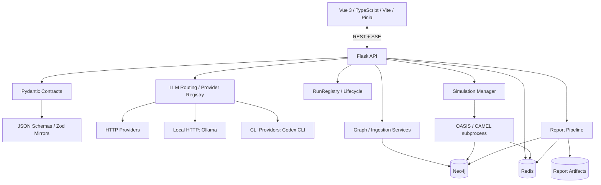

# Agora — Architektur

**Stand:** 08.09.2026  
**Geprüfte Main-Baseline:** `0c47737f`  
**Produktversion:** `0.9.5`

Dieses Dokument beschreibt die **aktuelle produktive Architektur** und ihre noch offenen Grenzen. Der frühere April-2026-Zielentwurf mit geplanten Modulnamen ist als Migrationsgeschichte überholt; der tatsächliche Istzustand steht hier, Detailentscheidungen in [`decisions/`](decisions/) und der verifizierte Projektstatus in [`STATUS.md`](STATUS.md).

---

## 1. Architekturprinzipien

### Contracts first

API-, Run-, Report- und Routing-Grenzen werden in Pydantic-v2-Modellen definiert. JSON-Schemas und Zod-Spiegel verhindern, dass Backend und Frontend unbemerkt auseinanderlaufen.

Kanonische Pfade:

- Backend-Verträge: `backend/app/contracts/`
- generierte Schemas: `schemas/`
- Frontend-Spiegel: `frontend/src/contracts/`
- Schema-Gate: `uv run python -m app.contracts.dump_schemas --check`

### Single Source of Truth je Domäne

Eine Konfiguration oder ein Zustand soll genau eine führende Quelle besitzen. Legacy-/Bootstrap-Fallbacks dürfen eine bereits aufgelöste Route nicht überschreiben.

Bekannte Ausnahme: Die Embedding-Runtime erfüllt dieses Prinzip noch nicht vollständig (#1417).

### Dünne API, fachliche Services

Flask-Routen validieren Auth, Requests und Responses und delegieren an Services. Persistenz, LLM-Transport, Reportlogik, Simulation und Graphzugriff werden außerhalb der Route gekapselt.

### Ehrliche Degradation

Fehler oder unvollständige Ergebnisse werden nicht auf `completed` normalisiert. Beispiele:

- Report mit fehlenden Sections → `INCOMPLETE`
- Nutzer-Stop → `stopped/user_stop`
- verwaister Simulationsprozess → `failed/process_restart`
- ungültige Evidence → `evidence_omitted` bzw. Contract-Fehler statt scheinbar geprüfter Evidence

### Single-User vor Plattformausbau

Die aktuelle Architektur ist für einen kontrollierten Single-User-Betrieb ausgelegt. Multi-User, Kubernetes, Federation und allgemeine Plugins sind bewusst kein Vor-1.0-Ziel.

---

## 2. Systemübersicht



---

## 3. Frontend

### Produktive Oberfläche

Die Vue-v4-Routen sind die einzige produktive Oberfläche. Historische Parallelansichten sind entfernt, archiviert oder Redirects. Die gemeinsame Shell liegt unter `frontend/src/components/v4/`.

Technik:

- Vue 3
- TypeScript
- Vite
- Pinia
- Zod
- zentrale API-Adapter und Error-Envelopes

### Contract-Grenze

Frontend-Code soll API-Payloads nicht per bloßer TypeScript-Assertion „glauben“, wenn ein Zod-Vertrag existiert. Besonders Evidence-/Report-Pfade validieren die Response an der Wire-Grenze.

### Live-State

SSE wird für geeignete Live-Sichten genutzt; andere Artefakte werden weiterhin gezielt per HTTP geladen. Redis ist Transport für Live-State, aber **keine persistente Jobqueue**.

---

## 4. Flask-Backend

### Application Factory

Das Backend nutzt eine Flask Application Factory mit zentraler Konfiguration, Blueprint-Registrierung und Serviceverdrahtung.

### API-Schicht

`backend/app/api/` ist nach Domänen geschnitten, unter anderem:

- Graph/Ingestion
- Simulation Lifecycle/Prepare/Run/Profile/Interviews
- Reports/Exports
- Runs/Usage/Routing
- LLM Provider/Connections/Embedding
- Auth/API Keys
- Status/Logs

Die Route ist nicht der Ort für Persistenz- oder Promptlogik.

### Ein Web-Worker als aktueller Hardstop

`backend/gunicorn.conf.py` setzt bewusst `workers = 1`.

Grund: Teile von Run-/Monitor-/Cancel-/Daemon-Thread-Zuständen sind weiterhin prozesslokal. Mehrere Web-Worker würden daraus widersprüchliche Wahrheiten machen. Diese Grenze wird nicht durch Redis allein aufgehoben.

Das ist einer der Gründe, warum Report-/Prepare-/Graph-Langläufer langfristig aus dem Webprozess herausgelöst oder vollständig persistent orchestriert werden müssen (#1472, #1265).

---

## 5. Run- und Job-Lifecycle

### RunRegistry

Die `RunRegistry` persistiert technische Jobs und ihren Status. Ein fachlicher Lauf kann mehrere Jobs enthalten.

### Simulationsprozess

Die eigentliche OASIS/CAMEL-Simulation läuft als separater Prozess. `process_manager` und Monitorlogik verwalten PID, Generation, State und Terminalzustand.

Aktuelle Schutzmechanismen:

- Start derselben `simulation_id` wird serialisiert.
- frisches PID-loses `STARTING` besitzt eine Grace-Period.
- Nutzer-Stop schreibt einen expliziten Marker und endet als `user_stop`.
- Monitor-Generation verhindert, dass ein alter Monitor einen Replacement-Prozess überschreibt.
- Startup-Reconciliation prüft stale `pending`/`processing`/`paused` Runs.
- Gunicorn ruft Reconciliation auch in `post_fork` auf.

### Offene Grenze

Prepare, Report und Graph-Build laufen weiterhin als daemonisierte Threads im Webprozess. Ein Prozessrestart kann sie außerhalb der OASIS-Reconciliation unterbrechen. Die persistente Recovery-/Resume-Architektur dafür ist #1472.

---

## 6. Graph- und Ingestion-Schicht

Neo4j speichert Wissensgraph, Relationen, Provenance und Vektorstrukturen.

Wichtige Eigenschaften:

- Upload-Provenance über Dokument-/Chunk-IDs (ADR-0013).
- Retry-after-commit-sichere Episode-/Relation-Writes per stabiler UUID (#1460).
- getrennte Read-/Write-/Search-Schichten unter `backend/app/storage/`.
- Ingestion-Orchestrierung in Services statt API-Routen.

Offene fachliche Architekturarbeit:

- Alias-/Koreferenzauflösung und kontrollierte semantische Entitätsklassen (#1470).
- Embedding-Runtime-SSoT (#1417).

---

## 7. Provider-, Routing- und Secret-Architektur

Die heutige Architektur trennt:

1. statische Provider-Definition,
2. konkrete `ProviderConnection`,
3. Secret,
4. Modellreferenz,
5. Stage-Route.

Kanonische Komponenten:

- `backend/app/services/llm_provider_registry.py`
- `backend/app/llm/providers/registry.py`
- `ProviderConnection`
- `AiModelRef` / `AiRoute` / `LlmRoute`
- `LLMClient`
- Provider-Secret-Store

### Transportklassen

- `http` — externer oder lokaler HTTP-Endpunkt mit Provideradapter
- `local` — lokaler HTTP-Dienst ohne Credential-Transport, aktuell vor allem Ollama
- `cli` — lokaler CLI-Subprozess mit eigener Sessionauth, z. B. Codex CLI

Eine aufgelöste CLI-Route hat bewusst keine Base-URL. `.env` darf diesen Zustand nicht mit einem fremden HTTP-Key/Endpoint „reparieren“ (#1418/#1422).

### Secrets

- `AGORA_SECRET_KEY` verschlüsselt Provider-Secrets.
- `AGORA_FERNET_KEY` verschlüsselt den Workspace-API-Key-Store.
- `SECRET_KEY` signiert Flask-/Ticketdaten.
- `AGORA_AUTH_TOKEN` ist der Master-API-Token.

Details: [`secret-key-lifecycle.md`](secret-key-lifecycle.md).

---

## 8. Embedding-Architektur

Chat-Routing und Embedding-Konfiguration sind strukturell getrennt.

Die persistente Embedding-Konfiguration lebt im `EmbeddingConfigurationStore`; Migrationen besitzen einen eigenen Lifecycle und dürfen Vektorindizes nicht blind ersetzen.

**Bekannter Architekturbruch (#1417):** Einige produktive Runtime-Consumer können weiterhin direkt `Config.EMBEDDING_*` aus der Umgebung lesen. Damit kann die UI eine aktive Konfiguration anzeigen, während ein Lauf tatsächlich eine andere verwendet. Gleiche Vektordimension schützt nicht gegen semantisch inkompatible Embeddingräume.

Zielzustand:

```text
Run/Workspace
  → Runtime Embedding Resolver
  → EmbeddingConfigurationStore
  → Connection / Secret Store
  → Registry Default
  → ENV nur als Legacy/Bootstrap-Fallback
```

---

## 9. Report- und Evidence-Architektur

Die Reportpipeline ist in Planung, Tool-/ReAct-Verarbeitung, Evidence, Claim-/Requirement-Gates, Persistenz und Export geschnitten.

### Persistenzinvariante

Seit #1475:

1. Sektions-Evidence wird vor Markdown persistiert.
2. Markdown wird atomar geschrieben und ist der Commit-Marker.
3. Resume restauriert nur konsistente Evidence+Markdown-Paare.
4. Orphan-Markdown wird vor Regeneration entfernt.

### Statusinvariante

Seit #1479:

- fehlende Sections, Cancel-Lücken und blockierende Degradationen dürfen nicht als normal `COMPLETED` erscheinen,
- ein auslieferbarer Report kann `INCOMPLETE` sein,
- Resume bewahrt relevante Degradationsmarker.

### Evidence-Vertrag

Pydantic, JSON Schema und Zod spiegeln die Evidence-Response. Vertragswidrige Alt-Evidence kann als `evidence_omitted` ausgeliefert werden, ohne die Daten als validiert vorzutäuschen (#1477/#1482).

Offene Trust-Arbeit: #1345, #1240, #1301/#1400.

---

## 10. Budget- und Telemetriearchitektur

Run-Budgets unterstützen Zeit, Calls, Tokens und Kosten. Der Enforcer reserviert laufende Calls pro Run, damit Parallelität harte Limits nicht überzieht.

Seit #1478 werden Text-, Tool-, Vision- und Interviewaufrufe pro physischem Providerversuch geprüft und im Ledger erfasst.

Bekannte Grenze: `scripts/run_parallel_simulation.py` besitzt einen eigenen `ParallelIPCHandler`, dessen Report-Budget-Attribution noch nicht vollständig mit dem normalen IPC-Pfad gleichgezogen ist.

---

## 11. Persistenzübersicht

| Domäne | Führende Persistenz / Rolle |
|---|---|
| Knowledge Graph | Neo4j |
| Run-/Jobstatus | RunRegistry-Artefakte |
| Simulationsprozess | Simulationsartefakte + `run_state.json`/Prozessmetadaten |
| Reports | `backend/uploads/reports/<report_id>/` |
| Provider-Secrets | verschlüsselter Store unter `backend/data/` |
| Workspace-API-Keys | verschlüsseltes `backend/data/api_keys.json` |
| Live-Events | Redis, nicht als dauerhafte Job-SSoT |
| Contracts | Pydantic-Code + generierte Schemas/Zod-Spiegel |

---

## 12. Sicherheitsgrenzen

- API-Zugriff über Master-Token oder Workspace-API-Keys mit Scopes.
- signierte Tickets für URL-basierte Browserpfade wie SSE/Downloads.
- credential-behaftete HTTP-Verbindungen werden auf sichere Transporte geprüft.
- Upload-/Modellinhalte sind untrusted Daten, nicht Instruktionen.
- OASIS- und CLI-Subprozesse sind eigene Prozessgrenzen, aber keine Sandbox gegen den Benutzeraccount des Backends.

Prompt Injection aus untrusted Observation/Quellinhalt bleibt ein offenes Härtungsthema (#1224).

Siehe [`security-threat-model.md`](security-threat-model.md).

---

## 13. Reproduzierbarkeit

Die Architektur besitzt Run-Manifeste und seed-bezogene Felder, aber noch **keinen vollständig reproduzierbaren Experimentvertrag**.

Fehlende bzw. unvollständige Teile umfassen unter anderem:

- Input-Hashes/Dateinamen,
- bytegenaue Prompt-Snapshots,
- nachweislich verdrahtete RNG-Seeds,
- vollständige Provider-/Route-/Feature-Snapshots,
- Replay aller Originalparameter,
- gegebenenfalls gespeicherte Modellantworten.

Das ist der Kern von #763/#1274. Ein vorhandenes `random_seed`-Feld allein ist keine Reproduzierbarkeitsgarantie.

---

## 14. Architekturarbeit bis 1.0

Die wichtigsten offenen Architekturthemen sind derzeit:

1. restart-sichere Langläufer außerhalb der OASIS-Simulation (#1472),
2. kanonische Embedding-Runtime (#1417),
3. Report-Parallelität außerhalb des einzelnen gevent-Webworkers (#1265),
4. vollständige Run-Manifeste und Replay (#763/#1274),
5. Simulationstreue/Role-Consistency/Recommender (#1323/#1236),
6. nachgewiesenes Backup/Restore/Upgrade/Rollback (#766).

Neue Plattformflächen wie Multi-User oder Kubernetes lösen keine dieser Grundfragen und sind deshalb vor 1.0 bewusst nachrangig.
