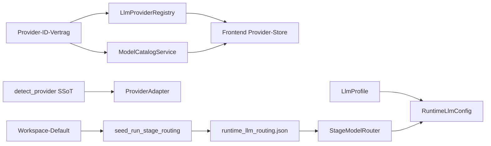
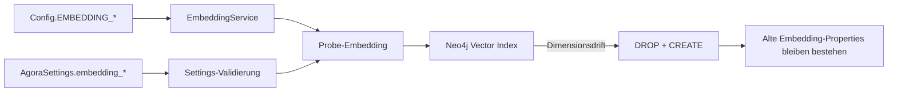
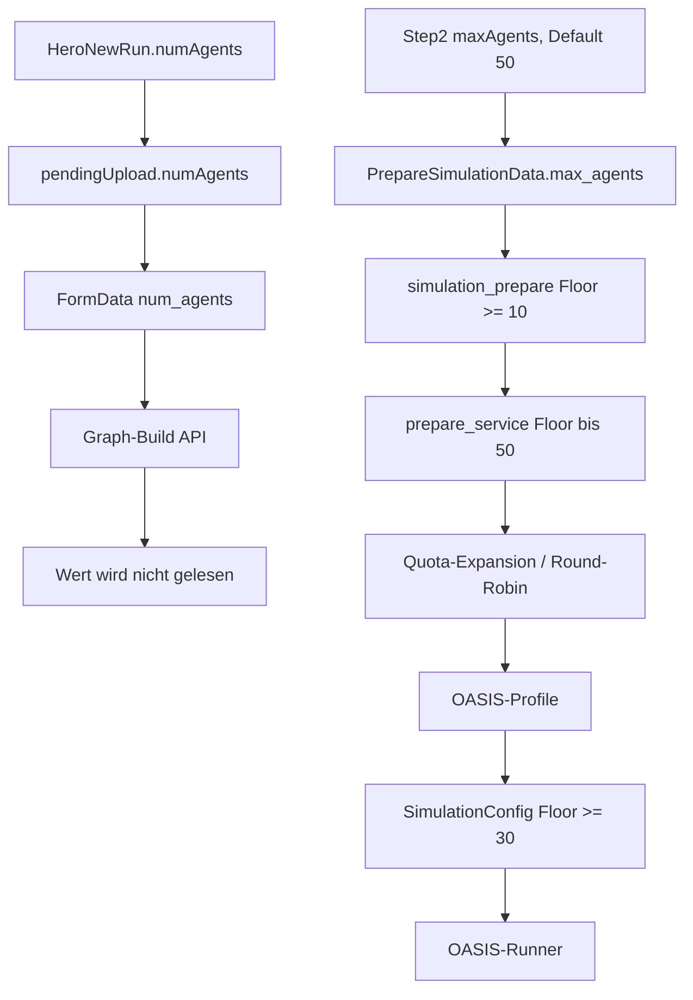

# Current-State Map

## Provider und Routing



Drift:

- Registry und Catalog führen parallele Fallbackmodelle.
- Fähigkeiten sind nicht durchgehend modellbezogen und live verifiziert.
- Profile, Verbindungen und Routing werden in der UI und im Backend als
  unterschiedliche fachliche Systeme präsentiert.
- Die bestehende Detection-SSoT bleibt erhalten; der Epic baut keine neue
  URL-/Namensheuristik daneben.

## Embeddings



`KNOWN_EMBEDDING_DIMS` und `infer_vector_dim_for_model()` sind heute die
Dimensionsquelle. Es fehlt ein Job, der neue Vektoren schreibt, prüft und erst
danach atomar auf einen versionierten Index umschaltet.

## Persona-Anzahl



Die gewünschte Zahl, die Zahl erzeugter Profile und die Zahl simulierter
Agents sind derzeit nicht derselbe Vertrag. Ziel ist:

```text
requested_persona_count
== generated_persona_count
== persisted_persona_count
== simulated_persona_count
```

## Informationsarchitektur

Die v4-Shell ist teilweise produktiv, teilweise Stub:

| Bereich | Istzustand | Entscheidung für diesen Epic |
|---|---|---|
| General, Integrationen, API Keys, LLM Providers | verdrahtet | konsolidieren |
| LLM Routing | run-spezifisch trotz Settings-Name | Semantik trennen |
| Users & Teams, Audit Logs | Route plus Coming-soon | Profil umbenennen bzw. ausblenden |
| Projekte, Datensätze, Vorlagen, Monitoring | deaktivierter Sidebar-Stub | je eigener MVP-Slice oder ausblenden |
| Profil | fehlt | mit Onboarding-Slice ergänzen |
| `/settings-classic` | parallele Legacy-Settings | migrieren und deprecaten |

Tote oder unverdrahtete Kandidaten sind `components/ui/ModelPicker.vue`,
`LlmProviderCard.vue` und `views/Settings/llmRouting/mockData.ts` samt Mock-
Cards. Vor Entfernung ist jeweils ein Import-/Impact-Check Pflicht.

Grundsatz für die Umsetzung:

- funktionierende Bereiche verdrahten;
- klar begrenzte MVPs separat slicen;
- nicht vorhandene Mehrbenutzerfunktionen ausblenden oder als Profil benennen;
- keine `ComingSoonCard` als fertige Hauptnavigation verkaufen.

## Design-Bestand

`tokens-v3.css` und `states.css` enthalten bereits semantische Surface-, Text-,
Status-, Spacing-, Radius-, Shadow-, Focus- und Reduced-Motion-Tokens. Die
Golden-Gate-Referenz liefert visuelle Richtung, keine Komponentenbibliothek.
Übertragbar sind dunkle Glass-Surfaces, Gold-/Korall-Akzente, ruhige
Typografie-Hierarchie, `clamp()`-Skalen, responsive Breakpoints,
`:focus-visible`, Reduced Motion und ein `backdrop-filter`-Fallback.

Der v4-`ModelPicker` wird nicht nur optisch umgebaut: `LlmProfilePicker` dient
als Accessibility-Referenz für Label, `aria-busy`, Alert und Focus-State.

## Testlücken

- Dashboard-Persona-Wert bis OASIS-Profilzahl.
- Provider-Fähigkeiten vom Catalog bis zu allen Model-Pickern.
- Embedding-Wechsel mit vorhandenen Daten, Abbruch und Rollback.
- Wiederaufnahme des Onboardings nach jedem Schritt.
- Tastaturbedienung und Fehlerzustände des gemeinsamen Model-Pickers.
- direkte Tests für Provider-/Profile-/Routing-Stores, LlmProvidersView,
  Responsive-Verhalten und Sidebar-Focus-Management.
