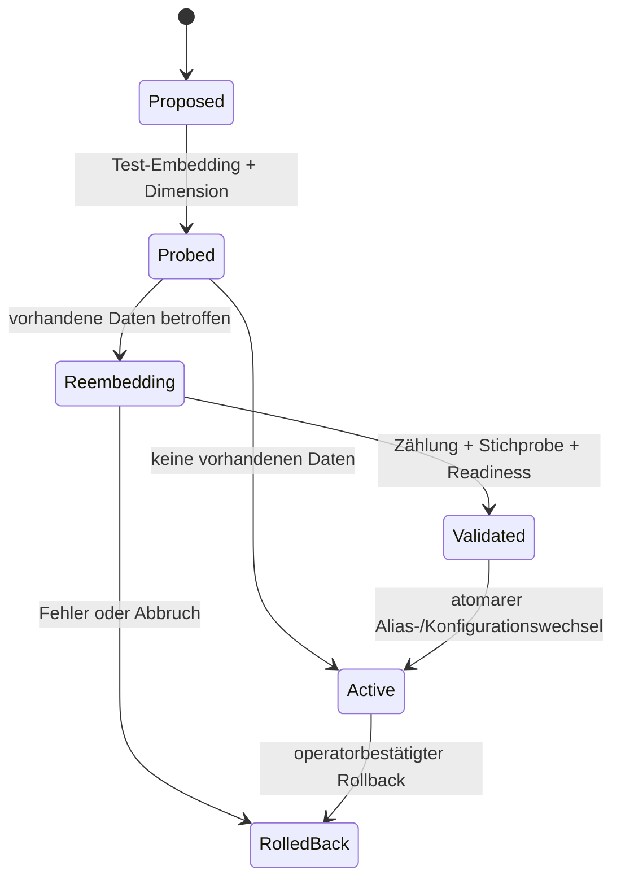

# Target Architecture

## Prinzipien

1. Pydantic v2 ist die fachliche SSoT; Zod wird generiert oder eng gespiegelt.
2. Provider-Detection bleibt in `backend/app/llm/providers/registry.py`.
3. Provider-Verbindung, Modell, Route, Benutzerprofil und KI-Preset sind
   getrennte Verträge.
4. Fähigkeiten steuern die UI; Namensheuristiken sind nur markierte Fallbacks.
5. Secrets bleiben im Backend-Secret-Store und erscheinen nur als Referenz.
6. Chat- und Embedding-Routing werden getrennt persistiert.
7. Jede effektive Route wird mit Quelle und Fähigkeiten im Run-Snapshot erfasst.

## Zielverträge

```text
ProviderConnection
  id, provider_kind, display_name, transport, auth_mode, base_url,
  enabled, status, status_message, secret_ref, capabilities,
  created_at, updated_at, last_tested_at

AiModel
  provider_connection_id, model_id, display_name, capabilities,
  source, status, context_window, max_output_tokens,
  embedding_dimensions, metadata_updated_at

AiRoute
  stage, provider_connection_id, model_id, source,
  validated_capabilities, provider_options

UserProfile
  avatar_ref, display_name, username, role, organisation, language,
  timezone, report_language, theme, privacy_mode, created_at, updated_at

AiPreset
  name, routes, embedding_configuration_ref, created_at, updated_at
```

## Routing

```text
Stage-Override
→ Run-Override
→ Projekt-Default
→ Workspace-Default
→ sichtbarer, auditierter Provider-Fallback
```

Legacy-Profile werden zunächst als Adapter gelesen. Neue Writes gehen nur in
die kanonischen Verträge. Adapter erhalten Telemetrie und ein Ablaufdatum.

## Embedding-Lifecycle



Indizes erhalten eine Versionskennung. Ein bestehender Index wird erst nach
bestätigtem Backup- und Rollback-Plan entfernt.

## Onboarding

Der backendseitig persistierte Wizard speichert nach jedem Schritt. Abschluss:
gültiges Benutzerprofil, mindestens ein Chat-Modell und eine gültige
Embedding-Konfiguration. Betriebsmodi `local`, `hybrid`, `server` beeinflussen
nur Empfehlungen und Feature-Verfügbarkeit.

## Persona-Invariante

`requested_persona_count` ist die tatsächlich simulierte Gesamtzahl. Segment-,
Skeptiker- und Diversitätsquoten werden innerhalb dieses Budgets deterministisch
gerundet. Eine fachliche Mindestempfehlung ist Warnung, kein stiller Floor.
