# Plan: Frontend-Umbau — eine Hülle, drei Bibliotheken, ein Lauf-Arbeitsbereich

Stand 2026-10-06. Epic: #1790. Grundlage: Abstimmung mit dem Maintainer am selben Tag (16 Entscheidungen, Abschnitt 1). Basis-Commit für alle Pfadangaben: `origin/main` = `444b2680`.

Zugehöriger Gestaltungsauftrag: [`frontend-umbau-design-prompt.md`](frontend-umbau-design-prompt.md).

Dieser Plan beschreibt **was** entsteht und **in welcher Reihenfolge**. Er enthält noch keine Anker-Tabellen je Schritt; die kommen je Etappe hinzu, sobald der Gestaltungsentwurf abgenommen ist.

---

## 0. Warum

Vier Befunde aus den Screenshots vom 25.09. und 05.10.2026 und aus dem Router (`frontend/src/router/index.ts`):

1. **Zwei Hüllen leben nebeneinander.** `components/shell/` (ShellRoot, Shelf, Dossier, Stack) und `components/v4/shell/` (AppShell, Sidebar, Topbar). Dazu zwei Startseiten: Ablage (`/`) und Dashboard (`/dashboard`).
2. **Der Graph hängt am Schritt, nicht am Lauf.** Er ist nur über `StepGraphBuild` erreichbar. Der Stepper lautet Upload → Personas → Simulation → Report → Interaktion; nach dem Build führt kein Weg zurück.
3. **Modellwahl an vier Orten.** `StepModelOverrideChip` in jeder Schrittansicht, dazu `/settings/llm-routing`, `/settings/llm-providers` und `/workspace/provider-keys`. Nirgends steht, welche Stufe mit welchem Modell läuft.
4. **Feed und Bericht ohne vertraute Form.** Twitter und Reddit stehen als zwei schmale Spalten nebeneinander, Twitter ohne Antwortbezug, darunter das Rohprotokoll (`tqdm`-Balken von `twhin-bert`). Die Ablage listet jeden Bericht als eigene Zeile mit demselben abgeschnittenen Titel.

Vorbild für Aufbau und Ruhe ist die Mac-App „Screens 5": schmale Seitenleiste mit Gruppen und Zählern, Kacheln, ein Einstellungsfenster mit Symbolliste, eine Akzentfarbe.

---

## 1. Entscheidungen des Maintainers (05.10.2026)

| # | Thema | Entscheidung |
|---|---|---|
| 1 | Umfang | Neue Hülle, alte Innereien. Stores, Contracts und API-Anbindung bleiben. Neu gezeichnet werden Hülle, Bibliothek, Einstellungen, Simulation, Bericht, Interviews, Personas, Graph. Alles andere bekommt nur die neuen Tokens und steht auf der Restliste (Abschnitt 9). |
| 2 | Hauptobjekte | Läufe, Graphen und Personasätze stehen gleichrangig in der Bibliothek. Berichte sind Teil eines Laufs. Jobs wandern in die Aktivität. |
| 3 | Graph bearbeiten | Frei bearbeitbar, bis der erste Lauf darauf gestartet wurde. Danach gesperrt; Ausweg ist Duplizieren. Handänderungen tragen die Herkunft „manuell" und können nie hohe Confidence stützen. |
| 4 | Lauf | Ein Arbeitsbereich mit sechs festen Reitern: Übersicht · Graph · Personas · Simulation · Bericht · Interviews. Ein Startdialog ersetzt den Assistenten. |
| 5 | Modelle | Profil im Startdialog, Abweichung je Stufe aufklappbar. Das Modell steht sichtbar am Startknopf jeder Stufe. „Neu erzeugen mit …" legt eine weitere Fassung an und überschreibt nichts. |
| 6 | Simulation | Dreispalter, ein Netzwerk zur Zeit, Faden-Ansicht je Beitrag, Rundenregler. Unterreiter Feed · Runden · Diagnose. |
| 7 | Bericht | Lesedokument mit Gliederung links und Belegspalte rechts. Sprünge vom Beleg in Graph, Feed und Interview. Fassungswähler. „Unvollständig" als Hinweisband. |
| 8 | Logs | Ausziehbare Konsole von jeder Seite, im Lauf vorgefiltert. Vollansicht unter Werkzeuge → Aktivität (Jobs · Protokoll). |
| 9 | Graph-Ansicht | Dreispalter mit Umschalter Netz/Tabelle und Detailspalte. Im Lauf nur lesend. |
| 10 | Personas | Kachelbibliothek, Persona-Karten mit Herkunftsmarke, Editor-Fenster, KI-Hilfe an drei Stellen, Beispielbeitrag als Vorschau, Sperre nach dem ersten Lauf. |
| 11 | Einstellungen | Ein Fenster über der App mit Symbolliste links, eigene Adresse je Abschnitt. |
| 12 | Start | Die Bibliothek ist die Startseite. Das Dashboard entfällt. |
| 13 | Bildsprache | Ruhig und systemnah. Neutrales Graphit, Violett als einziger Akzent, Zustandsfarben getrennt, Leseschrift nur im Bericht, Hell/Dunkel nach System. |
| 14 | Interviews | Gesprächsansicht am Lauf, Einzel- und Gruppenfrage, klar als „Interview" markiert. |
| 15 | Reihenfolge | Acht Etappen (Abschnitt 8), ein Epic mit Checkliste. |
| 16 | Gestaltungsauftrag | Klickbarer Prototyp der Kernstrecke mit Inhalten aus dem Hollerau-Lauf, Einzelbilder für den Rest, Bausteinblatt, zwei Durchgänge. |

Rahmen, der mitgilt:

- **Supabase bleibt Datenbank.** Die Hülle bekommt Plätze für Profilmenü und Workspace-Umschalter, aber keine Team-, Rollen- oder Freigabeansichten (ADR-0019, Mehrbenutzerbetrieb nach 1.0). Der Feed bleibt bei SSE.
- **Etappen 7 und 8 sind neue Funktionen.** Sie brauchen einen Eintrag in `ROADMAP.md`; Etappe 8 zusätzlich einen ADR (Abschnitt 7).
- **Der Stopp für Simulationsläufe bleibt bestehen**, bis das Aktivitätsmodell (#1779, Schritt 2.4) fertig ist. Geprüft wird an vorhandenen Läufen.

### 1.1 Abweichung von der Abstimmung

In der Abstimmung waren acht Einstellungsabschnitte vereinbart, und „Integrationen" sollte entfallen, falls dort nichts Eigenes steht. Die Prüfung ergab: `INTEGRATION_SETTINGS_SECTIONS` (`frontend/src/views/Settings/settingsSections.ts`) enthält `embedding`, `ontology`, `hybrid_search`, `agent_tools`, `webtools` und `oasis`. Das sind echte Stellschrauben der Verarbeitung. Der Plan führt deshalb einen **neunten Abschnitt „Pipeline"** (Abschnitt 5). **Zu bestätigen.**

---

## 2. Begriffe und ihre technische Entsprechung

Die Oberfläche spricht in den Begriffen aus `CONTEXT.md`. Die Zuordnung zu den Kennungen im Code ist ein Vorschlag dieses Plans und wird in Etappe 2 festgezurrt.

| Begriff in der Oberfläche | Technische Entsprechung heute | Bemerkung |
|---|---|---|
| **Lauf** | eine Simulation (`simulation_id`, `sim_…`) samt ihrer Berichte und Interviews | Die Ablage führt Läufe schon heute unter `sim_…`. |
| **Graph** (Bibliotheksobjekt) | ein Projekt (`project_id`) mit seinem `graph_id` | Ein Projekt trägt genau einen Graphen. `POST /api/simulation/create` nimmt `project_id` und optional `graph_id`; mehrere Simulationen je Projekt sind schon möglich (`GET …/list?project_id=`). Die Wiederverwendung fehlt also in der Oberfläche, nicht im Backend. |
| **Personasatz** | **gibt es noch nicht** | `/api/simulation/persona-library` speichert einzelne Persona-Vorlagen, keine benannten Sätze. Personas leben heute je Simulation (`…/<simulation_id>/profiles`). Der Satz als eigenes Objekt ist Backend-Arbeit in Etappe 7. |
| **Bericht** | `report_id`, mehrere je Simulation | `GET /api/report/list` und `…/by-simulation/<id>` existieren. Ob `by-simulation` alle Fassungen liefert oder nur die jüngste, wird in Etappe 5 geprüft. |
| **Fassung** | weiterer Bericht bzw. Zweig derselben Simulation | `ReportBranchControls.vue` und `POST …/<simulation_id>/branch` existieren. |
| **Job** | Eintrag der `RunRegistry` (`run_id`, `run_type`) | erscheint nur noch unter Aktivität und in der Lauf-Übersicht. |
| **Lauf ohne Graph** | `POST /api/simulation/create-from-personas` mit leerem `graph_id` | Der Graph-Reiter zeigt einen Leerzustand mit Erklärung, keinen Fehler. **Ein solcher Lauf bekommt keinen Bericht:** `POST /api/report/generate` lehnt Läufe ohne Graphen ab, weil Berichte sich auf Belege aus dem Graphen stützen. Der Umbau ändert das nicht (siehe 4.6). |

---

## 3. Menüstruktur

### 3.1 Seitenleiste

```
Bibliothek
  Läufe                 9      Startseite
  Graphen               3
  Personasätze          2
Im Blick
  Läuft gerade          0      gefilterte Läufe
  Braucht dich          2      gestoppt, fehlgeschlagen, unvollständig, wartet auf Freigabe
Werkzeuge
  Vergleich
  Aktivität            42      Jobs · Protokoll
──────────────────────────
● System        Einstellungen  Zustandspunkt öffnet Einstellungen → System
```

Die Seitenleiste klappt auf Symbole ein. Einstellungen klappen sie nicht mehr auf, sie öffnen ein Fenster.

### 3.2 Werkzeugleiste (oben)

| Element | Verhalten |
|---|---|
| Brotkrumen | `Läufe / <Frage des Laufs> / Simulation`. Titel statt Kennung; die Kennung steht als kopierbare Marke daneben. |
| Suche (⌘K) | bestehende `CommandPalette`, erweitert um Graphen, Personasätze, Personas und Einstellungsabschnitte. |
| Neuer Lauf | Hauptknopf, öffnet den Startdialog (3.4). |
| Ansicht | Kacheln/Liste, Sortierung (nur in Bibliotheksansichten). |
| Konsole | Knopf mit Zähler ungelesener Fehler, Tastenkürzel. |
| Profilmenü | Konto, Workspace (ein Eintrag, solange einmandantig), Hell/Dunkel, Abmelden. |

### 3.3 Vollständiger Menübaum

```
Bibliothek
├─ Läufe
│  └─ Lauf
│     ├─ Übersicht
│     ├─ Graph                (lesend)
│     ├─ Personas             (lesend)
│     ├─ Simulation
│     │  ├─ Feed              Twitter | Reddit → Faden-Ansicht
│     │  ├─ Runden
│     │  └─ Diagnose
│     ├─ Bericht              Fassungswähler → Gliederung · Text · Belege
│     └─ Interviews           Gespräche → Einzel | Gruppe
├─ Graphen
│  └─ Graph                   Netz | Tabelle · Detailspalte · Quelle · Verwendung
└─ Personasätze
   └─ Personasatz             Karten → Editor-Fenster
Im Blick
├─ Läuft gerade
└─ Braucht dich
Werkzeuge
├─ Vergleich
└─ Aktivität
   ├─ Jobs
   └─ Protokoll
Einstellungen (Fenster)
├─ Allgemein
├─ Aussehen
├─ Anbieter
├─ Profile
├─ Embedding
├─ Pipeline
├─ Budgets
├─ Zugang
└─ System
Konsole (ausziehbar, überall)
```

### 3.4 Startdialog „Neuer Lauf"

Ein Dialog, fünf Gruppen, kein Assistent:

| Gruppe | Inhalt |
|---|---|
| Frage | Die Simulationsfrage als Pflichtfeld, optional die Streitfrage. |
| Graph | vorhandenen wählen, „neu aus Quelle" (Datei ablegen, Graph entsteht in der Bibliothek) oder „ohne Graph". Bei „ohne Graph" steht direkt an der Auswahl: „Simulation und Interviews sind möglich, ein Bericht nicht." Die Stufe Bericht entfällt dann aus Modellwahl und Vorabschätzung. |
| Personasatz | vorhandenen wählen oder „erzeugen lassen" (Anzahl, Obergrenze). |
| Modelle | Profil wählen. Aufklappbar: je Stufe (Graph, Personas, Simulation, Bericht) abweichen. Je Stufe eine grobe Kostenangabe. |
| Umfang und Budget | Tage, Runden, Aktivitätsmodus; Grenzen für Zeit, Tokens, Kosten und Aufrufe, vorbelegt aus Einstellungen → Budgets. Vorabschätzung (`PreflightEstimateCard`). |

„Starten" führt in die Übersicht des neuen Laufs. „Nur anlegen" legt den Lauf an, ohne eine Stufe zu starten.

---

## 4. Ansichten im Einzelnen

### 4.1 Bibliothek → Läufe (Startseite)

- **Band „Im Blick"** über den Kacheln, nur sichtbar, wenn etwas läuft oder Aufmerksamkeit braucht.
- **Lauf-Kachel:** Frage als Titel (zweizeilig, nicht abgeschnitten), Quelle bzw. Graph, fünf Stufenpunkte mit Zustand (Graph, Personas, Simulation, Bericht, Interviews), Datum, Kosten. Laufend: Runde und Fortschritt. Fehlgeschlagen oder gestoppt: der Grund in einem Satz.
- **Listenansicht** als Alternative mit denselben Angaben in Spalten.
- **Filter „Mit Bericht":** zeigt nur Läufe mit mindestens einem Bericht; die Kachel nennt dann die Zahl der Fassungen und führt mit einem zweiten Knopf direkt zur jüngsten. Ein Klick auf die Zahl klappt die Liste aller Fassungen des Laufs auf (Datum, Modell, Zustand), jede Zeile öffnet genau diese Fassung. Die Liste kommt aus `GET /api/report/list?simulation_id=…`. Bis Etappe 5 führt eine Zeile auf die alte Berichtsansicht `/v4/report/:reportId`, danach auf den Bericht-Reiter mit vorgewählter Fassung. So bleibt jede ältere Fassung erreichbar, auch bevor es den Fassungswähler gibt. Er ersetzt den heutigen Ablage-Filter „Berichte" und steht in der Sortier- und Filterleiste, nicht in der Seitenleiste.
- **Mehrfachauswahl:** zwei Läufe markieren → „Vergleichen"; löschen mit Rückfrage.
- **Leerzustand:** ein Satz, was ein Lauf ist, und der Knopf „Neuer Lauf".

Zustände eines Laufs in der Oberfläche (aus `CONTEXT.md`, nie zusammenlegen): läuft, fertig, **unvollständig** (`INCOMPLETE`), gestoppt (`user_stop`), Budget erschöpft, fehlgeschlagen (auch `process_restart`). „Unvollständig" bekommt nie die Farbe oder das Symbol von „fertig".

### 4.2 Lauf → Übersicht

Ersetzt den Stepper. Eine Zeile je Stufe:

| Spalte | Inhalt |
|---|---|
| Stufe | Graph · Personas · Simulation · Bericht · Interviews |
| Zustand | Marke wie in 4.1, bei Degradation mit Grund (Fallback-Personas, fehlende Abschnitte, `evidence_omitted`) |
| Modell | das tatsächlich gelaufene Modell; vor dem Start das geplante, änderbar |
| Dauer, Tokens, Kosten | aus dem Usage-Ledger (`RunUsageBreakdown`) |
| Nächster Schritt | genau ein Knopf: Starten, Fortsetzen, Ansehen, Neu erzeugen mit … |

Darunter: Budgetstand des Laufs (`RunResourceMonitor`), die Frage, verknüpfter Graph und Personasatz als Karten mit Sprung in die Bibliothek.

### 4.3 Lauf → Graph und Bibliothek → Graph

Dieselbe Komponente, im Lauf lesend.

```
┌ links ──────────┬ Mitte ─────────────────────┬ rechts ─────────────┐
│ Suche           │ [Netz │ Tabelle]           │ Gewählte Entität    │
│ Typen (Filter)  │                            │  Name, Typ, Aliase  │
│  Person      12 │  Netz: ziehen, zoomen      │  Beschreibung       │
│  Organisation 8 │  Tabelle: sortieren,       │  Beziehungen (7)    │
│ Entitätenliste  │  mehrfach wählen           │  Herkunft           │
│                 │  + Entität  + Beziehung    │                     │
└─────────────────┴────────────────────────────┴─────────────────────┘
```

- **Kopf:** Name, Quelle, Zahl der Entitäten und Beziehungen, Zustand (bearbeitbar | gesperrt, mit Liste der Läufe, die ihn nutzen), Duplizieren, Export.
- **Tabelle:** Entitäten und Beziehungen als zwei Reiter. Mehrfachauswahl für Zusammenführen und Löschen.
- **Bearbeiten** (nur Bibliothek, nur ungesperrt): Felder in der Detailspalte, Beziehung durch Ziehen von Knoten zu Knoten oder „+ Beziehung".
- **Herkunft:** je Entität und Beziehung „Dokument, Abschnitt" oder „manuell, Datum". Manuelle Kanten sind im Netz gestrichelt und tragen die Marke „manuell".
- **Aus dem Bericht kommend:** die belegende Kante ist ausgewählt und zentriert.
- **Im Lauf:** Knöpfe „In Bibliothek öffnen" und „Duplizieren und bearbeiten".
- **Während des Builds:** Fortschritt und Protokoll des Graph-Jobs an derselben Stelle; der Graph baut sich sichtbar auf.
- **Weiter vorhanden, auf der Restliste:** Rundenregler und Diff (`GraphRoundSlider`, `GraphDiffPanel`).

### 4.4 Lauf → Personas und Bibliothek → Personasatz

- **Bibliothek:** Kacheln je Satz mit Name, Anzahl, zugehörigem Graphen, Verwendung.
- **Im Satz:** Raster aus Persona-Karten. Je Karte Avatar, Name, Rolle, Haltung in einem Satz, Art (Einzelperson | Kollektiv), Freigabestatus und **Herkunftsmarke**: aus Graph erzeugt · von Hand · KI-Entwurf · **Fallback**. Fallback ist eine Degradation und sieht auch so aus.
- **Filter:** Typ, Haltung, Freigabestatus, Herkunft. Mehrfachauswahl für Freigeben, Ablehnen, Löschen.
- **Editor-Fenster** (Aufbau wie das Einstellungsfenster): Abschnitte Identität · Haltung und Ziele · Sprache und Ton · Aktivität · Bezug zum Graphen.
- **KI-Hilfe:** „Entwurf aus Stichworten", „Feld vorschlagen", „Aus Entität ableiten". Jeder Vorschlag ist ein Entwurf zum Annehmen oder Verwerfen; nichts wird ungefragt gespeichert. Am Knopf stehen Modell und Kostenhinweis.
- **Vorschau:** ein Beispielbeitrag in der Stimme der Persona, mit „SIM" markiert.
- **Qualität:** die Angaben aus `…/profiles/quality` als Hinweise am Satz (Dubletten, Schieflage der Haltungen).
- **Im Lauf:** lesend, mit „In Bibliothek öffnen" und „Duplizieren und bearbeiten". Knopf „Befragen" an jeder Karte.

### 4.5 Lauf → Simulation

Unterreiter **Feed · Runden · Diagnose**. Kopf: Zustand, Runde x von y, Beiträge, Kosten, Starten/Stoppen, Modell.

**Feed**

```
┌ links ─────────┬ Mitte ───────────────────────┬ rechts ──────────┐
│ Twitter│Reddit │ Zeitleiste                   │ Persona-Karte    │
│ Filter         │  Beitrag                     │  Rolle, Haltung  │
│  Persona       │   ↳ 4 Antworten · 2 ↻ · 7 ♥  │  Befragen        │
│  Runde         │  Beitrag                     │ Runde 11 von 24  │
│  Streitfrage   │                              │  Aktivität       │
└────────────────┴──────────────────────────────┴──────────────────┘
```

- **Twitter:** einspaltige Zeitleiste. Beitragskarte mit Avatar, Name, Zeit, Text, Zählern für Antworten, Weiterleitungen und Zustimmung. Klick öffnet die **Faden-Ansicht**: der Beitrag oben, darunter die Antworten mit Verbindungslinie.
- **Reddit:** Beitragsliste mit Stimmen- und Kommentarzahl. Klick öffnet den Beitrag mit eingerücktem, einklappbarem Kommentarbaum.
- **Rundenregler** oben: live mitlaufen oder nach dem Lauf Runde für Runde zurückgehen. „Neue Beiträge"-Pille statt Springen der Liste.
- **„SIM"** an jedem Beitrag. Es sind synthetische Äußerungen.
- **Leerzustand** (noch nicht gestartet): Erklärung in zwei Sätzen, Modell, Startknopf. Die bisherige Seite „Pipeline" entfällt.

**Runden:** Liste der Runden mit Aktivität je Runde und Netzwerk, Sprung in den Feed an dieser Runde. Die Aktionstabelle (`SimActionsTable`) ist hier ein Umschalter „Runden | Aktionen".

**Diagnose:** dieselbe Komponente wie die Konsole, gefiltert auf Tool-Calls und Fehler dieses Laufs. Rohe Fortschrittsbalken werden zu einer Zeile zusammengefasst.

### 4.6 Lauf → Bericht

```
┌ Gliederung ───┬ Bericht ──────────────────────┬ Belege ──────────┐
│ Kurzfazit   ● │ Kopf: Frage · Fassung 3 ▾     │ zum gewählten    │
│ 1 Risiken   ● │ Zustand · Modell · Export     │ Claim            │
│ 2 Akteure   ◐ │                               │  Quelle, S. 4  → │
│ 3 Szenarien ○ │ Lesetext in Lesebreite        │  Kante im Graph →│
│ Hypothesen  4 │ Claims dezent markiert        │  Beitrag im Feed→│
│ Datenlücken 3 │ Zitate als Karte mit SIM      │  Interview     → │
└───────────────┴───────────────────────────────┴──────────────────┘
```

- **Mitte:** Fließtext in Lesebreite mit Leseschrift. Claims tragen eine kleine Marke mit Confidence; Klick füllt die Belegspalte.
- **Rechts:** Belege zum Claim, gruppiert nach Art (Dokument, Graph, Simulation, Interview, Web), jeder mit Sprung an den Ursprung. Ohne Auswahl: Belegdichte des Berichts (`evidence_density.json`) und Positionierungsquote.
- **Links:** Gliederung mit Zustand je Abschnitt (fertig, degradiert, fehlt). Hypothesen und Datenlücken als eigene Einträge mit Zähler.
- **Kopf:** Fassungswähler (Datum, Modell, Zustand je Fassung), „Neu erzeugen mit …", Export.
- **Hinweisband** bei „Unvollständig": was fehlt, in Listenform. Bei `evidence_omitted`: eigener Hinweis in der Belegspalte.
- **Trennscharf:** Claim, Hypothese und Datenlücke haben drei verschiedene Darstellungen. Ein fehlgeschlagenes Binding erscheint als Binding-Problem, nie als Datenlücke.
- **Während der Erzeugung:** Abschnitte füllen sich, Protokoll (`ReportLiveLogPane`) als einklappbarer Bereich bzw. in der Konsole.
- **Export und Druck:** nur die Mitte, Belege als Fußnoten.
- **Weiter vorhanden, auf der Restliste:** Red-Team- und Provenance-Abschnitt (`ReportRedTeamSection`, `ReportProvenanceSection`).
- **Lauf ohne Graph:** Der Reiter zeigt eine Erklärung statt eines Startknopfs („Dieser Lauf hat keinen Wissensgraphen; Berichte stützen sich auf Belege aus dem Graphen"). In der Übersicht steht die Stufe Bericht auf „nicht verfügbar", in der Kachel ist ihr Stufenpunkt „übersprungen". Das ist kein Fehlerzustand.
- **Nachfragen an den Berichtsagenten:** Die heutige Gesprächsansicht (`Step5Interaction`) enthält zwei Funktionen: den Chat mit dem Berichtsagenten über `POST /api/report/chat` und die Persona-Interviews über `…/interview/batch`. Die Interviews ziehen in den Reiter Interviews (4.7). Der Chat mit dem Berichtsagenten bleibt erhalten und hängt am Bericht, weil er eine `report_id` braucht. **Vorschlag, vom Maintainer zu bestätigen:** Die rechte Spalte des Berichts bekommt einen Umschalter „Belege | Nachfragen". Der Entwurf aus Durchgang 2 enthält dafür noch keine Ansicht.

### 4.7 Lauf → Interviews

```
┌ links ───────────┬ Mitte ──────────────────────┬ rechts ──────────┐
│ Gespräche        │ Gespräch mit Anke Wübbena   │ Persona-Karte    │
│  Anke Wübbena  3 │  Du: …                      │ Beiträge im Feed │
│  Kreistag      1 │  Anke (SIM · Interview): …  │ (5) →            │
│  Gruppe: Klinik  │                             │ Im Bericht       │
│ + Neues Gespräch │  [Frage eingeben]  Modell   │ zitiert (2) →    │
└──────────────────┴─────────────────────────────┴──────────────────┘
```

- Am Lauf, nutzbar ab abgeschlossener Simulation, unabhängig vom Bericht. Die Endpunkte hängen schon heute an der Simulation (`POST /api/simulation/interview`, `…/interview/batch`, `…/interview/all`, `…/interview/history`).
- Einzelgespräch oder Gruppenfrage (Antworten nebeneinander).
- Jede Antwort trägt „SIM" und „Interview" und sieht anders aus als ein Feed-Beitrag.
- Modell und Kostenhinweis am Eingabefeld; Interviews laufen durchs Budget.

### 4.8 Werkzeuge → Vergleich

Bestehende `CompareView`/`BranchComparePanel` in der neuen Hülle. Einstieg auch über Mehrfachauswahl in der Bibliothek. Aufbau unverändert (Restliste).

### 4.9 Werkzeuge → Aktivität und die Konsole

- **Jobs:** alle Einträge der `RunRegistry` mit Art, Lauf, Zustand, Dauer, Sprung zum Lauf, Abbrechen. Ein Klick öffnet die Job-Detailansicht unter `/activity/jobs/:runId`; das ist die heutige `RunDetailView` mit Ereignissen und Wiedergabe, unverändert im Aufbau (Restliste).
- **Protokoll:** Livestrom von `/api/logs/stream` mit Filter nach Stufe, Suche, Pause, Kopieren.
- **Konsole:** dieselbe Protokoll-Komponente als Auszug am unteren Rand, von jeder Seite erreichbar. In einem geöffneten Lauf auf diesen Lauf vorgefiltert, Schalter „alles zeigen". Höhe verstellbar und gemerkt.

---

## 5. Einstellungsfenster

Ein Dialog über der App. Links Symbolliste, rechts gruppierte Zeilen mit Schaltern und Auswahlfeldern. Jeder Abschnitt hat eine eigene Adresse.

| Abschnitt | Inhalt | ersetzt |
|---|---|---|
| Allgemein | Sprache, Standardwerte neuer Läufe (Tage, Runden, Aktivitätsmodus), Protokollstufe, Benachrichtigungen | `settings/general` (`llm` wandert zu Profile, `logging`, `locale`, `event_bus`) |
| Aussehen | Hell/Dunkel/System, Dichte (Komfort/Kompakt), Schriftgröße | `ui`, `DensityToggle` aus der Kopfleiste |
| Anbieter | je Anbieter eine Karte: Verbindung, Transportart, Schlüssel, Zustand, verfügbare Modelle | `settings/llm-providers` + `workspace/provider-keys` |
| Profile | Modell-Profile, je Profil vier Stufen, eines als Standard | `settings/llm-routing`, `LlmProfileManager` |
| Embedding | aktive Konfiguration, Migration | `settings/embedding` |
| Pipeline | Ontologie, Hybridsuche, Agentenwerkzeuge, Web-Werkzeuge, OASIS | `settings/integrations` (siehe 1.1) |
| Budgets | Standardgrenzen für Zeit, Tokens, Kosten, Aufrufe | heute nur im Startablauf (`RunBudgetForm`) |
| Zugang | API-Schlüssel, Audit-Protokoll, Konto, Sicherheit | `settings/api-keys`, `settings/audit-logs`, `settings/profile`, `security` |
| System | Zustand von Neo4j, Redis, PostgreSQL, Version, Sprung zur Konsole | `SystemHealthCard` |

Regeln:

- **Embedding:** Solange #1417 offen ist, steht dort ein Hinweis, dass einzelne Verbraucher noch die Umgebungsvariablen lesen. Die Oberfläche behauptet nicht, die angezeigte Konfiguration sei die wirksame.
- **Anbieter:** Eine `cli`-Route zeigt nie Felder für HTTP-Endpunkt oder fremden Schlüssel (#1418/#1422).
- **Schlüssel:** nie im Klartext anzeigen, nur Länge und Präfix.

---

## 6. Adressschema und Weiterleitungen

Pfade bleiben englisch wie im Bestand, Beschriftungen deutsch. Jede alte Adresse bleibt erreichbar: Sie zeigt so lange auf ihre bisherige Ansicht, bis das neue Ziel gebaut ist, und wird erst in dieser Etappe zur Weiterleitung (Spalte „ab Etappe" in 6.2).

Der Lauf-Arbeitsbereich liegt unter `/simulations/…` und nicht unter `/runs/…`, weil `/runs/:id` heute die Detailansicht eines Jobs der `RunRegistry` ist (`RunDetailView`, `GET /api/runs/<run_id>`). Eine Lauf-Übersicht unter derselben Adresse würde gespeicherte Job-Links auf eine Ansicht führen, die mit der Kennung nichts anfangen kann.

### 6.1 Neue Adressen

| Adresse | Ansicht |
|---|---|
| `/library/runs` | Bibliothek → Läufe (Start). `?view=running` und `?view=attention` für „Im Blick", `?view=with-report` für Läufe mit Bericht. |
| `/library/graphs` | Bibliothek → Graphen |
| `/library/persona-sets` | Bibliothek → Personasätze |
| `/simulations/:simulationId` | Lauf → Übersicht |
| `/simulations/:simulationId/graph` | Lauf → Graph. `?edge=`/`?entity=` für Sprünge aus dem Bericht. |
| `/simulations/:simulationId/personas` | Lauf → Personas |
| `/simulations/:simulationId/simulation/feed/:network?` | Feed, `network` = `twitter` \| `reddit` |
| `/simulations/:simulationId/simulation/post/:postId` | Faden-Ansicht. `?claim=` hebt den Beitrag hervor und zeigt den Rückweg zum Bericht. |
| `/simulations/:simulationId/simulation/rounds` | Runden |
| `/simulations/:simulationId/simulation/diagnostics` | Diagnose |
| `/simulations/:simulationId/report/:reportId?` | Bericht; ohne `reportId` die jüngste Fassung. `?claim=` für die Auswahl, `?panel=questions` öffnet rechts die Nachfragen an den Berichtsagenten. Seit Etappe 5 umgesetzt (siehe 11d). |
| `/simulations/:simulationId/interviews/:conversationId?` | Interviews (seit Etappe 6). `conversationId` ist `persona-<agent_id>` oder `group-<kennung>`; eine Gruppe gibt es nur in der Sitzung, in der sie gefragt wurde. |
| `/graphs/:projectId` | Graph-Ansicht der Bibliothek |
| `/persona-sets/:setId` | Personasatz |
| `/compare/:simulationId?` | Vergleich; mit Kennung ist der erste Lauf vorgewählt |
| `/activity/jobs`, `/activity/jobs/:runId`, `/activity/log` | Aktivität; `:runId` ist die Job-Detailansicht |
| `/settings/:section` | Einstellungsfenster über der zuletzt gezeigten Ansicht |

### 6.2 Weiterleitungen

Eine Zeile wird erst in der genannten Etappe umgestellt. Bis dahin bleibt die alte Adresse mit ihrer alten Ansicht in der neuen Hülle bestehen.

| Alt | Neu | ab Etappe |
|---|---|---|
| `/`, `/home`, `/dashboard`, `/v4/dashboard` | `/library/runs` | 2 |
| `/runs`, `/ablage`, `/ablage?filter=lauf` | `/library/runs` | 2 |
| `/ablage?filter=bericht` | `/library/runs?view=with-report`: die Läufe, die mindestens einen Bericht haben, mit Zahl der Fassungen, Sprung zur jüngsten und aufklappbarer Liste aller Fassungen (4.1). Die alte Ablage zeigt jede Fassung als eigene Zeile; die Liste hält sie einzeln erreichbar, bis Etappe 5 den Fassungswähler bringt | 2 |
| `/ablage?filter=graph` | `/library/graphs` | 2 |
| `/ablage?filter=personasatz` | `/library/persona-sets` | 7, umgesetzt (`shelfRedirect`, die übrige Query bleibt stehen) |
| `/ablage?filter=jobs`, `/v4/history` | `/activity/jobs` | 2 |
| `/ablage/lauf/:objectId` | `/simulations/:objectId` | 2 |
| `/ablage/bericht/:objectId` | `/simulations/:simulationId/report/:objectId` (Simulation aus dem Bericht auflösen) | 5, umgesetzt |
| `/ablage/graph/:objectId` | `/graphs/:projectId` (Projekt aus der Kennung auflösen) | 2 |
| `/ablage/personasatz/:objectId` | `/persona-sets/:setId` | 7, **offen**: `shelfObjectGuard` kennt den Satz weiterhin nicht und lässt die Adresse auf die alte Ablage-Ansicht fallen (siehe 11f) |
| `/runs/:id` | `/activity/jobs/:id`, Kennung unverändert | 2 |
| `/process/new` (Start aus einer neuen Quelle, von `HeroNewRun` angesteuert) | Startdialog „Neuer Lauf" mit „Graph: neu aus Quelle" | 3; bis dahin alte Ansicht, weil dort die vorgemerkten Dateien verarbeitet und Budget und Rundenzahl übergeben werden |
| `/process/:projectId`, `/v4/graph-build/:projectId` | `/graphs/:projectId` | 3; bis dahin alte Ansicht, damit der Start aus einer neuen Quelle durchgehend funktioniert |
| `/v4/env-setup/:projectId` | `/simulations/:simulationId/personas`, sobald eine Simulation existiert; sonst Startdialog mit vorgewähltem Graphen | 3 |
| `/simulation/:id`, `/simulation/:id/start`, `/v4/simulation/:id` | `/simulations/:id/simulation/feed` | 4 |
| `/v4/simulation/:id/feed`, `…/threads` | `/simulations/:id/simulation/feed` | 4 |
| `/v4/simulation/:id/thread/:postId` | `/simulations/:id/simulation/post/:postId` | 4 |
| `/v4/simulation/:id/rounds`, `…/live`, `…/actions` | `/simulations/:id/simulation/rounds` | 4 |
| `/report/:reportId`, `/v4/report/:reportId` | `/simulations/:simulationId/report/:reportId` (Simulation aus dem Bericht auflösen) | 5, umgesetzt (`StepReport` bleibt als Auflöse-Ansicht) |
| `/interaction/:reportId`, `/v4/interaction/:reportId` | `/simulations/:simulationId/report/:reportId?panel=questions` (Simulation aus dem Bericht auflösen). Die Adresse öffnet heute standardmäßig den Chat mit dem Berichtsagenten, deshalb führt sie zu „Nachfragen" am selben Bericht und nicht zu den Interviews. Umgesetzt mit #1790: die Route `StepInteraction` nutzt `ReportRedirectView` mit dem Vorgabewert `panel=questions`; ein vorhandenes `?panel=`, die übrige Query und der Hash bleiben, „Bericht nicht gefunden“ ist ein sichtbarer Zustand | erledigt (#1790); Altansicht entfernt |
| `/v4/compare/:simulationId` | `/compare/:simulationId` | 2 |
| `/settings/general` | `/settings/general` | 3 |
| `/settings/integrations` | `/settings/pipeline` | 3 |
| `/settings/profile`, `/settings/users-teams`, `/settings/api-keys`, `/settings/audit-logs` | `/settings/access` | 3 |
| `/settings/llm-routing` | `/settings/profiles` | 3 |
| `/settings/llm-providers`, `/workspace/provider-keys` | `/settings/providers` | 3 |
| `/settings/embedding` | `/settings/embedding` | 3 |
| `/settings-classic` | `/settings/general` | 3 |
| `/v4/simulation/:simulationId/interviews` (Übergangsadresse aus Etappe 2) | `/simulations/:simulationId/interviews` | 6 (umgesetzt; Query und Hash bleiben) |

Zwischen Etappe 2 und der Etappe einer Zeile verlinken die Reiter des Laufs auf die noch bestehende alte Ansicht. Der Reiter „Simulation" führt also bis Etappe 4 auf `/v4/simulation/:id/feed`. Der Reiter „Bericht" führt bis Etappe 5 auf `/v4/report/:reportId`, der Reiter „Interviews" bis Etappe 6 auf die alte Gesprächsansicht.

Die alte Gesprächsansicht ist heute nur über `/v4/interaction/:reportId` geroutet. Ein Lauf ohne Bericht, also auch jeder Lauf ohne Graph, käme so bis Etappe 6 nicht an seine Interviews. Etappe 2 legt deshalb die Übergangsadresse `/v4/simulation/:simulationId/interviews` an, die dieselbe Ansicht nur mit der Simulationskennung öffnet. `Step5Interaction` nimmt `reportId` und `simulationId` schon heute als getrennte, optionale Props und lädt ohne `reportId` keinen Bericht. Der Reiter „Interviews" führt bis Etappe 6 immer auf diese Übergangsadresse, mit oder ohne Bericht; `/v4/interaction/:reportId` bleibt für gespeicherte Links bestehen. In Etappe 2 zu prüfen: Ohne `reportId` öffnet die Ansicht im Interview-Teil und blendet den Chat mit dem Berichtsagenten aus. Etappe 6 leitet die Übergangsadresse auf `/simulations/:simulationId/interviews` um (umgesetzt, #1805).

Auflösungen, die eine Weiterleitung braucht:

- `report_id → simulation_id` für Berichte und Interviews: liefert `GET /api/report/<report_id>`.
- `graph_id → project_id` für `/ablage/graph/:objectId`: in Etappe 2 prüfen, welche der beiden Kennungen die Ablage dort führt.
- `/ablage/personasatz/:objectId`: in Etappe 2 prüfen, welche Kennung die Ablage dort führt; die Ablage zeigt heute null Personasätze.

Vor dem Umstellen einer Zeile wird mit CRG geprüft, wer die alte Routen-Kennung (`name:`) noch verwendet.

---

## 7. Was aus dem Bestand wohin wandert

| Neu | Aus dem Bestand | Art |
|---|---|---|
| Hülle | `components/v4/shell/` (AppShell, Sidebar, SidebarGroup, SidebarItem, Topbar, Breadcrumbs, CommandPalette); `components/shell/` (UserMenu, ActivityIndicator) | zusammenführen; ShellRoot, Shelf, Stack, Dossier entfallen |
| Bibliothek → Läufe | `views/shell/ShelfView.vue`, `components/v4/dashboard/` (ActiveRunsCard, RecentReportsCard) | neu zeichnen, Daten bleiben |
| Startdialog | `HeroNewRun`, `SimulationStartConfig`, `EnvSetupModelPanel`, `RunBudgetForm`, `PreflightEstimateCard`, `ContestedQuestionField` | umhängen in einen Dialog |
| Lauf → Übersicht | `components/shell/Dossier.vue`, `RunUsageBreakdown`, `RunResourceMonitor`, `DegradationNotice` | neu zeichnen |
| Aktivität → Job-Detail | `RunDetailView`, `RunDetailAppShellView`, `RunReplayDialog` | umhängen unter `/activity/jobs/:runId` |
| Graph | `GraphPanel`, `components/graph/` (GraphCanvas, GraphDetailPanel, GraphLegend, GraphMiniMap, GraphToolbar, GraphHints), `Step1GraphBuild` | umhängen; Tabelle und Bearbeiten neu (Etappe 8) |
| Personas | `components/step2/` (PersonaCardGrid, PersonaDetailModal, AddPersonaModal, PersonaLibraryPanel, AgentCapControl, QuotaPlanEditor) | neu zeichnen; Satz-Objekt und KI-Entwurf neu (Etappe 7) |
| Simulation | `components/v4/sim-feed/` (TwitterPost, RedditPost, RedditThread, SimThreadTree, SimThreadTreeLevel, FeedTimeline, SimFilterBar, PersonaAvatar, SimBadge, NewItemsPill, SimRoundsList, SimActionsTable, SimulationPulseBar), `components/step3/` | neu anordnen; `FeedColumn` (Zwei-Spalten-Aufbau) und `SimTabsBar` entfallen |
| Bericht | `components/step4/` (ReportReader, ReportEvidenceRail, ReportOutline, ReportOutlinePanel, ReportBranchControls, ReportModelControls, ReportModeControls, ReportLiveLogPane) | neu zeichnen; Sprünge neu |
| Interviews | `Step5Interaction`, `StepInteractionView` (nur der Interview-Teil; der Berichtsagenten-Chat geht in den Bericht) | neu zeichnen, an den Lauf hängen |
| Konsole, Protokoll | `LogDrawer`, `SimulationToolPanel` | ausbauen |
| Einstellungsfenster | `SettingsOverlay`, `SettingsSectionPanel`, `LlmProviderCard`, `LlmProfileManager`, `ProfileForm`, `AiModelPicker`, Ansichten unter `views/Settings/` | umhängen in ein Fenster |
| Modell je Stufe | `StepModelOverrideChip`, `AiModelPicker` | sichtbar am Startknopf statt als Chip in der Kopfzeile |
| Bausteine | `components/v4/forms/`, `components/v4/data/`, `reka-ui` | bleiben, bekommen neue Tokens |

Der Bestand ist dafür gut vorbereitet: 3.664 Token-Verweise (`var(--…)`) gegen 113 hart kodierte Farbwerte in 174 Komponenten; 261 Tokens in `frontend/src/assets/styles/tokens-v3.css`.

### 7.1 Neue Backend-Arbeit

Contracts-first: jede Zeile beginnt mit einem Vertrag unter `backend/app/contracts/`, zieht den Frontend-Spiegel nach und rendert die Schemas im selben Commit.

| Etappe | Was | Bemerkung |
|---|---|---|
| 3 | Standard-Budgets als persistierte Einstellung | nur falls heute nicht vorhanden; in der Etappe prüfen |
| 5 | Sprungziele je Beleg (Chunk, Kante, Beitrag, Interview) im Evidence-Vertrag | prüfen, was `GET /api/report/<id>/evidence` schon trägt; nur ergänzen, nichts am Gating ändern |
| 6 | keine für die Interviews selbst: die Endpunkte hängen bereits an der Simulation | Der Chat mit dem Berichtsagenten (`POST /api/report/chat`) ist eine andere Funktion und zieht in den Bericht-Reiter um (4.6). |
| 7 | Personasatz als Objekt (anlegen, benennen, duplizieren, sperren), Lauf aus Satz starten | Metadaten in PostgreSQL, nicht in den alten JSON-Speichern |
| 7 | KI-Entwurf einer Persona und Beispielbeitrag | über `LLMClient.chat_json` mit Pydantic-Schema, im Budget-Ledger verbucht |
| 8 | Graph: Entitäten und Beziehungen anlegen, ändern, löschen, zusammenführen | neuer Schreibpfad nach Neo4j, retry-idempotent wie die Ingestion (#1460) |
| 8 | Graph: Sperre nach erstem Lauf, Duplizieren | Sperre serverseitig durchsetzen, nicht nur in der Oberfläche |
| 8 | Herkunft „manuell" | **ADR nötig**, siehe 7.2 |

### 7.2 Evidence-Gating bei Handänderungen (Etappe 8)

Eine von Hand angelegte Entität oder Beziehung hat keine Quelle im Dokument. Ohne Regel könnte der Bericht sie wie belegtes Wissen zitieren. Vorgaben für den ADR:

- Die fünf Hartanker aus ADR-0002 bleiben unverändert. Eine Erweiterung von `EvidenceSourceKind` um eine manuelle Art ist eine Änderung an Anker 3 und braucht `docs/decisions/0002-supersedes.md` und die Freigabe des Maintainers.
- Ein Claim, der sich nur auf manuelle Graph-Evidence stützt, kann nie hohe Confidence erhalten.
- Manuelle Herkunft ist im Graphen, in der Belegspalte und im Export sichtbar.
- Die Erweiterung der Provenance-Regel (ADR-0013) wird im selben ADR beschrieben.
- Vor dem Merge: `agora-evidence-auditor-m3`.

---

## 8. Etappen

Jede Etappe ist ein PR und für sich benutzbar. Ein Epic mit Checkliste, keine Einzel-Issues. Pre-Commit- und Pre-Push-Gate je Scope; `docs/STATUS.md` und ein Changelog-Fragment in jedem PR.

| # | Etappe | Inhalt | Backend | Fertig, wenn |
|---|---|---|---|---|
| 0 | Gestaltung | Auftrag an Claude Design in zwei Durchgängen, Abnahme durch den Maintainer | nein | Bausteinblatt und Kernstrecke sind abgenommen |
| 1 | Tokens und Hülle | neue Farb-, Schrift- und Formtokens für Hell und Dunkel; eine Hülle; Seitenleiste; Werkzeugleiste; Konsole. Die Seitenleiste verlinkt auf die bestehenden Ansichten; **keine Adresse wird in dieser Etappe umgeleitet** | nein | jede bestehende Adresse zeigt ihre bisherige Ansicht in der neuen Hülle; nur noch eine Hülle im Code; Hell/Dunkel folgt dem System |
| 2 | Bibliothek und Lauf | Läufe als Kacheln, „Im Blick", Lauf mit sechs Reitern, Übersicht, Graph im Lauf lesend, Graphen-Bibliothek lesend, Aktivität mit Job-Detail, Filter „Mit Bericht" mit Liste aller Fassungen; Übergangsadresse `/v4/simulation/:simulationId/interviews` für den Reiter „Interviews"; der Knopf „Neuer Lauf" öffnet bis Etappe 3 den bestehenden Start (`HeroNewRun` → `/process/new`); Weiterleitungen der Zeilen „ab Etappe 2" aus 6.2 | nein | von jedem Lauf ist der Graph mit einem Klick erreichbar; jede Berichtsfassung eines Laufs lässt sich einzeln öffnen; die Interviews eines Laufs ohne Bericht lassen sich öffnen; ein zweiter Lauf lässt sich auf einem vorhandenen Graphen anlegen; ein gespeicherter Link `/runs/<run_id>` öffnet weiterhin den Job; ein Lauf aus einer neuen Quelle lässt sich weiterhin starten |
| 3 | Einstellungen, Profile, Startdialog | Einstellungsfenster mit neun Abschnitten, Profil im Startdialog, Modell am Startknopf jeder Stufe, „Neu erzeugen mit …" | klein | die Übersicht zeigt je Stufe das gelaufene Modell; kein Modell-Bedienelement mehr außerhalb von Startdialog, Stufe und Einstellungen |
| 4 | Simulation | Dreispalter, Twitter- und Reddit-Faden, Rundenregler, Unterreiter, Diagnose | nein | ein Beitrag mit Antworten ist in beiden Netzwerken als Faden lesbar; kein Rohprotokoll mehr unter dem Feed |
| 5 | Bericht | Lesedokument, Belegspalte, Sprünge, Fassungswähler, Hinweisband, Export, Nachfragen an den Berichtsagenten, Zustand „nicht verfügbar" für Läufe ohne Graph | klein | von einem Claim sind es höchstens zwei Klicks bis zum Beitrag bzw. zur Kante; „Unvollständig" ist ohne Scrollen sichtbar; der Chat mit dem Berichtsagenten ist weiter erreichbar |
| 6 | Interviews | Gesprächsansicht am Lauf, Gruppenfrage, „Befragen" an jeder Persona-Karte. `Step5Interaction` wird erst entfernt, wenn Etappe 5 den Berichtsagenten-Chat übernommen hat | nein | Interviews sind ohne Bericht erreichbar; Interview-Antworten sind von Feed-Beiträgen unterscheidbar |
| 7 | Personasätze | Bibliothek, Karten, Editor-Fenster, KI-Entwurf, Beispielbeitrag, Sperre und Duplizieren | ja | ein Satz lässt sich von Hand anlegen und in zwei Läufen verwenden |
| 8 | Graphen | Bearbeiten in Netz und Tabelle, Herkunft „manuell", Sperre und Duplizieren, ADR | ja | eine Handänderung ist im Bericht als solche erkennbar und stützt keine hohe Confidence |

Etappe 4 wird an vorhandenen Läufen geprüft (etwa am exportierten DeepSeek-Lauf `sim_44fee3d638cf`), nicht an einem neuen Lauf.

Abhängigkeiten: 1 → 2 → 3; 4, 5 und 6 setzen 2 voraus. 4 ist von 5 und 6 unabhängig. 6 kann vor 5 gebaut werden, entfernt die alte Gesprächsansicht aber erst nach 5, damit der Chat mit dem Berichtsagenten nie ohne Platz ist. 7 und 8 setzen 2 und 3 voraus.

---

## 9. Restliste: bleibt im alten Aufbau, bekommt nur Tokens

| Ansicht | Bestand |
|---|---|
| Anmeldung, Registrierung, Passwort, E-Mail-Bestätigung | `views/auth/` |
| Onboarding | `views/onboarding/OnboardingView.vue` |
| Vergleich | `views/v4/CompareView.vue`, `components/compare/` |
| Audit-Protokoll | `views/Settings/SettingsAuditLogsView.vue` (Inhalt, im neuen Fenster) |
| Budgetformular und Vorabschätzung | `components/v4/run-budget/` (Inhalt, im Startdialog) |
| Quotenplan und Agenten-Obergrenze | `QuotaPlanEditor`, `AgentCapControl` |
| Graph nach Runden, Graph-Diff | `GraphRoundSlider`, `GraphDiffPanel` |
| Red-Team- und Provenance-Abschnitt des Berichts | `components/report/` |
| Job-Detail mit Ereignissen und Wiedergabe | `RunDetailView.vue`, `RunDetailAppShellView.vue`, `RunReplayDialog.vue` |
| Nicht gefunden | `views/NotFoundView.vue` |

---

## 10. Navigationsstruktur

```mermaid
flowchart TB
  subgraph HUELLE["Hülle (immer sichtbar)"]
    direction LR
    SB["Seitenleiste"]
    WL["Werkzeugleiste: Suche, Neuer Lauf, Profilmenü"]
    KON["Konsole (ausziehbar)"]
  end

  subgraph BIB["Bibliothek"]
    L["Läufe (Startseite)"]
    G["Graphen"]
    P["Personasätze"]
  end

  subgraph BLICK["Im Blick"]
    LG["Läuft gerade"]
    BD["Braucht dich"]
  end

  subgraph WERK["Werkzeuge"]
    VGL["Vergleich"]
    AKT["Aktivität: Jobs · Protokoll"]
  end

  SB --> BIB
  SB --> BLICK
  SB --> WERK
  SB --> EINST
  LG --> L
  BD --> L

  ND["Dialog: Neuer Lauf<br/>Frage · Graph · Personasatz · Profil · Budget"]
  WL --> ND
  ND --> LAUF

  subgraph LAUF["Lauf (ein Arbeitsbereich, sechs Reiter)"]
    direction LR
    UE["Übersicht"]
    LGR["Graph (lesend)"]
    LPE["Personas (lesend)"]
    SIM["Simulation"]
    BER["Bericht"]
    INT["Interviews"]
  end

  L --> LAUF

  subgraph SIMU["Simulation: Unterreiter"]
    FEED["Feed: Twitter | Reddit"]
    FADEN["Faden-Ansicht je Beitrag"]
    RUND["Runden"]
    DIAG["Diagnose"]
  end
  SIM --> SIMU
  FEED --> FADEN

  subgraph BERI["Bericht: Dreispalter"]
    GLI["Gliederung"]
    TXT["Lesetext mit Claims"]
    BEL["Belegspalte"]
  end
  BER --> BERI
  TXT --> BEL

  GED["Graph-Ansicht<br/>Netz | Tabelle · Detailspalte<br/>bearbeitbar bis zum ersten Lauf"]
  PED["Personasatz<br/>Karten · Editor-Fenster · KI-Entwurf"]
  G --> GED
  P --> PED
  LGR -. "In Bibliothek öffnen / Duplizieren" .-> GED
  LPE -. "In Bibliothek öffnen / Duplizieren" .-> PED

  BEL -. "Kante im Graph" .-> LGR
  BEL -. "Beitrag im Feed" .-> FADEN
  BEL -. "Interview" .-> INT
  FADEN -. "Persona befragen" .-> INT
  FADEN -. "Persona ansehen" .-> LPE
  DIAG -. "gleiche Komponente, gefiltert" .-> KON
  AKT -. "Vollansicht" .-> KON
  VGL --> L

  subgraph EINST["Einstellungsfenster"]
    direction LR
    E1["Allgemein"]
    E2["Aussehen"]
    E3["Anbieter"]
    E4["Profile"]
    E5["Embedding"]
    E6["Pipeline"]
    E7["Budgets"]
    E8["Zugang"]
    E9["System"]
  end
  E4 -. "Profil wählen" .-> ND
```



Durchgezogene Linien sind Navigation, gestrichelte sind Sprünge zwischen Reitern und Objekten. Die gestrichelten Linien sind die Verdrahtung, die heute fehlt.

---

## 11. Stand Etappe 0

**Durchgang 1 geliefert am 05.10.2026** als Handoff-Bündel aus Claude Design (`Frontend redesign prompt-handoff.zip`; die Prototypen liegen unter [`docs/design/frontend-umbau/`](../../design/frontend-umbau/README.md)). Inhalt: `AgoraApp.dc.html` (Hülle, Bibliothek, Lauf-Übersicht, Dialog, Konsole; über Eigenschaften in 14 Varianten gezeigt), `AgoraBausteine.dc.html` (Bausteinblatt) und die Übersichtsseite. **Vom Maintainer abgenommen am 06.10.2026**, einschließlich der unten genannten Abweichungen. Durchgang 2 ist noch nicht beauftragt.

Abweichungen des Entwurfs von der Beschreibung, vom Gestalter selbst benannt:

| Abweichung | Folge für den Bau |
|---|---|
| „Läuft" ist neutral mit drehendem Ring statt farbig | Zustand „läuft" braucht kein eigenes Farb-Token |
| „Braucht dich" zählt auch fehlgeschlagene Läufe | Filter `attention` umfasst gestoppt, fehlgeschlagen, unvollständig, Budget erschöpft |
| Kacheltitel mindestens zwei Zeilen, wachsen bis vier | Kachelhöhe im Raster ist nicht fest |
| Plaketten der Seitenleiste neutral, farbig nur in den Einstellungen | — |
| Abstand statt Trennlinie über „System" | — |
| Bei 1024 px wird die Suche zum Symbolknopf | ein Umbruchpunkt in der Werkzeugleiste |

**Durchgang 2 geliefert am 06.10.2026** (`Agora Durchgang 2.zip`; die Prototypen liegen unter [`docs/design/frontend-umbau/`](../../design/frontend-umbau/README.md)). **Vom Maintainer abgenommen am 06.10.2026**, einschließlich der unten genannten Abweichungen. Etappe 0 ist damit abgeschlossen. Inhalt: der klickbare Prototyp der Kernstrecke und 36 Einzelbilder, alle über `AgoraApp.dc.html` mit der Eigenschaft `screen` angesteuert; je Bereich eine eigene Datei (`AgoraGraph`, `AgoraSim`, `AgoraBericht`, `AgoraInterviews`, `AgoraPersonas`, `AgoraEinstellungen`, `AgoraAktivitaet`, `AgoraLog`), dazu das ergänzte Bausteinblatt und die fünf Dreispalter bei 1024 px. Der Stand von Durchgang 1 liegt unverändert als `AgoraAppD1.dc.html` bei.

Abweichungen in Durchgang 2, vom Gestalter selbst benannt:

| Abweichung | Folge für den Bau |
|---|---|
| Neuer Laufzustand „Angelegt" und Stufenpunkt „übersprungen" | Zustandsliste in 4.1 wächst auf sieben; „übersprungen" gilt für Läufe ohne Graph |
| Belastbarkeit eines Claims ist neutral (Balken und Wort) | Confidence bekommt keine Ampelfarbe; Grün, Gelb, Rot bleiben den Laufzuständen |
| Der Reiter „Personas" im Lauf führt in den Personasatz der Bibliothek, es gibt keine eigene Laufansicht | **weicht von 4.4 ab.** Bis Etappe 7 gibt es kein Satz-Objekt; der Reiter zeigt bis dahin die Personas der Simulation in derselben Kartenansicht |
| „Zur Stelle im Dokument" zeigt den Auszug im Beleg und öffnet nichts | eine Dokumentansicht ist nicht Teil des Umbaus |
| Gruppenfrage: rechts die Liste der Teilnehmenden statt einer Persona-Karte | — |
| „Löschen" im Graph-Editor ist ein gewöhnlicher Knopf, die Warnung kommt in der Rückfrage | — |
| Persona-Editor mit neutralen Plaketten | — |
| Bei 1024 px klappt die Seitenleiste ein, die linke Spalte wird zur Überlagerung, die rechte bleibt | ein Umbruchpunkt für alle Dreispalter |
| Vom Claim zum Beitrag: Claim anklicken, dann „Im Feed zeigen"; der Faden öffnet mit hervorgehobenem Beitrag und Rückweg zum Bericht | Sprung braucht `?post=` und `?claim=` an der Faden-Adresse (6.1 ergänzen) |

Die Beispieldaten des Entwurfs (14 Entitäten, 22 Beziehungen, 14 Personas) sind Platzhalter und keine Vorgabe.

Tokens des Entwurfs (je Dunkel | Hell, alle in `oklch`), Vorlage für Etappe 1:

| Gruppe | Tokens |
|---|---|
| Flächen | `--s0` bis `--s4`, `--field`, `--line` |
| Text | `--fg`, `--fg2`, `--fg3` |
| Akzent (Violett, Farbton 293) | `--acc`, `--acc-hover`, `--acc-press`, `--acc-text`, `--acc-soft`, `--acc-line`, `--on-acc` |
| Zustände | `--ok`, `--warn`, `--err`, jeweils mit `-soft` |
| Überlagerung | `--scrim`, `--shadow-pop`, `--shadow-dlg` |

Schrift: Systemschrift (`-apple-system`, `Segoe UI Variable`, `system-ui`), Festbreite `ui-monospace`/`SF Mono`/`Menlo`. Radien: 6, 8, 10, 12, 16 und 999 für Pillen.

Der Entwurf kommt mit 26 Tokens aus, der Bestand hat 261 in `tokens-v3.css`. Etappe 1 bildet die alten Namen über `tokens-compat.css` auf die neuen ab, statt 3.664 Verweise umzuschreiben.

---

## 11a. Stand Etappe 2

**Umgesetzt (Epic #1797, Branch `feat/1797-bibliothek-und-lauf`)** nach 8: Bibliothek der Läufe als Kacheln und Liste mit „Im Blick“ und Filter „Mit Bericht“ samt Liste aller Fassungen; Lauf-Arbeitsbereich unter `/simulations/:simulationId` mit sechs Reitern und Übersicht je Stufe; Graph lesend im Lauf und in der Bibliothek (`/library/graphs`, `/graphs/:projectId`); Aktivität mit Jobs, Job-Detail und Protokoll; Übergangsadresse `/v4/simulation/:simulationId/interviews`; alle Weiterleitungen der Zeilen „ab Etappe 2“ aus 6.2 (`router/legacyRedirects.ts`). Der Knopf „Neuer Lauf“ öffnet `/library/runs/new` mit dem bestehenden Start. Die e2e-Smokes laufen auf den neuen Adressen und prüfen je eine Weiterleitung.

**Geklärt (6.2, „Auflösungen“):** Die Ablage führt Graphen unter der `project_id` (`ShelfObject.id`; `graph_id` steht nur daneben); `/ablage/graph/:objectId` leitet deshalb unverändert auf `/graphs/:objectId`. Läufe führt sie unter `simulation_id`, sonst `project_id`, sonst `run_id` (`endeavorKey` in `useShelf`); `/ablage/lauf/:objectId` leitet bei `sim_` auf den Lauf-Arbeitsbereich, bei `proj_` auf die Graph-Ansicht, sonst auf den Job. Personasätze führt die Ablage nicht; `/ablage/personasatz/:objectId` bleibt bis Etappe 7 auf der alten Ansicht.

**Bewusst nicht gebaut, weil der Bestand es nicht trägt:** Löschen von Läufen (kein Endpunkt); Vergleich zweier Läufe (die Vergleichsansicht nimmt einen Lauf); Kosten, „Runde x von y“ und Modell je Fassung in den Kacheln; geplantes Modell je Stufe (Etappe 3); Herkunft „Dokument, Abschnitt“ im Graphen (nur die Zahl der Quellenfragmente); der Vorfilter der Konsole ist eine Textsuche nach der Kennung; die Dashboard-Karten `StatsRow`, `ActiveRunsCard`, `SystemHealthCard`, `RecentReportsCard` und `QuickActionsRow` sind bis Etappe 3 nicht mehr geroutet.

**Offen:** Die Tab-Reihenfolge-Prüfung (`helpers/tabOrder.ts`) meldet in langen, gestapelten Listen (Entitätenliste und Tabellenzeilen im Graph-Leser) einen Sprung nach oben, wenn der Browser beim Tab scrollt. Ein einzelner Tab-Stop je Liste (Listbox mit Pfeiltasten) würde das beheben und ist für Etappe 8 (Graph bearbeiten) vorzumerken.

---

## 11b. Stand Etappe 3

**Umgesetzt (Epic #1799)** nach 8: Einstellungsfenster als modaler Dialog über der zuletzt gezeigten Ansicht mit neun Abschnitten unter `/settings/:section` (Allgemein, Aussehen, Anbieter, Profile, Embedding, Pipeline, Budgets, Zugang, System; Zugangsregeln je Abschnitt in `components/settings-window/sections.ts`); Startdialog „Neuer Lauf“ unter `/library/runs/new` mit den fünf Gruppen aus 3.4; Standard-Budgets als Settings-Abschnitt `budget`, im Dialog vorbelegt; geplantes bzw. gelaufenes Modell je Stufe in der Übersicht; „Neu erzeugen mit …“ in der Berichtszeile; Startparameter des Dialogs (Tage, Runden, Budget) wandern über `pendingRunParams` (sessionStorage, je `simulationId`) an die Startlinks der Lauf-Übersicht. Weiterleitungen der Zeilen „ab Etappe 3“ aus 6.2 für `/settings/*`, `/workspace/provider-keys` und `/settings-classic` (`router/index.ts`, Query und Hash bleiben, alte Routen-Namen bleiben als Weiterleitungs-Einträge). Seitenleiste, Profilmenü, Befehlspalette, Onboarding, Embedding-Ansicht und Demo-Banner zeigen direkt auf die Abschnitte. Entfernt: `SidebarGroup.vue` (unbenutzt), die i18n-Schlüssel `sidebar.settings.*` außer `label`, `views.settingsWindow.placeholderTitle` und `placeholder`, `views.run.overview.modelPlannedHint`.

**Geklärt:** „Gibt es persistierte Standard-Budgets?“ Ja, seit #1799 als Settings-Abschnitt `budget` (siehe Tabelle der offenen Punkte).

**Bewusst nicht umgeleitet** (Abweichung von der Spalte „ab Etappe 3“ in 6.2): `/process/new` und `/process/:projectId`, weil der Startdialog bei „neu aus Quelle“ per `setPendingUpload` und `router.push({ name: 'Process', params: { projectId: 'new' } })` an genau diese Route weiterreicht; eine Umleitung auf den Startdialog wäre eine Schleife und bräche den Upload-Fluss. `/v4/graph-build/:projectId`, weil die Graph-Ansicht der Bibliothek (`GraphLibraryDetailView`, `GraphProjectReader`) selbst auf diese Ansicht verweist und sie den Aufbau mit Fortschritt trägt. `/v4/env-setup/:projectId`, weil der Parameter von `StepEnvSetup` in Wahrheit eine `simulation_id` ist und `/simulations/:simulationId/personas` noch nicht existiert (kommt mit der Personas-Ansicht des Laufs). Alle drei bleiben auf ihrer alten Ansicht.

**Bewusst nicht gebaut / offen:**

- Frage bei vorhandenem Graphen: schreibgeschützt, der Dialog nennt sie als zum Graphen gehörig.
- „Ohne Graph“ und „Personasatz wählen“ sind sichtbar, aber deaktiviert. Der Personasatz als Objekt kommt erst mit Etappe 7 („Kommt mit den Personasätzen in der Bibliothek“); „Ohne Graph“ steht als „Noch nicht verfügbar“ im Dialog.
- Abschnitt Profile = Profile mit je einem Modell (`LlmProfile`) plus „Standardmodell je Stufe“ (Routing-Standards). Ein Vier-Stufen-Profil, wie 5 es nennt, trägt der Bestand nicht.
- Im Dialog gilt ein Modell bzw. Profil je Lauf; die Abweichung je Stufe im Dialog (3.4) fehlt.
- „Neu erzeugen mit …“ gibt es nur für den Bericht und ohne Fortschrittsanzeige: Der Dialog meldet Fehler (auch Budget und Rate-Limit) und löst bei Erfolg `done` aus, mehr nicht.
- „Neu aus Quelle“ reicht an den bestehenden Upload-Weg weiter: Streitfrage, Personas-Obergrenze und Aktivitätsmodus kommen dort nicht an; der Dialog sagt das an den Feldern.
- Der Systemstatus zeigt Backend, Neo4j und Ollama, aber weder Redis noch PostgreSQL; der Statusvertrag (`useSystemStatus`) liefert sie nicht. Backend-Arbeit, nicht Teil dieser Etappe.
- Die Schriftgröße skaliert nur die semantischen `--fs-*`-Token (`assets/styles/font-scale.css`); feste Pixelwerte in älteren Ansichten bleiben.
- Die Standardwerte für Tage und Runden aus 5 („Allgemein“) haben keinen Settings-Schlüssel (`settings_schema.py` kennt keinen); der Dialog schlägt sie weiter aus der Auto-Schätzung vor.
- „Zugang“ ist ohne Token erreichbar (Konto war es schon vorher); Schlüssel und Audit-Protokoll sind im Abschnitt gesperrt, solange kein Token vorliegt.
- Das Fertig-Kriterium „kein Modell-Bedienelement mehr außerhalb von Startdialog, Stufe und Einstellungen“ ist erst mit den Etappen 4 bis 6 voll erreichbar: Die alten Schritt-Ansichten tragen ihre eigenen Modellwahl-Chips (`StepModelOverrideChip` in `StepGraphBuildView`, `StepEnvSetupView` und `SimulationLayout`) bis dahin.
- Die Budget-Standards sind nur für Betreiber änderbar; Besucher der Demo-Instanz sehen den Abschnitt als gesperrte Vorschau.
- Die statischen Erklärkarten der Demo-Vorschau (`DemoPreviewStaticView`) sind nach den Weiterleitungen nicht mehr erreichbar und können mit der nächsten Aufräumrunde entfallen.
- Kein Abschnitt rendert mehr einen Platzhaltertext; mehrere (Zugang, Anbieter, Profile) betten die bisherigen Ansichten im Modus `embedded` ein, ihr Umbau auf Zeilen mit Schaltern ist nicht Teil dieser Etappe.
- Die e2e-Smokes (`golden-gate-accessibility`: Fenster als modale Dialoge, Weiterleitungen) laufen nur in der CI gegen den Docker-Stack; lokal wurden sie typgeprüft, nicht ausgeführt.

---

## 11c. Stand Etappe 4

**Umgesetzt (Epic #1801)** nach 8 und 4.5: Simulation als Reiter am Lauf unter `/simulations/:simulationId/simulation/` mit den Unterreitern Feed (Dreispalter, Twitter-Zeitleiste und Faden, Reddit-Liste und Kommentarbaum, Rundenregler, „Neue Beiträge“-Pille, „SIM“-Kennzeichen), Runden (Umschalter Runden | Aktionen) und Diagnose (Protokoll des Laufs, vorgefiltert, plus Konsolenprotokoll des Simulationsprozesses). Der Kopf trägt Zustand, Runde, Beiträge, Kosten, Modell und die Steuerung; Starten liegt dort, die Pipeline-Seite entfällt. Kopf, Feed und Runden teilen einen Laufstand (`useSimulationRunStateContext`, ein Strom und ein Polling je Lauf). Weiterleitungen der Zeilen „ab Etappe 4“ aus 6.2 (`router/index.ts`, `router/legacyRedirects.ts`; Query und Hash bleiben, alte Routen-Namen bleiben als Weiterleitungs-Einträge). Entfernt: `Step3Simulation`, `StepSimulationView`, `SimulationLayout`, die Altansichten Feed, Diskurs, Strang, Runden und Protokoll, `SimulationLiveView` samt ihren Bausteinen (7: `FeedColumn`, `SimTabsBar`, Zeitleiste, Strangbaum und -liste, Rundenliste, `TwitterPost`, `RedditPost`, `RedditThread`, `NewItemsPill`, Filterleiste, Kopfstreifen) und die danach unbenutzten `useSimClock`, `useSimulationLiveMetrics` und `feedHighlight`; die i18n-Schlüssel `feed.*` (soweit nur von diesen Ansichten genutzt), `step3.*` (soweit nur von ihnen genutzt) und `views.run.simulation.diagnostics.pending`. Erhalten blieben `SimBadge`, `PersonaAvatar`, `SimActionsTable`, `SimulationPulseBar` (von keiner Ansicht importiert) und die Strang-Helfer in `useSimFeed.ts`. `StepModelOverrideChip` für die Stufe `simulation_rounds` entfällt mit `SimulationLayout`; die Komponente selbst bleibt (andere Stufen nutzen sie).

**Backend trotz Planung „nein“:** Etappe 4 war ohne Backend geplant. Der Feed-Snapshot musste trotzdem erweitert werden, weil er für beendete Läufe nicht trug, was der Feed braucht: Der Twitter-Snapshot war für echte Läufe leer (die Twitter-Datenbank speichert in `post`/`comment` den OASIS-Zeitschritt als Ganzzahl, der Snapshot verwarf jede Zeile ohne Datum), die Runde je Beitrag steht nur im Aktionsprotokoll (`actions.jsonl`), nicht in den OASIS-Tabellen, und Twitter-Antworten (`CREATE_COMMENT`) samt Elternkommentar (`parent_comment_id`) fehlten. Die Änderung steht in `backend/app/api/simulation_history.py` und `backend/app/services/sim/snapshot_rounds.py`. Die Spalte „Backend“ der Etappentabelle bleibt unverändert.

**Geklärt:** Die Startparameter des Startdialogs lesen Kopf und Steuerung direkt aus `pendingRunParams` (`useSimulationControl`); die Übergabe über die Adresse entfällt. Die Personas-Ansicht (`StepEnvSetupView`) legt dort geänderte Runden, Tage und das Budget des Dashboard-Starts (`HeroNewRun`) ebenfalls in `pendingRunParams` ab, bevor sie auf den Feed wechselt.

**Abweichungen:**

- `/simulation/:id` führte bisher auf die Personas-Ansicht (`StepEnvSetup`, ADR-0010-Seam mit Umbenennung `simulationId` → `projectId`); die Zeile „ab Etappe 4“ aus 6.2 setzt den Feed. Die Weiterleitung folgt 6.2.
- Der „Bericht“-Start der Stufentabelle (`deriveStages`) führte auf die Pipeline-Seite, deren Knopf „Weiter zum Bericht“ ihn auslöste. Er führt jetzt auf die Berichtsseite im Zustand „bereit“ (Sentinel-ID `new`, `simulationId` und – soweit bekannt – `runId` in der Query); die Berichtsseite fragt wie bisher vor dem Start nach.
- „Job abbrechen“ (`cancelRun`, vorher „Abbrechen“ der Pipeline-Seite, gedacht für einen hängenden Job) ist im Kopf nachgezogen, mit Bestätigung. Der Neustart nach Stopp, Budgetabbruch oder Fehlschlag liegt als „Erneut starten“ ebenfalls im Kopf (das Backend setzt eine vorbereitete, nicht laufende Simulation beim Start auf „bereit“ zurück, `_ensure_startable_state`); ein abgeschlossener Lauf lässt sich dort bewusst nicht neu starten.
- Bewusst entfallen mit der Pipeline-Seite: der Link zum Trace des Statusstroms (SigNoz), die Dichte-Umschaltung des Feeds, das Kopieren einer Protokollzeile als JSON und der Ungelesen-Zähler des Werkzeug-Panels, die Sim-Uhr der Feed-Kopfzeile (#1018; der Kopf zeigt Runde x von y statt der Sim-Zeit), die Zählung der Aktionen aus dem Feed-Fenster (der Kopf nimmt die Zähler des Laufstatus) und der Zurück-Knopf.

**Bewusst nicht gebaut / offen:**

- Twitter-Antworten (`CREATE_COMMENT`) und `parent_comment_id` existieren in keinem der vorhandenen Läufe (die Twitter-Kommentare sind erst seit #1713 S5 freigeschaltet); ihre Darstellung ist per Fixture getestet, nicht an echten Daten. Auf Twitter bestehen Fäden in Altläufen aus Zitaten und Weiterleitungen.
- Der Zeitstempel eines Twitter-Beitrags im Snapshot ist der Protokollzeitpunkt (Wanduhr beim Emittieren), nicht die Sim-Zeit; der Reddit-Zeitstempel kommt unverändert aus der Datenbank (OASIS schreibt dort `CURRENT_TIMESTAMP` bzw. Sim-Zeit).
- Beiträge ohne eindeutig zuordenbare Runde bleiben ohne Runde (der Feed meldet das beim Zurückgehen); Twitter-Zeilen, die weder ein Datum noch eine eindeutige Protokollzuordnung haben, fehlen im Snapshot (nur im Server-Log sichtbar).
- Snapshot-Obergrenze 5000 Beiträge je Netzwerk (die jüngsten), mit sichtbarem Hinweis, wenn sie erreicht ist.
- Kein Streitfrage-Filter, weil der Beitrag kein entsprechendes Feld trägt; die Streitfrage steht als Text in der linken Spalte.
- „Befragen“ an der Persona-Karte kam mit Etappe 6 (11e).
- Die Diagnose beschränkt das Server-Protokoll per Textsuche auf den Lauf (kein Filter im Backend, wie bei der Konsole in 11a); Tool-Calls werden an belegten Zeilenmustern erkannt (`composables/activity/logKinds.ts`), nicht an einem Feld.
- Die Persona-Zuordnung läuft über die Listenposition des Profils (`persona_id` = Position, `useRunPersonas`); die Haltung kann fehlen und steht dann als „nicht erfasst“.
- Die Aktionstabelle filtert nach Runde, Netzwerk und Aktionsart, nicht nach Persona.
- `useSimFeed.ts` hält noch den alten Store (`useSimFeed`, `clearSimFeed`), den kein Verbraucher mehr schreibt; die Strang-Helfer werden von `threads.ts` genutzt. Aufräumen, sobald sie umgezogen sind.
- Die e2e-Smokes (Gates für Feed, Runden, Diagnose; Weiterleitungen der alten Adressen) laufen nur in der CI gegen den Docker-Stack; lokal wurden sie typgeprüft, nicht ausgeführt.

## 11e. Stand Etappe 6

**Umgesetzt (Issue #1805)** nach 8 und 4.7: Interviews als Reiter am Lauf unter `/simulations/:simulationId/interviews/:conversationId?` als Dreispalter.

- **Links** (`ConversationList`): Gespräche je Persona aus dem Verlauf, „Neues Gespräch“ mit Persona-Auswahl, Gruppenfrage mit Personenauswahl, Warnung bei vielen Personas und Kostenhinweis „n Aufrufe“.
- **Mitte** (`ConversationPane`): Einzelgespräch als Verlauf „Du: …“ / „<Name>“ mit den Marken „SIM“ und „Interview“, Plattform und Zeitstempel; die Antwort steht auf einer eigenen Fläche (gestrichelter Rahmen, Akzentkante), nicht in `TwitterCard`/`RedditRow`. Fehler je Antwort stehen mit Grund da, nie als leere Antwort. Antworten sind kopierbar. Gruppenfrage: Antworten nebeneinander im Spaltenraster (bricht bei schmaler Breite um), Zählzeile „x von y beantwortet“, je Antwort Verweis ins Einzelgespräch. Eingabe mit echtem Label, Senden per Knopf und Strg/Cmd+Enter, während des Sendens gesperrt (`readonly`, Status per `aria-live`), daneben Modell des Laufs und Kostenhinweis. Ein Erklärsatz nennt, dass Einträge auch aus Interviews des Berichts stammen können.
- **Rechts** (`InterviewPersonaPane`): `PersonaCard` mit „Beiträge im Feed (n) →“ (Sprung in den Feed mit `?persona=<id>`, Zahl aus dem Feed-Snapshot; bei erreichtem Snapshot-Limit „mindestens n“) und „Im Bericht zitiert (n) →“. Bei Gruppengesprächen die Liste der Beteiligten mit Sprung ins Einzelgespräch.
- **„Befragen“ aus dem Feed:** `PersonaCard` zeigt den Verweis (Prop `interviewTo`), wenn im Feed eine Persona gewählt und die Simulation nicht mehr läuft; Ziel `persona-<persona_id>`.
- **Deep-Link** `persona-<n>` ohne Verlauf öffnet ein leeres Gespräch; ohne Profil und ohne Verlauf steht ein Hinweis statt des Eingabefelds.
- **Budget:** Interviews aus der Oberfläche buchen auf den `simulation_run`-Job. Ein Budgetabbruch kommt als HTTP 409 `budget_exceeded`; die Ansicht zeigt eine dauerhafte Meldung mit Abbruchgrund (`termination_reason`) und Zahlen (`dimension`, `observed`, `threshold`) aus dieser Antwort (`InterviewBudgetNotice`), das Eingabefeld bleibt bedienbar. Fehlt ein Feld im Body, steht nur die Meldung.
- **Weiterleitung:** `/v4/simulation/:id/interviews` leitet auf die neue Adresse um (6.2).

**Wie „Im Bericht zitiert“ belegt ist:** Die Zahl zählt Einträge des Beleg-Index (`GET /api/report/<id>/evidence`) der jüngsten Berichtsfassung mit `voice_key === "agent:<agent_id>"` (Backend: `agent:{agent_id}` in `stance_analysis.py`/`action_search.py`). Es ist die Zahl der Belege dieser Persona, nicht die Zahl der Stellen im Text. Fehlt der Bericht oder ist die Evidence nicht lesbar (Fehler, `evidence_omitted`), fehlt die Zeile; nichts wird geschätzt. Bei 0 steht „Im Bericht zitiert (0)“ ohne Verweis. Ziel des Sprungs ist bis Etappe 5 der Berichts-Reiter aus `runTabs` (`StepReport`); `RunReport` gab es auf diesem Stand nicht.

**Bewusst nicht gebaut / offen:**

- Kein Gesprächsobjekt im Backend: ein „Gespräch“ ist die Menge der Verlaufszeilen einer Persona; Gruppen gibt es nur in der Sitzung der Frage und verschwinden beim Neuladen (der Verlauf enthält nur Einzelzeilen, gleiche Fragen an mehrere Personas sind dort nicht von Einzelfragen zu unterscheiden).
- Keine Modellwahl je Frage: der Endpunkt nimmt kein Modell an, die Ansicht nennt das Modell des Laufs (`llm_model` der Konfiguration).
- Interviews, die der Bericht geführt hat, liegen in derselben Tabelle und sind nicht unterscheidbar; der Erklärsatz sagt das.
- **Folgen der Budget-Zurechnung zum Simulations-Job:** Interviews zählen gegen das Budget des Laufs der Simulation. Nach Ende wegen Zeit- oder Token-Limit werden weitere Fragen dauerhaft abgelehnt (409). Der Budgetstatus der beendeten Simulation wird durch Interviews „überschritten“, auch wenn der Lauf selbst regulär endete.
- Der Zähler „Beiträge im Feed“ lädt je Interviews-Ansicht einen Feed-Snapshot (ohne SSE-Strom) und zählt über beide Netzwerke; bei mehr als 5000 Beiträgen je Netzwerk steht „mindestens“.
- ~~`Step5Interaction`, `StepInteractionView` und die Route `StepInteraction` bleiben bis zur Übernahme des Berichtsagenten-Chats durch Etappe 5 bestehen.~~ Erledigt mit #1790: Die Altansicht ist entfernt, `/v4/interaction/:reportId` leitet auf den Bericht (`?panel=questions`). Die Umfrage der Altansicht ist Teil der Gruppenfrage im Interviews-Reiter: „Alle auswählen/abwählen“, Zählzeile, Kostenhinweis, Warnung bei großen Gruppen, Ergebnis je Persona und „Als CSV exportieren“ (`agora-survey-<Zeitstempel>.csv`, Spalten `agent_id,username,question,answer` plus neu `error`; Zellen mit `=`, `+`, `-`, `@`, Tab oder CR am Anfang werden mit `'` entschärft). Gesendet wird weiter über `POST /api/simulation/interview/batch` (kein `/interview/all`).
- Das Gate `golden-gate-accessibility` prüft den Interviews-Reiter einer nicht gelaufenen Simulation (Hinweiszustand) und die Weiterleitung der Übergangsadresse; es läuft nur in der CI gegen den Docker-Stack. Lokal wurden Verlauf, Gruppenraster und Budgetmeldung mit denselben Helfern (axe, 320 px, Tastatur, Tab-Reihenfolge, Fokus) gegen den Vite-Dev-Server mit gemockten Antworten geprüft.

---

## 11d. Stand Etappe 5

**Umgesetzt (#1804)** nach 4.6: Bericht als Reiter am Lauf unter `/simulations/:simulationId/report/:reportId?` (Gliederung, Lesetext, Seitenspalte „Belege | Nachfragen“, Fassungswähler mit Modell je Fassung aus `llm_model`, Export, Start/Neuerzeugung). **Belegspalte:** Kennzahlen (Belegdichte aus `GET /api/report/<id>/evidence-density`, Positionierungsquote aus `…/stance-analysis`, je mit den Zuständen Daten, „für diese Fassung nicht gespeichert“ bei 404 und sichtbarer Auslassung bei `artifact_omitted`; `applicable=false` steht als „Lauf ohne Streitfrage“), Belege des gewählten Claims nach Quellenart gruppiert (Auszug, Herkunft, Bindung, kopierbar), Claim-Liste je Abschnitt (Confidence als Text, Zahl der Belege, Quellenarten; Auswahl über `?claim=`, `aria-current`), Hypothesen und Datenlücken als getrennte Listen, einklappbarer Block „Prüfhinweise (n)“ für Binding-/Gate-Probleme (`unbound_evidence_refs`, `unverified_statements`, `gate_decision_log`, `degradation_log`; nie als Datenlücke bezeichnet). **Sprünge:** `agent_action` mit `origin_post_id` → Feed-Beitrag (`RunSimulationPost` mit `?claim=` und `?report=`), erst nachdem der Feed-Snapshot auf Bedarf geladen wurde und Beitrag **und** Text (normalisierter Enthaltensein-Vergleich) zum Beleg passen, sonst „Beitrag im Feed nicht eindeutig zuordenbar“; `entity_summary` mit `origin_node_uuids` → Graph-Reiter `?entity=<uuid>` (der Graph-Leser kannte `?entity=` schon); `agent_interview` mit `voice_key` → Interviews-Reiter des Laufs (`RunInterviewsLegacy`, bis Etappe 6); `graph_fact` ohne Kantenkennung: „Keine Kantenkennung im Beleg“. Der Feed-Beitrag bietet bei `?claim=` den Rückweg „Zurück zum Bericht“ auf dieselbe Fassung. Aufgelöst in `composables/run/report/evidenceJumps.ts`. **Entfernt:** `StepReportView`, `Step4Report` und die Leseumgebung unter `components/step4/` (`ReportReader`, `ReportOutline`, `ReportOutlinePanel`, `ReportEvidenceRail`, `ReportBranchControls`, `ReportModeControls`, `ReportModelControls`) samt Specs; `ReportReaderTestId` ist durch `RunReportTestId` ersetzt. Erhalten: `ReportLiveLogPane`, `useReportExports`, `useReportGeneration`, `ConfidenceBadge`/`confidenceUtils` (ohne Aufrufer), `ReportRedTeamSection` und `ReportProvenanceSection` (ohne Aufrufer, Restliste). Der Bericht steht im Accessibility-Gate (`golden-gate-accessibility`, Zustand ohne Bericht); `minimal-report` prüft die neue Adresse und `RunReportTestId`.

**Bewusst nicht gebaut / offen:**

- Claims im Fließtext sind nicht anklickbar: der Lesetext gespeicherter Berichte ist ein Markdown-Block ohne Claim-Anker. Die Claim-Liste in der rechten Spalte ersetzt das.
- Graph-Belege (`graph_fact`) tragen keine Kantenkennung; ein Sprung zur Kante ist nicht möglich.
- Gespeicherte Berichte erscheinen als ein Block, nicht Abschnitt für Abschnitt; die Gliederung nennt die Zustände.
- `origin_post_id` ist nur mit Textabgleich ein Sprung (in rund 8 % alter Läufe zeigt sie auf einen anderen Beitrag); bei abgeschnittenem Snapshot (5000 je Netzwerk) kann auch ein richtiger Beitrag als „nicht eindeutig zuordenbar“ erscheinen.
- Die Druckansicht ist nicht im Browser abgenommen.
- ~~Der Umfrage-Tab der Altansicht hat keinen Ersatz; deshalb bleiben `Step5Interaction`, `StepInteractionView` und die Route `StepInteraction` bestehen (Etappe 6).~~ Erledigt mit #1790: Umfrage im Interviews-Reiter, Altansicht entfernt, Route `StepInteraction` ist eine Weiterleitung (siehe 6.2 und 11e).
- Die Interviews-Verweise führen auf die Übergangsadresse, nicht auf die einzelne Stimme.
- Die e2e-Smokes (`minimal-report`, `golden-gate-accessibility`) laufen nur in der CI gegen den Docker-Stack. Lokal: Typprüfung und eine temporäre Messung gegen gemockte Daten im Vite-Dev-Server (axe ohne serious/critical, 320 px, Tastatur, Tab-Reihenfolge, Fokus, reduzierte Bewegung grün).

---

## 11f. Stand Etappe 7

**Umgesetzt (Issue #1807)** nach 8 und 4.4:

- **Bibliothek** (`/library/persona-sets`, `LibraryPersonaSetsView`): Kacheln je Satz mit Zustand („bearbeitbar" | „gesperrt"), Anzahl Personas, Verwendung und Änderungsdatum; Aktionen Duplizieren und Löschen (bei gesperrtem Satz deaktiviert, mit Grund), Anlegen über einen eigenen Dialog. Der Sammelsatz „Importiert" (`pset_importiert`) ist als Kachel gekennzeichnet, damit übernommene Altbestände nicht wie handgepflegte Sätze aussehen.
- **Satz-Ansicht** (`/persona-sets/:setId`, `PersonaSetView`): Kopf mit Name (auch bei gesperrtem Satz umbenennbar), Zustand, Liste der nutzenden Läufe und „Duplizieren"; Karten aus Persona-Kacheln mit Herkunftsplakette je Eintrag (`graph` · `manual` · `ai_draft` · `fallback`, Symbol und Text; Entwurf und Fallback sehen als Degradation aus); Filter nach Herkunft, Art und Rolle plus Textsuche; Mehrfachauswahl („Alle angezeigten auswählen", „Löschen (n)" nach Rückfrage); Qualitätshinweise aus `GET /api/persona-sets/<id>/quality`.
- **Editor-Fenster** (`PersonaEditorDialog` mit den Abschnitten Identität · Haltung und Ziele · Sprache und Ton · Aktivität · Bezug zum Graphen aus `components/persona-sets/editor/`). Zwei Abschnitte tragen einen offenen Hinweis, weil der Vertrag die Felder nicht kennt: Haltung und Ziele sowie Sprache und Ton gehören in die Persona-Beschreibung; Herkunft und Quell-Entität setzt das System.
- **Sperre nach dem ersten Lauf** serverseitig: `PersonaSetService.assert_editable` lehnt Eintragänderungen und das Löschen mit `409 persona_set_locked` ab. In der Oberfläche sind alle ändernden Bedienelemente bei gesperrtem Satz deaktiviert und nennen den Grund; der Ausweg ist „Duplizieren und bearbeiten" (Kopie ohne Sperre und ohne Läufe).
- **KI-Entwurf** (`PersonaSetDraftPanel`, Endpunkt `POST /api/persona-sets/<id>/draft`): freier Brief, ein Knopf, der fertige Eintrag im Satz und der Beispielbeitrag als Vorschau („So könnte diese Persona schreiben") mit SIM-Markierung. Der Entwurf läuft als eigener Job `run_type="persona_draft"` in der `RunRegistry`, damit er im Budget-Ledger steht und in der Aktivität auftaucht. Herkunft, Längenbegrenzungen und die Form des Profils vergibt der Dienst, nicht das Modell und nicht der Aufrufer. Der Entwurf **fällt nicht** auf regelbasierte Ersatzprofile zurück, sondern antwortet `502 llm_unavailable`; die Oberfläche sagt dann „Der Anbieter war nicht erreichbar. Der Auftrag ist in Ordnung — ein neuer Versuch hilft."
- **Lauf aus Satz** im Startdialog über „vorhandenen wählen“ und `POST /api/simulation/create-from-personas` mit `persona_set_id`, ohne Graph und ohne erneuten Prepare-Aufruf (Entscheidung des Maintainers vom 07.10.2026): Der Lauf bekommt eine Kopie der Personas, der Satz wird erst nach erfolgreicher Vorbereitung gesperrt. Der Simulationsstatus und sein Zod-Spiegel tragen den optionalen Rückverweis. Berichte gibt es für diese Läufe nicht (4.6 bleibt unverändert).

**Geklärt:** Die Weiterleitungen der Etappe 7 sind nicht beide getan. `/ablage?filter=personasatz` führt über `shelfRedirect` auf die Personasatz-Bibliothek; `/ablage/personasatz/:objectId` kennt `shelfObjectGuard` weiterhin nicht und bleibt auf der alten Ablage-Ansicht (6.2, dort als offen markiert). Praktisch ist das folgenlos, weil die Ablage nach 11a keine Personasätze führt — es gibt also keine alten Links, die ins Leere liefern würden; die Regel bleibt trotzdem eine Lücke.

**Bewusst nicht gebaut / offen:**

- Keine Modellwahl je KI-Entwurf: Der Auftrag nimmt kein Modell an, der Entwurf läuft über die aktive LLM-Konfiguration. 4.4 verlangt Modell und Kostenhinweis am Knopf; das ist mit der Ein-Bestätigung-Konfiguration des Entwurfs nicht vereinbar und bleibt offen.
- Keine Interview-Budget-Berechnung an den Persona-Karten im Satz. „Befragen" (4.4, im Lauf) lebt am Lauf und bucht auf dessen Job; im Satz gibt es keinen Lauf, dessen Budget man schätzen könnte.
- `PersonaModel` bleibt unverändert; die Herkunft steht nur am Satz-Eintrag (und im Laufprofil als `persona_set_origin`, nicht im Modell).
- Der Entwurf fällt nicht auf regelbasierte Ersatzprofile zurück (anders als die Persona-Erzeugung im Prepare-Pfad). Ein erfundener Entwurf, der als `ai_draft` auf der Kachel stünde, wäre schlimmer als eine sichtbare Fehlermeldung.
- Freigabestatus und Haltung als eigene Felder gibt es nicht: Der Vertrag kennt weder ein Freigabe-Feld noch ein Haltungsfeld, deshalb fehlen der Filter „Freigabestatus" und die Mehrfachaktionen „Freigeben/Ablehnen" aus 4.4. Der Filter nach Rolle ersetzt die Rollenachse, nicht die Haltung; die Haltung steht in der Beschreibung.
- Der Lauf aus einem Satz wird im Startdialog über „vorhandenen wählen“ ausgelöst, nicht über einen eigenen Startknopf am Satz oder an der Kachel. Der Reiter „Personas" am Lauf führt weiter auf die alte Personas-Ansicht statt auf den Satz.
- Der Beispielbeitrag ist eine Vorschau, kein gespeicherter Zustand: Er trägt kein `origin` und wird nicht gespeichert; fehlt er in der Modellantwort, bleibt die Vorschau leer und wird das gesagt.
- 4.4 nennt drei KI-Hilfen („Entwurf aus Stichworten", „Feld vorschlagen", „Aus Entität ableiten"). Gebaut ist nur der Entwurf aus Stichworten; die beiden anderen brauchen einen anderen Aufrufweg und sind offen.
- Ein Satz lässt sich in **einem** Lauf verwenden; der Weg „in zwei Läufen verwenden" aus der Fertig-Bedingung von Abschnitt 8 führt über Duplizieren (die Sperre sitzt nach dem ersten Lauf). Das ist die bewusste Folge der Sperre, keine Lücke — aber die Formulierung der Fertig-Bedingung trifft den Stand nicht mehr.

---

## 12. Offene Punkte

| Punkt | Wer klärt | Wann |
|---|---|---|
| Neunter Einstellungsabschnitt „Pipeline" (1.1) | Maintainer | vor Etappe 0 |
| Zuordnung Lauf = Simulation, Graph = Projekt (Abschnitt 2) | Maintainer, dann Lead | vor Etappe 2 |
| Filter „Mit Bericht" in der Bibliothek als Ersatz für den Ablage-Filter „Berichte" (Vorschlag in 4.1) | Maintainer | vor Etappe 2 |
| Platz für die Nachfragen an den Berichtsagenten (Vorschlag in 4.6) | Maintainer | vor Etappe 5 |
| Welche Kennung führt die Ablage für Graph- und Personasatz-Objekte? (6.2) | Lead | Etappe 2; geklärt, siehe 11a (Graph: `project_id`; Personasätze führt die Ablage nicht) |
| Liefert `by-simulation` alle Berichtsfassungen? | Lead | Etappe 5 |
| Trägt der Evidence-Vertrag schon Sprungziele je Beleg? | Lead | Etappe 5 |
| Gibt es persistierte Standard-Budgets? | Lead | Etappe 3; geklärt: ja, seit #1799 als Settings-Abschnitt `budget` (siehe 11b) |
| Roadmap-Eintrag für Etappen 7 und 8, ADR für „manuell" | Maintainer | Roadmap-Eintrag getragen (`ROADMAP.md`, vor `0.10.0-rc.1`, Freigabe am 07.10.2026); ADR für „manuell" steht mit Etappe 8 aus |
| Ist gns3 bereits auf PostgreSQL umgestellt? | Lead | vor Etappe 7 |
