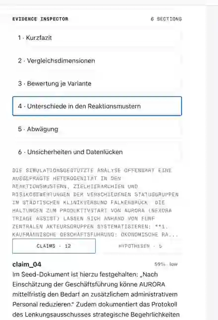

# Referenzlauf 6 — AURORA Rollout-Entscheidungsreport

**Datum:** 14.08.2026  
**Simulation:** `sim_4245ff3d7b23`  
**Report:** `report_3c594fcc7613`  
**Szenario:** fiktiver Städtischer Klinikverbund Falkenbrück / AURORA (`Nexora Triage Assist`)

Dieser Referenzlauf bewertet die Entscheidung, ob ein KI-gestütztes Triage- und Dokumentationssystem gleichzeitig an zwei Klinikstandorten produktiv gehen, zunächst gestaffelt in Falkenbrück-Mitte starten oder verschoben werden sollte.

Der Report wurde bewusst aus **derselben abgeschlossenen Simulation** wie der vorherige AURORA-Report neu erzeugt. Damit ist er eine beobachtbare Referenz für Änderungen an der Report-Pipeline: Unterschiede in Ausgabequalität und Laufzeit entstehen hier nicht durch einen neuen stochastischen Simulationslauf.

## Was der Lauf zeigt

- sechs Reportabschnitte aus derselben abgeschlossenen Simulation,
- Quellenrecherche über `insight_forge`, `panorama_search` und `quick_search`,
- gezielte `interview_agents`-Aufrufe über den gesamten Report,
- einen Evidence Inspector für Claims, Hypothesen, Confidence und gebundene Evidenz,
- direkte `agent_interview`-Evidence-Cards neben Report-Claims,
- nachgelagertes Evidence Gating gegen unbelegte Präzision,
- deutlich geringere Reportlaufzeit als beim vorherigen Report über dieselbe Simulation.

Die resultierende Empfehlung ist ein **konditionierter, gestaffelter Rollout** beginnend in Falkenbrück-Mitte mit Sicherheits-, Schulungs-, Mitbestimmungs- und Fallback-Bedingungen vor einer Ausweitung.

## Evidence Inspector

Das Bild ist anklickbar und öffnet die Originalauflösung. Der Inspector ist Teil der Referenz, weil nicht nur der Reporttext bewertet wird: Claims und Hypothesen lassen sich gemeinsam mit den Evidence-Records untersuchen, die die Report-Pipeline gebunden hat.

## Agenteninterviews als Evidenz

Diese Ansicht zeigt die Verbindung zwischen Reporttext, simuliertem Persona-O-Ton und `agent_interview`-Evidence-Records. Genau diese Schicht unterscheidet den Workflow von einer reinen Dokument-RAG-Zusammenfassung.

## Warum Referenzlauf und keine Showcase-Demo

Der Lauf dokumentiert Fortschritt und verbleibende Trust-Grenzen. Bekannte Einschränkungen sind unter anderem:

- der dokumentierte Seed-Fakt zu **38 Fällen mit abweichender Dringlichkeitseinstufung** wird in einzelnen Abschnitten weiterhin fälschlich als numerisch unzureichend belegt degradiert,
- einzelne Interviewzitate zeigen noch auf den generischen Anker `seed_doc:seed_aurora#chunk:0` statt auf einen präzisen Interview-Record,
- Confidence kann trotz stark passender `SUPPORTED`-Evidenz `low` bleiben,
- ReportV3 kann die Validierung verfehlen, während der Report-Task einen abgeschlossenen Zustand erreicht,
- Netzwerkmetriken der Simulation wie Cluster- und Bridge-Struktur werden im finalen Text noch zu wenig genutzt.

Wichtig: Der Repository-Stand enthält derzeit **nicht alle Artefakte, Fixtures und Replay-Daten, die nötig wären, um diesen exakten Lauf aus einem frischen Checkout vollständig zu reproduzieren**. Er ist deshalb eine **beobachtbare Regressionreferenz**, kein vollständig reproduzierbarer Golden Run.

## Regressionserwartungen

Künftige Änderungen an der Report-Pipeline können diesen Lauf als Vergleichspunkt verwenden. Dabei sollte insbesondere geprüft werden:

1. Der `38 Fälle`-Seed-Fakt wird als belegt gebunden, solange ein Claim nicht über die Quelle hinausgeht.
2. Simulierte Persona-Zitate zeigen auf konkrete `agent_interview`-Evidenz statt auf einen generischen Seed-Anker.
3. Stark gestützte `SUPPORTED`-Quellenfakten werden nicht automatisch als `low` Confidence ausgegeben.
4. Ein fehlgeschlagener kanonischer Report-Contract darf keinen irreführenden vollständig abgeschlossenen Zustand erzeugen.
5. Frühwarnindikatoren, Stop-/Expand-Kriterien und Akteurs-Reaktionsketten bleiben im finalen Report sichtbar.

[English version](./README.md)
